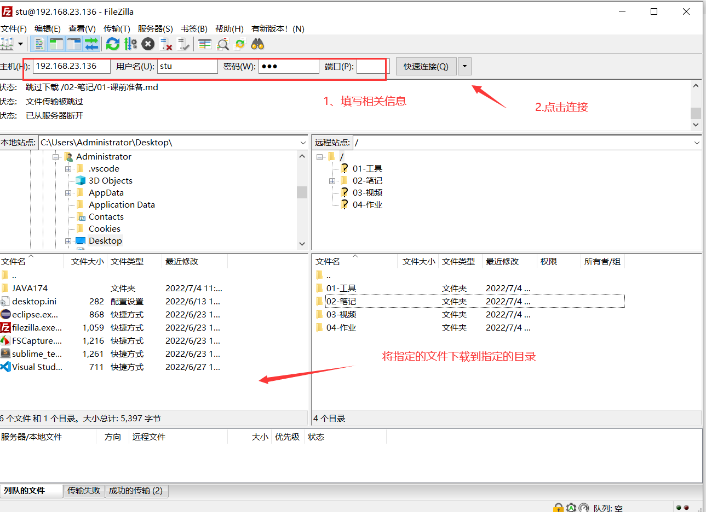

# 课前准备

## 一、学习资料的下载

+ FTP的使用
+ 在任意位置创建文件夹`java174`
  + 将学习资料下载到该文件夹中

## 二、笔记内容查看方式

+ 安装文本编辑器
  + `typora-setup-x64.exe`
+ 安装结束后，打开任意`md`文件
+ 设置打开**大纲**
  + view ---> show outline panel
+ 设置主题
  + file   --->  preferences
  + open theme folder
  + 将主题文件放在打开的文件夹中
  + 关闭当前文件 重新打开