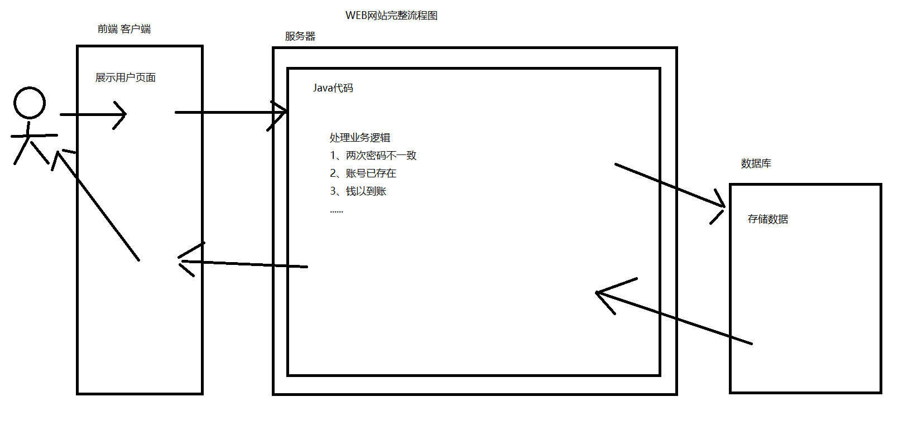
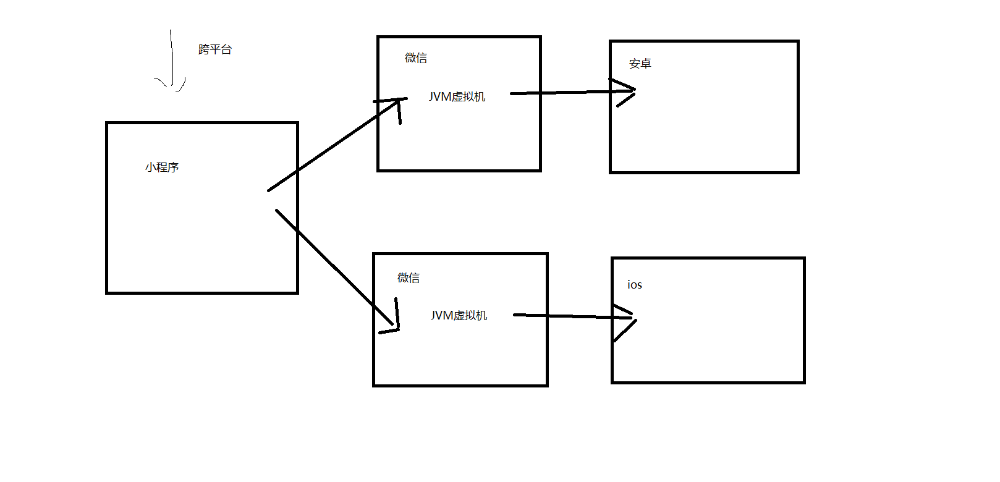
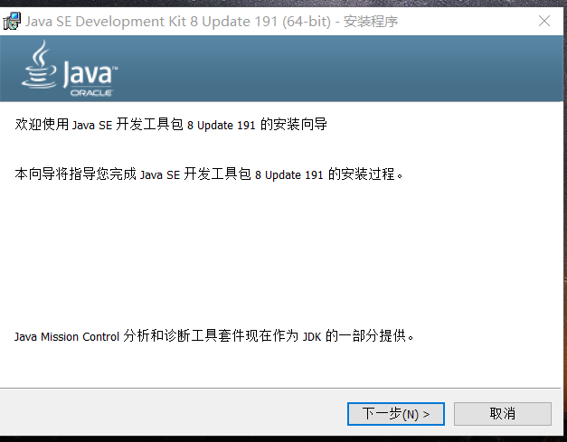
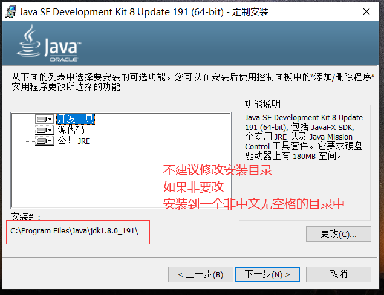
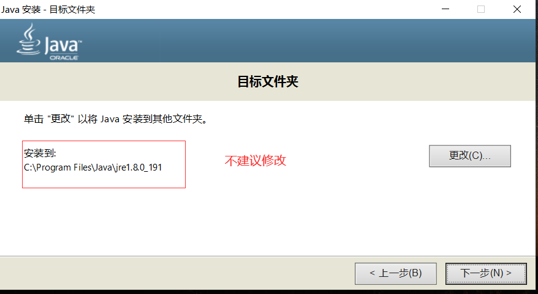
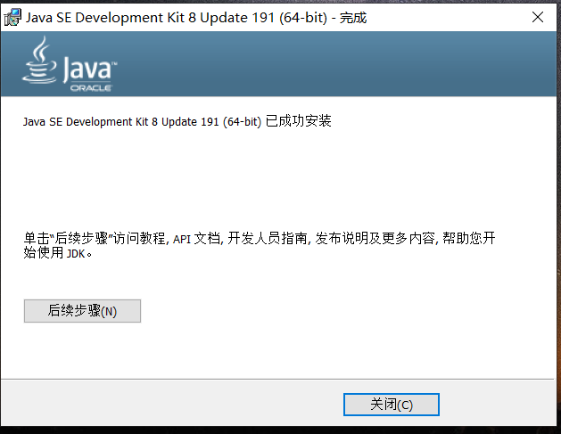
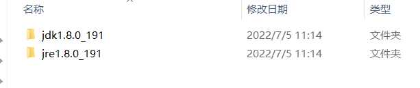
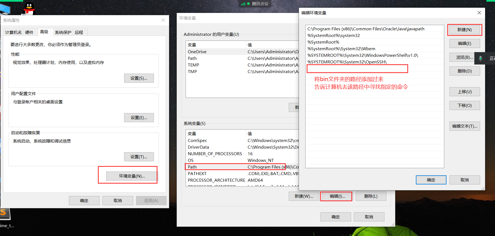
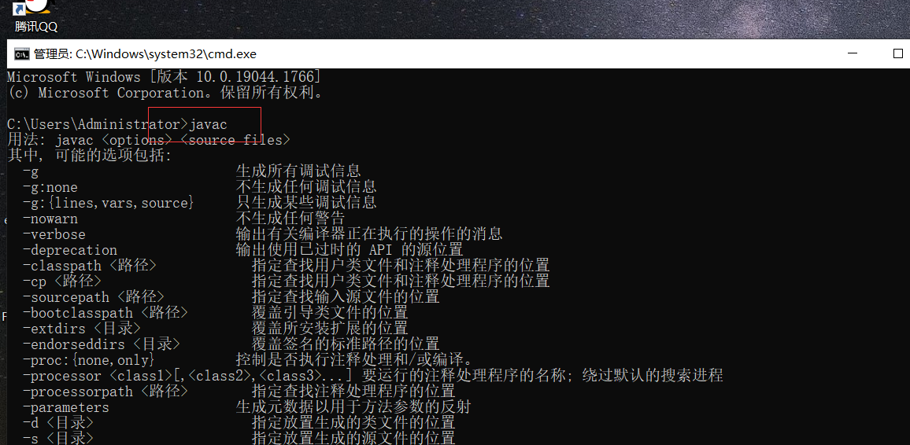
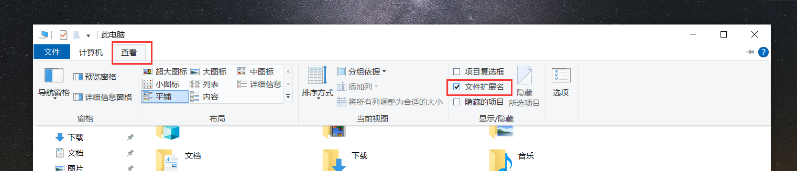

# Java简介


## 一、简介

JAVA是一种**计算机交互语言**

计算机交互语言是人（**程序员**）与计算机交互的一种方式

+ 交互
  + 交互的双方必须使用同一种语言
  + 程序员通过计算机语言编写一些列的指令，计算机按照既定的指令去完成一系列的任务
+ Java就是众多计算机语言之一

## 二、Java的作用



## 三、Java的特点以及优势

+ 相对简单
+ **跨平台**
  + 一次编译，到处执行
  + 我们的Java代码并不是直接运行在**操作系统**中的
  + 而是运行在**JVM**中
  + 不同的操作系统需要安装不同版本的**JVM**
  + 但是对于Java开发者而言Java代码只需要编写一次 不需要关心操作系统
  + 通过以上方式实现了跨平台
+ **面向对象**
+ 安全性高
+ 多线程
+ 开源（免费）



## 四、安装Java开发环境

### 1、开发环境

教会计算机Java语言

+ SDK
  + Software Development Kit
  + 软件开发工具包
+ JDK
  + Java Development Kit
  + Java开发工具包
+ **想要教会计算机Java语言，需要安装JDK**

### 2、安装JDK和配置

#### 2-1、安装JDK

**不要做第一个吃螃蟹的人**












#### 2-2、配置环境变量

+ 环境变量
  + JDK所有的操作命令都是存放在JDK安装目录中的bin文件夹中
  + 我们想要使用这些命令只能在bin文件夹中使用
  + 这样使用非常的不方便
  + 我们应该教会计算机去哪里寻找指定的命令并执行
  + 这个教会的过程需要通过**配置环境变量**来完成
+ 此电脑 ----> 右击 ----> 属性 ---->  高级系统设置





## 五、HelloWorld

+ 展示文件**后缀**
  + 文件名+后缀
  + 文件名是当前文件的名字
  + 后缀决定了当前文件的**展示形式**



+ 在桌面创建文本文档`HelloWorld.txt`
+ 将该文件的后缀修改为`java`
+ 使用记事本打开该文件，编写以下内容

```java
public class HelloWorld{
  public static void main(String[] args){
    System.out.println("HelloWorld");
  }
}
```

+ 打开**终端**，将目录切换到`java`文件所在的目录中
  + `cd`切换目录
+ 通过`javac`命令对编写的java文件进行**编译（对文件中的代码进行检测）**，得到`class`文件
+ 运行class文件

## 六、总结与分析

+ **程序员编写的所有代码带应该放在`.java`文件中**
+ 一个Java文件中的代码最基本的组成结构分为3个部分
  + 这3个部分是**父子关系**
  + 类、方法、执行代码
+ 类
  + public
    + 访问权限符
  + class
    + 用来定义一个Java类
  + HelloWorld
    + **类名**
    + 定义当前类的名字
    + 在一个Java文件中**可以定义多个类，这些类只能是兄弟关系**
      + 如果一个文件中有多个类，那么这些类只能有一个被`public`修饰
      + **被`public`修饰的类名必须和文件名完全一致（包括大小写）**
      + 我们建议一个文件中只定义一个类
      + **开发规范要求，类名首字母必须大写，其余部分采用驼峰命名法（多个单词之间 第二个单词的首字母大写）**
  + {}
    + 作用域
    + 代码块
    + **在Java代码中，所有的括号成对打印**
    + `{`一般情况下右边不允许有内容
    + `}`一般情况下独占一行
+ 方法
  + 方法必须定义在**类**中
  + `public static void main(String[] args){}`
  + main方法是Java程序的**唯一入口**
  + 在一个类中可以定义很多个方法，但是我们的JVM虚拟机只会运行`main`方法中的内容
+ 执行代码
  + `System.out.println("HelloWorld");`
  + 系统控制台输出打印指定的内容
    + 如果指定的内容是纯数字可以不加`""`
  + 指定计算机需要做的事情
  + 每一个执行代码必须以`;`结尾
+ **在编写代码的过程中 我们需要通过合适的缩进（tab）体现出代码的层级关系**

## 七、JDK、JRE、JVM

+ JDK
  + Java开发环境
  + 内置了Java常用的**操作命令、代码中的核心关键字以及类库**
  + 提供了程序员编写代码以及对java文件进行操作的环境
+ JRE
  + Java运行环境
  + 内置了JVM虚拟机，提供了class文件所运行的环境
+ JVM
  + Java虚拟机
  + 用于运行Java代码
+ `javac`对`java`文件进行编译，得到`class文件`
+ `java`运行`class`文件
+ **程序员编写的是`java`文件，计算机运行的是`class`文件**
+ 安装JDK时，会自动安装JRE，JRE中又包含了JVM
  + 综上所述，只需要安装JDK即可

## 八、Java的技术体系

Java诞生于1995年，由Sun公司发明，目前已被Oracle（**甲骨文**）收购

+ J2SE
  + Java标准版
  + 基础语法
  + 一般用于做图形化界面的开发
+ J2EE
  + Java企业版/网页版
  + JavaWeb开发
  + 在J2SE原有的基础上添加了一些新的组件
    + 让Java代码实现了和前端页面交互
    + Java代码走上了网络时代
+ J2ME
  + Java小型版

## 九、注释

程序员在编写代码的过程中经常会使用到一些**说明性的文字**

+ 写在代码中的任意位置
+ 不参与编译

我们需要对这些内容进行**注释**

+ 单行注释
  + `//注释的内容`
  + 一般用于对执行代码进行说明
+ 多行注释
  + `/*注释的内容*/`
  + 一般用于对方法进行说明
+ 文档注释
  + `/**注释的内容*/`
  + 一般用于对类进行说明

一般在代码的编写过程中，要求注释的占比达到30%

## 十、包

一个完整的Java项目中会有很多个Java文件

这些Java文件的名字不能随便取，需要**见名知意**

难免会出现同名的情况，在同一个文件夹中，文件名是不允许重名的

此时我们需要将同名的文件放在不同的文件夹中

**在一个项目中用于存放java文件的文件夹被我们称之为包**

+ 包名.类名
  + 一个类的**完整类名**
  + 只有完整类名才可以在一个项目中锁定一个具体的类
  + `a.c.A`,`b.A`
+ 包名的命名规则
  + 公司域名倒置 + 项目名
  + baidu.com
  + wanhe.net
  + taobao.com