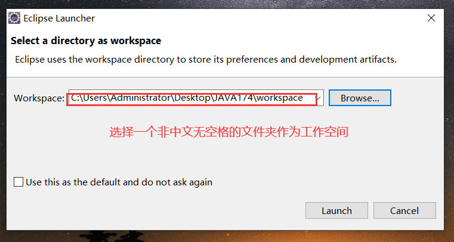
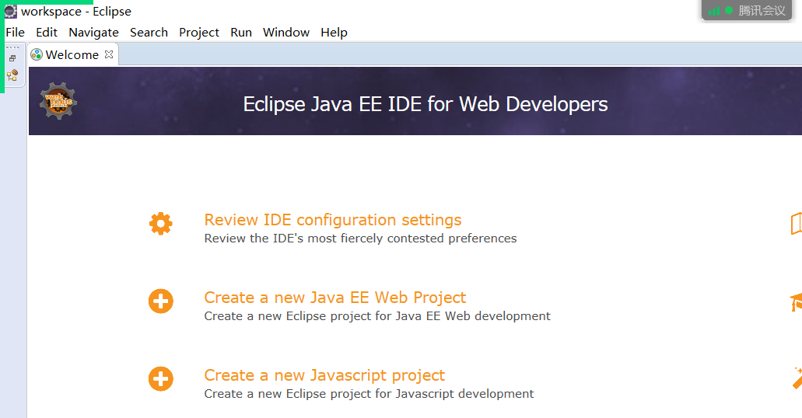
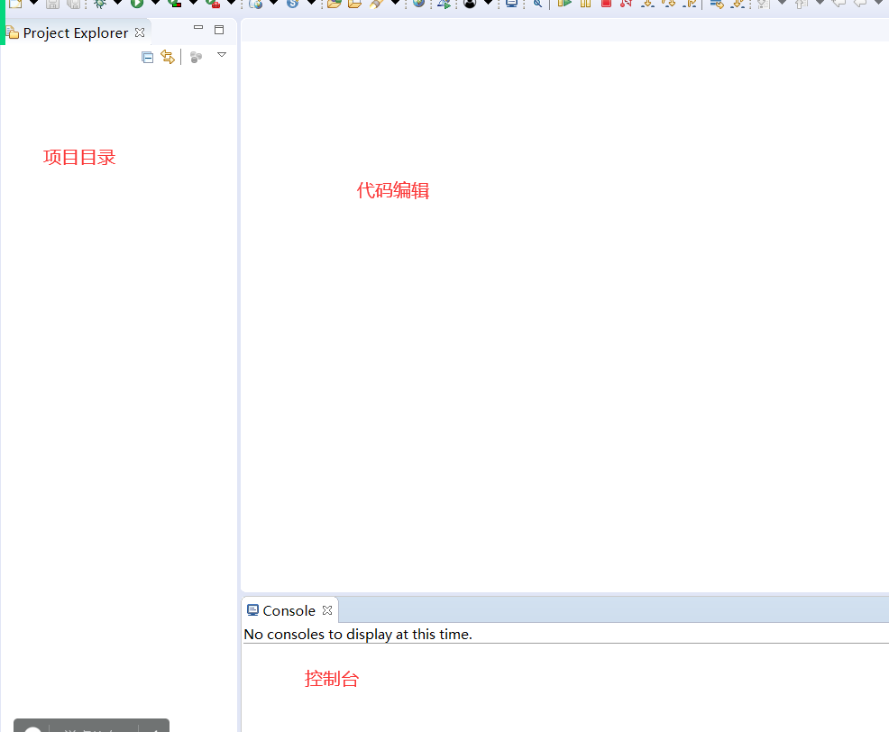
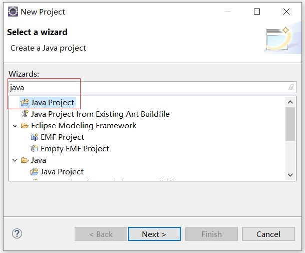
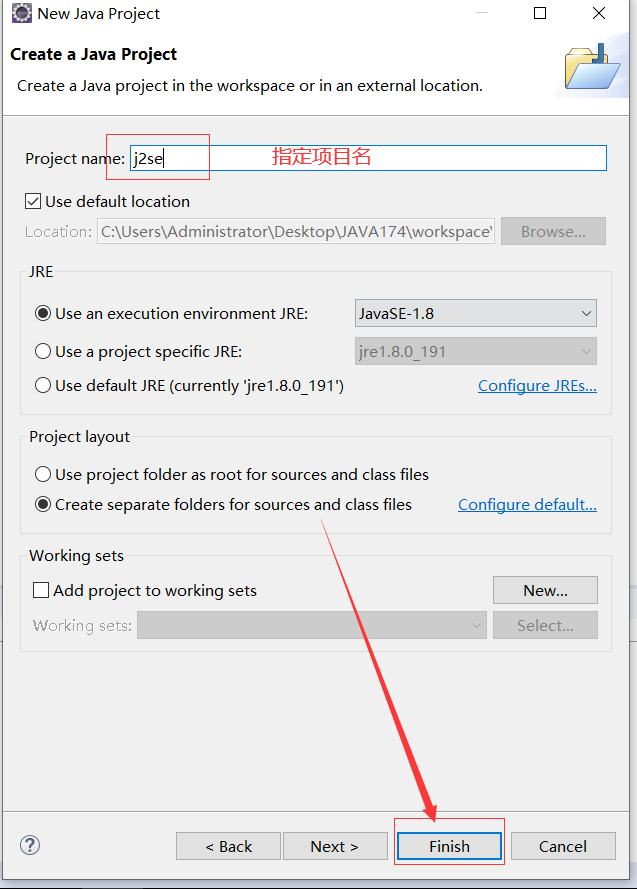
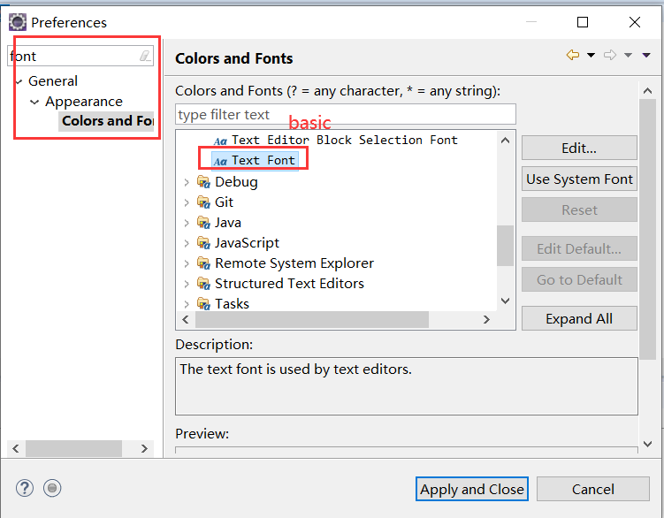
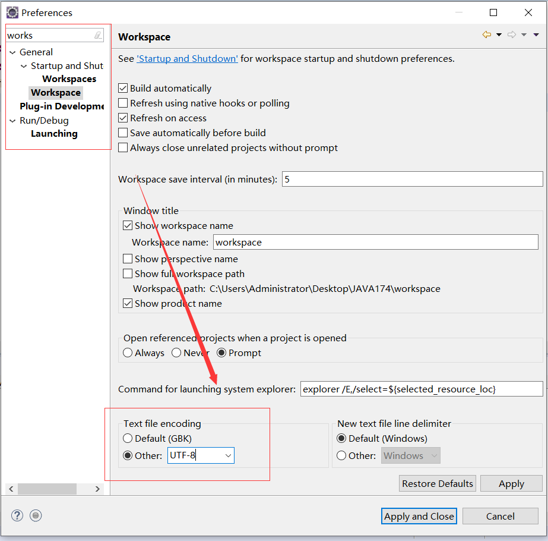

# Eclipse

## 一、简介

+ 开源的
+ 是一款辅助Java开发的**开发工具**
+ 处理了代码的编译和运行，使程序员只关心代码的编写

## 二、安装和使用

### 1、安装

1、解压缩

2、创建快捷方式并运行

3、选择一个文件夹作为**工作空间**，用于存放今后所有的项目

### 2、使用

window ---> show view

+ 项目目录
  + 用来查看项目结构打开对应的java文件
  + Project Explorer
+ 代码编辑区域
+ 控制台
  + console

### 3、创建项目

+ **一个项目中所有的包和Java代码全部存放在src中**

### 4、创建包

在src上右击  --->  new  ---> package

**包名之间以`.`隔开**

### 5、创建类

在包上右击  ---> new  ---> class ---> 指定类名

### 6、设置字体

window  ---> preferences ---> 搜索font

### 7、运行代码

eclipse帮我们自动进行编译，将得到的class文件存放到bin文件夹中

### 8、设置字符集

