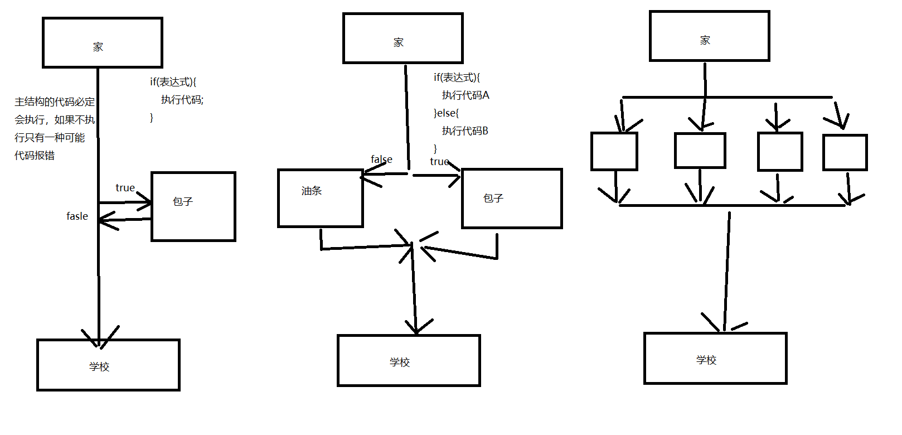
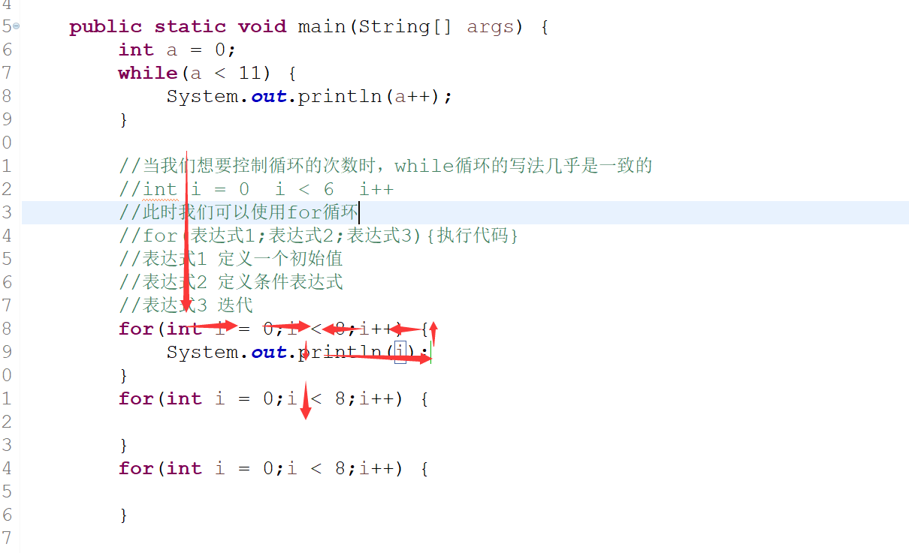

# 流程控制


## 一、简介

+ 流程
  + 入学有入学的流程、毕业流程、登机流程......
  + 做任何事情都有一系列的操作步骤
+ 在Java代码中，所有的代码都有自己的运行流程
  + 程序一旦启动，JVM虚拟机会按照指定的流程依次执行代码
+ Java中的常见流程
  + 顺序结构
  + 选择结构
  + 循环结构

## 二、顺序结构

程序一启动，JVM虚拟机会执行当前类中main方法中的内容，并开始从上往下依次执行

顺序结构是Java运行流程的主结构

任何其余结构都是依赖于该结构发生的

## 三、选择结构



### 1、if

```java
package net.wanhe.j2se.day03;

public class Test03 {
	
	public static void main(String[] args) {
		
		int time = 9;
		System.out.println("程序开始执行");
		System.out.println("程序正在执行");
		//表达式可以随便写 但是表达式的结果一定要是boolean类型
		//if语法中的代码要么执行，要么不执行
		if(time < 8) {
			System.out.println("买个包子");
		}
		System.out.println("程序正在执行");
		System.out.println("程序执行结束");
		
	}

}

```

### 2、if..else...

```java
package net.wanhe.j2se.day03;

public class Test04 {
	
	public static void main(String[] args) {
		int time = 5;
		System.out.println("程序开始执行");
		System.out.println("程序正在执行");
		//表达式可以随便写 但是表达式的结果一定要是boolean类型
		//if..else...语法中的代码要么执行代码A，要么执行代码B,两个情况必定有一个会发生，两种情况不会都发生
		if(time < 8) {
			System.out.println("买个包子");
		}else {
			System.out.println("买个油条");
		}
		System.out.println("程序正在执行");
		System.out.println("程序执行结束");
	}

}

```

### 3、if...else if...else...

```java
package net.wanhe.j2se.day03;

public class Test05 {
	
	public static void main(String[] args) {
		
		int time = 5;
		System.out.println("程序开始执行");
		System.out.println("程序正在执行");
		//表达式可以随便写 但是表达式的结果一定要是boolean类型
		//if..else if..else..语法中的代码
		//会从上往下依次进行判断 如果结果为true则执行对应的代码 语法结束
		//如果结果为false则 继续进行下一个条件判断
		//如果所有的条件都不满足 则执行else中的内容
		if(time < 6) {
			System.out.println("买个面条");
		}else if(time < 7) {
			System.out.println("买个馄饨");
		}else if(time < 8) {
			System.out.println("买个包子");
		}else {
			System.out.println("买个油条");
		}
		System.out.println("程序正在执行");
		System.out.println("程序执行结束");
		
	}

}

```

### 4、switch

```java
package net.wanhe.j2se.day03;

public class Test06 {
	
	public static void main(String[] args) {
		int a = 3;
		//switch()中的内容不再是一个返回boolean类型的表达式
		//而是一个变量
		//该语法会将()中的变量的值和case关键字后面的值做比较
		//如果比较的结果相同则执行当前case选项:后面的执行代码
		//并且会继续执行当前选项后面所有的内容
		//如果比较的结果不相同则跳过当前选项 继续下一个比较
		//这种现象我们称之为switch语法的 穿透性
		//我们可以通过break关键字阻断穿透性
		//break的作用是结束当前语法
		//如果所有的选项都不满足 则执行default后面的内容
		switch(a) {
			case 1:
				System.out.println("执行了case1");
				break;
			case 2:
				System.out.println("执行了case2");
				break;
			case 3:
				System.out.println("执行了case3");
				break;
			default:
				System.out.println("执行了default");
		}
	}

}

```

+ **case的值不能重复**

### 5、总结

+ 能用if就只用if，不要用if..else...
+ 做等值判断，建议使用switch
+ 做条件区间判断，建议使用if

### 6、作业

```java
package net.wanhe.j2se.day03;

import java.util.Scanner;

public class Test07 {
	
	public static void main(String[] args) {
		System.out.println("请输入一个年份:");
		//等待用户输入一个年份
		//准备一只笔
		Scanner sc = new Scanner(System.in);
		//让用户使用这只笔在控制台输入年份
		//将用户在控制台输入的整数赋值给变量year
		int year = sc.nextInt();
		System.out.println("您输入的年份是:" + year);
	}

}
```

1、提示用户在控制台输入一个年份，判断该年份是否是闰年，在控制台输出是或者不是

（年份能被4整除 且不能被100整除） 或者 能被400整除

```java
package net.wanhe.j2se.day03;

import java.util.Scanner;

public class Test07 {
	
	/*
	 * 提示用户在控制台输入一个年份，判断该年份是否是闰年，在控制台输出是或者不是
	 *（年份能被4整除 且不能被100整除） 或者 能被400整除
	 */
	public static void main(String[] args) {
		System.out.println("请输入一个年份:");
		//等待用户输入一个年份
		//准备一只笔
		Scanner sc = new Scanner(System.in);
		//让用户使用这只笔在控制台输入年份
		//将用户在控制台输入的整数赋值给变量year
		int year = sc.nextInt();
		System.out.println("您输入的年份是:" + year);
		//判断用户输入的年份是否是闰年
		if(year % 4 == 0 && year % 100 != 0 || year % 400 == 0) {
			System.out.println("是闰年");
		}else {
			System.out.println("是平年");
		}
	}

}
```

2、依次定义三个整型变量a,b,c 值随意

通过代码找出a,b,c中的最大值

```java
package net.wanhe.j2se.day03;

public class Test08 {
	
	/*
	 * 依次定义三个整型变量a,b,c 值随意
	 * 通过代码找出a,b,c中的最大值
	 */
	public static void main(String[] args) {
		int a = 45;
		int b = 34;
		int c = 12;
		int max = a;
		if(b > max) {
			max = b;
		}
		if(c > max) {
			max = c;
		}
		System.out.println(max);
//		if(a > b) {
//			if(a > c) {
//				System.out.println(a);
//			}else {
//				System.out.println(c);
//			}
//		}else{
//			if(b > c) {
//				System.out.println(b);
//			}else {
//				System.out.println(c);
//			}
//		}
		
	}

}
```

3、依次定义三个整型变量a,b,c 值随意

通过代码将abc中的值按照从小到大的顺序交换

```java
package net.wanhe.j2se.day03;

public class Test09 {
	
	/*
	 * 冒泡排序法
	 * 每一轮比较都在找剩余变量中的最大值存放到当前末尾的变量中
	 */
	public static void main(String[] args) {
		int a = 34;
		int b = 12;
		int c = 23;
		int d = 67;
		//第一轮
		//a和b两个变量中的最大值肯定存放在变量b中
		if(a > b) {
			int temp = a;
			a = b;
			b = temp;
		}
		//a和b和c三个变量中的最大值肯定存放在变量c中
		if(b > c) {
			int temp = b;
			b = c;
			c = temp;
		}
		if(c > d) {
			int temp = c;
			c = d;
			d = temp;
		}
		//第二轮
		if(a > b) {
			int temp = a;
			a = b;
			b = temp;
		}
		if(b > c) {
			int temp = b;
			b = c;
			c = temp;
		}
		//第三轮
		if(a > b) {
			int temp = a;
			a = b;
			b = temp;
		}
		System.out.println(a);
		System.out.println(b);
		System.out.println(c);
		System.out.println(d);
	}

}
```

4、提示用户在控制台输入一个三位数，判断该数值是否是**水仙花数**，在控制台输出是或者不是

各个位上的数字的立方和等于当前数字本身 153  1^3 + 5^3 + 3^3 = 153

```java
package net.wanhe.j2se.day03;

import java.util.Scanner;

public class Test10 {
	
	/*
	 * 提示用户在控制台输入一个三位数，判断该数值是否是水仙花数，在控制台输出是或者不是
	 * 各个位上的数字的立方和等于当前数字本身 153  1^3 + 5^3 + 3^3 = 153
	 */
	public static void main(String[] args) {
		System.out.println("请输入一个三位数:");
		Scanner sc = new Scanner(System.in);
		int num = sc.nextInt();
		int gw = num % 10;
		int sw = num % 100 / 10;
		int bw = num / 100;
		if(gw * gw * gw + sw * sw * sw + bw * bw * bw == num) {
			System.out.println("是一个水仙花数");
		}else {
			System.out.println("不是");
		}
		
	}

}
```

5、程序一启动，在控制台提示用户依次输入两个整数

请输入第一个整数:


请输入第二个整数:


用户输入结束后，展示如下菜单，并提示用户选择需要执行的功能


----xxx的计算机----

1、求和

2、求差

3、求乘积

4、求商（取整）

请选择:


根据用户输入的选项 计算对应的结果将结果在控制台展示出来

```java
package net.wanhe.j2se.day03;

import java.util.Scanner;

public class Test11 {
	
	public static void main(String[] args) {
		Scanner sc = new Scanner(System.in);
		System.out.println("请输入第一个整数:");
		int num1 = sc.nextInt();
		System.out.println("请输入第二个整数:");
		int num2 = sc.nextInt();
		//展示菜单
		System.out.println("----xxx的计算机----");
		System.out.println("1.求和");
		System.out.println("2.求差");
		System.out.println("3.求乘积");
		System.out.println("4.求商（取整）");
		System.out.println("请选择:");
		//获取用户输入的选项
		int chooise = sc.nextInt();
		switch(chooise) {
			case 1:
				System.out.println("结果为:" + (num1 + num2));
				break;
			case 2:
				System.out.println("结果为:" + (num1 - num2));
				break;
			case 3:
				System.out.println("结果为:" + (num1 * num2));
				break;
			case 4:
				System.out.println("结果为:" + (num1 / num2));
				break;
			default:
				System.out.println("请选择正确的选项");
		}
		
	}

}

```

## 四、循环结构

### 1、while

当满足某个条件时，做什么事情

`while(表达式){执行代码}`

+ 表达式的返回结果必须是boolean类型
+ 当程序运行到while语法时，会执行表达式
  + 如果表达式的结果为true，则执行`{}`中的代码
    + 当`{}`中的代码执行结束后，会重新执行**表达式**
    + 如果表达式的结果仍为true，则再一次执行`{}`中的代码
    + 形成**循环**，直到表达式的结果为false结束
  + 如果表达式的结果为false，则跳过当前语法
+ **使用循环一定要注意，表达式是可以发生改变的**

```java
package net.wanhe.j2se.day03;

public class Test12 {
	public static void main(String[] args) {
		int a = 5;
		while(a < 7) {
			System.out.println("正在循环中");
			a++;
		}
	}
}
```

### 2、do...while...

```java
package net.wanhe.j2se.day03;

public class Test13 {
	
	public static void main(String[] args) {
		int a = 5;
		while(a < 3) {
			System.out.println("1循环");
		}
		
		//dowhile先执行一次代码 再进行条件判断
		//不管条件成不成立 {}中的内容至少会执行一次
		do {
			System.out.println("2循环");
		}while(a < 3);
	}

}
```

### 3、for



```java
package net.wanhe.j2se.day03;

public class Test14 {
	
	public static void main(String[] args) {
		int a = 0;
		while(a < 11) {
			System.out.println(a++);
		}
		
		//当我们想要控制循环的次数时，while循环的写法几乎是一致的
		//int i = 0  i < 6  i++
		//此时我们可以使用for循环
		//for(表达式1;表达式2;表达式3){执行代码}
		//表达式1  定义一个初始值
		//表达式2  定义条件表达式
		//表达式3  迭代
		for(int i = 0;i < 8;i++) {
			System.out.println(i);
		}
		for(int i = 0;i < 8;i++) {
			
		}
		for(int i = 0;i < 8;i++) {
			
		}
		
	}

}

```

### 4、总结

+ **当需要循环的次数确定时，使用for循环**
+ **当循环的次数不确定时，使用while循环**

### 5、控制循环的关键字

+ continue
  + 结束当前循环，继续下一次
+ break
  + 结束整个语法

### 6、作业

1、计算机作业加入第5个选项 退出系统

要求程序启动后 按照原有流程根据用户的选项进行计算

当计算结果结束后 再一次提示用户输入两个数字 按照之前的操作继续执行

直到用户选择5 才可以让程序停止运行

```java
package net.wanhe.j2se.day03;

import java.util.Scanner;

public class Test18 {
	
	public static void main(String[] args) {
		boolean flag = true;
		while(flag) {
			Scanner sc = new Scanner(System.in);
			System.out.println("请输入第一个整数:");
			int num1 = sc.nextInt();
			System.out.println("请输入第二个整数:");
			int num2 = sc.nextInt();
			//展示菜单
			System.out.println("----xxx的计算机----");
			System.out.println("1.求和");
			System.out.println("2.求差");
			System.out.println("3.求乘积");
			System.out.println("4.求商（取整）");
			System.out.println("5.退出系統");
			System.out.println("请选择:");
			//获取用户输入的选项
			int chooise = sc.nextInt();
			switch(chooise) {
				case 1:
					System.out.println("结果为:" + (num1 + num2));
					break;
				case 2:
					System.out.println("结果为:" + (num1 - num2));
					break;
				case 3:
					System.out.println("结果为:" + (num1 * num2));
					break;
				case 4:
					System.out.println("结果为:" + (num1 / num2));
					break;
				case 5:
					flag = false;
					break;
				default:
					System.out.println("请选择正确的选项");
			}
		}
	}

}

```


2、通过代码找出所有的水仙花数

```java
package net.wanhe.j2se.day03;

public class Test19 {
	
	public static void main(String[] args) {
		for(int i = 100;i < 1000;i++) {
			int gw = i % 10;
			int sw = i % 100 / 10;
			int bw = i / 100;
			if(gw * gw * gw + sw * sw * sw + bw * bw * bw == i) {
				System.out.println(i);
			}
		}
	}

}
```


3、提示用户在控制台一次输入两个整数分别存放到变量a和b中

求a的b次方  a=2 b = 3

```java
package net.wanhe.j2se.day03;

import java.util.Scanner;

public class Test20 {
	
	public static void main(String[] args) {
		Scanner sc = new Scanner(System.in);
		System.out.println("请输入第一个整数:");
		int a = sc.nextInt();
		System.out.println("请输入第二个整数:");
		int b = sc.nextInt();
		//a  2     3
		//a * a    a * a * a
		int result = 1;
		for(int i = 0;i < b;i++) {
			result *= a;
		}
		System.out.println(result);
	}

}
```


4、在控制台输出1-100之间所有的偶数

```java
package net.wanhe.j2se.day03;

public class Test21 {
	
	public static void main(String[] args) {
		for(int i = 2;i < 101;i+=2) {//步长
			System.out.println(i);
		}
	}

}
```


5、在控制台输出0-100之间所有可以被7整除的数

```java
package net.wanhe.j2se.day03;

public class Test22 {
	
	public static void main(String[] args) {
		for(int i = 0;i < 101;i++) {
			if(i % 7 == 0) {
				System.out.println(i);
			}
			
		}
	}

}
```


6、计算1到100的总和

```java
package net.wanhe.j2se.day03;

public class Test23 {
	
	public static void main(String[] args) {
		int result = 0;
		for(int i = 1;i < 101;i++) {
			result += i;
		}
		System.out.println(result);
	}

}

```


7、依次提示用户在控制台输入4个整数，找出4个数中的最大值

```java
package net.wanhe.j2se.day03;

import java.util.Scanner;

public class Test24 {
	
	public static void main(String[] args) {
		int max = 0;
		Scanner sc = new Scanner(System.in);
		for(int i = 0;i < 4;i++) {
			System.out.println("请输入第" + (i+1) + "个整数:");
			int num = sc.nextInt();
			if(num > max) {
				max = num;
			}
		}
		System.out.println(max);
	}

}
```


8、在控制台输出以下图形，一次可以打印`******`

```java
******
******
******
```


9、在控制台输出以下图形，一次可以打印`*`

```java
******
******
******
```

```java
package net.wanhe.j2se.day03;

public class Test25 {
	
	public static void main(String[] args) {
		//控制的是行数
		for(int i = 0;i < 3;i++) {
			//控制的是每一行*的数量
			for(int j = 0;j < 6;j++) {
				System.out.print("*");
			}
			System.out.println();
		}
		
	}

}

```


10、在控制台输出以下图形，一次可以打印`*`

```java
*
**
***
****
```


11、在控制台输出以下图形，一次可以打印`*`

```java
      *
    **
  ***
****
```


12、在控制台输出以下图形，一次可以打印`*`

```java
      *
    ***  
  *****
*******
```

```java
package net.wanhe.j2se.day03;

public class Test25 {
	
	public static void main(String[] args) {
		//控制的是行数
		for(int i = 0;i < 3;i++) {
			//控制的是每一行*的数量
			for(int j = 0;j < 6;j++) {
				System.out.print("*");
			}
			System.out.println();
		}
		
		System.out.println("------");
		
		for(int i = 0;i < 4;i++) {
			//1  0  1
			//2  1  2
			//3  2  3
			for(int j = 0;j < i + 1;j++) {
				System.out.print("*");
			}
			System.out.println();
		}
		
		System.out.println("------");
		
		for(int i = 0;i < 4;i++) {
			//1 0 3
			//2 1 2
			//3 2 1
			//4 3 0
			for(int j = 0;j < 3 - i;j++) {
				System.out.print(" ");
			}
			for(int j = 0;j < i + 1;j++) {
				System.out.print("*");
			}
			System.out.println();
		}
		
		System.out.println("------");
		
		for(int i = 0;i < 4;i++) {
			// 1  0  3  1
			// 2  1  2  3
			// 3  2  1  5
			// 4  3  0  7
			for(int j = 0;j < 3 - i;j++) {
				System.out.print(" ");
			}
			for(int j = 0;j < i * 2 + 1;j++) {
				System.out.print("*");
			}
			System.out.println();
		}
	}

}

```

13、在控制台输出以下图形，一次可以打印`*`

```java
      *
    ***  
  *****
*******
  *****
    ***
      *
```

```java
package net.wanhe.j2se.day04;

public class Test01 {
	
	public static void main(String[] args) {
		
		for(int i = 0;i < 4;i++) {
			for(int j = 0;j < 3 - i;j++) {
				System.out.print(" ");
			}
			for(int j = 0;j < 2 * i + 1;j++) {
				System.out.print("*");
			}
			System.out.println();
		}
		for(int i = 0;i < 3;i++) {
			//0  1  5
			//1  2  3
			//2  3  1
			for(int j = 0;j < i + 1;j++) {
				System.out.print(" ");
			}
			for(int j = 0;j < 5 - 2 * i;j++) {
				System.out.print("*");
			}
			System.out.println();
		}
		
	}

}
```

14、在控制台打印乘法口诀表

```java
1 * 1 = 1
2 * 1 = 2  2 * 2 = 4
3 * 1 = 3  ..........
```

```java
package net.wanhe.j2se.day04;

public class Test02 {
	
	public static void main(String[] args) {
		
		for(int i = 0;i < 9;i++) {
			for(int j = 0;j < i + 1;j++) {
				//i  j
				//0  0  1 * 1
				//1  0  2 * 1
				//1  1  2 * 2
				System.out.print((j + 1) + "*" +  (i + 1) + "=" + (i + 1) * (j + 1) + "  ");
			}
			System.out.println();
		}
		
	}

}
```

15、在控制台输出以下图形，一次可以打印`*`

```java
      *
    *  *  
  *      *
*          *
  *      *
    *  *
      *
```

```java
package net.wanhe.j2se.day04;

public class Test03 {
	
	public static void main(String[] args) {

		for(int i = 0;i < 4;i++) {
			for(int j = 0;j < 3 - i;j++) {
				System.out.print(" ");
			}
			for(int j = 0;j < 2 * i + 1;j++) {
				if(j == 0 || j == 2 * i) {
					System.out.print("*");
				}else {
					System.out.print(" ");
				}
			}
			System.out.println();
		}
		for(int i = 0;i < 3;i++) {
			//0  1  5
			//1  2  3
			//2  3  1
			for(int j = 0;j < i + 1;j++) {
				System.out.print(" ");
			}
			for(int j = 0;j < 5 - 2 * i;j++) {
				if(j == 0 || j == 4 - 2 * i) {
					System.out.print("*");
				}else {
					System.out.print(" ");
				}
			}
			System.out.println();
		}
	}

}

```

