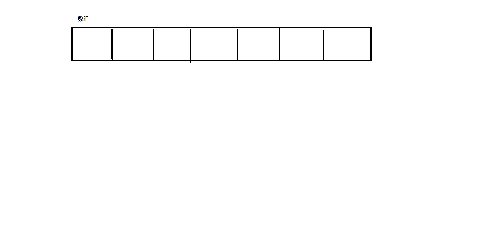
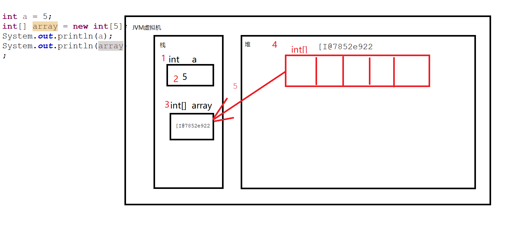
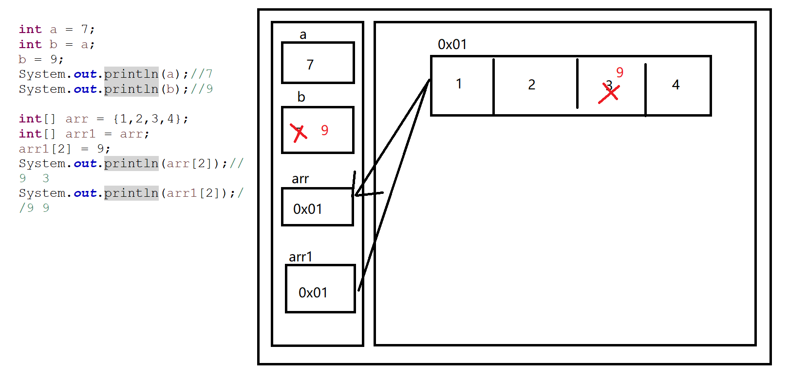
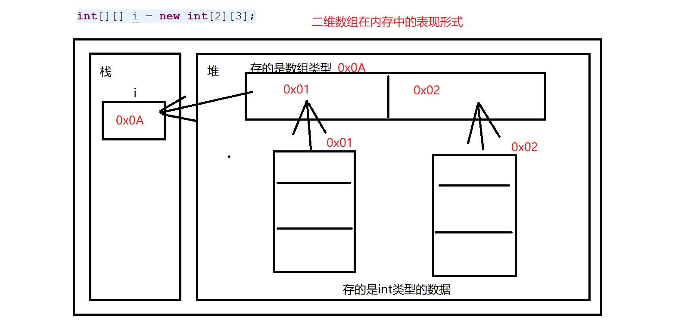

# 数组


## 一、简介

数据的组合

将**一系列相同类型的数据**存放在一起

+ 一个变量只能存放一个数据
+ 一个数组中可以存放很多个数据

数组在Java中是一种特殊的容器，可以存储大量的相同类型的数据

**数组在Java内存中的表现形式是一段连续的存储空间**



## 二、数组的定义

+ 数组也是一种数据类型
  + `[]`

```java
package net.wanhe.j2se.day04;

public class Test04 {
	
	public static void main(String[] args) {
		//定义一个int类型的变量赋值为5
		int a = 5;
		//在定义数组时 需要制定当前数组存储的数据的类型
		//同时还需要指定该数组可以存储的数据的个数
		//申明了一个存储int类型的数组类型的变量array
		//并且将一个长度为5的存储int类型的数组赋值给变量array
		//定义方式1
		int[] array = new int[5];
		//方式2 该方式是C的写法 保留下来是为了照顾C语言开发者的感受 所以不建议使用
		int array1[] = new int[5];
		//方式3 
		int[] array2 = new int[] {2,3};
		//方式4 = 方式三
		int[] array3 = {1,23,45,6};
		System.out.println(a);//5
		System.out.println(array2);//{2,3} [I@7852e922 地址
	}

}

```

## 三、基本数据类型和引用类型

+ JVM虚拟机有**栈**和**堆**两个部分组成
+ 我们的变量都是申明在**栈**中的
+ 基本数据类型的值也是放在**栈**中
+ 引用类型的数据是放在**堆**中的
+ JVM虚拟机在运行时只会去找**栈**中的东西，不能直接找**堆**
+ **`new`表示的是在堆中开辟空间**



```java
package net.wanhe.j2se.day04;

public class Test05 {
	
	public static void main(String[] args) {
		int a = 5;
		int b = 5;
		int[] array = new int[5];
		int[] array1 = new int[5];
		//传值和传引用
		System.out.println(a == b);//true
		System.out.println(array == array1);//false
	}

}

```

## 四、数组的使用

+ 数组在**堆**中被创建，被创建的同时虚拟机会为数组中的每一个格子生成一个编号
+ 这个编号是从0开始的
  + 假设数组的长度为5，编号是从0-4
  + 这些编号我们称之为**数组的下标**
+ 我们可以通过下表操作数组中的数据``

```java
package net.wanhe.j2se.day04;

public class Test06 {
	
	public static void main(String[] args) {
		int[] array = {1,4,6,5,7};
		System.out.println(array);
		//array[2] 获取数组中下表为2这个各自中存储的值 取值
		System.out.println(array[2]);//6
		//将8存放到数组中下表为3的各自中 如果有值则覆盖
		array[3] = 8;
		//不是存储的数据的数量 而是数组的总长
		//数组的长度是固定不变的
		int length = array.length;
		System.out.println(length);
		
	}

}
```



+ 我们在使用数组时 需要注意下标不能超出数组的表示范围，一旦超出会出现异常报错
  + **数组下标越界**

```java
Exception in thread "main" java.lang.ArrayIndexOutOfBoundsException: 3
	at net.wanhe.j2se.day04.Test08.main(Test08.java:7)
```

## 五、作业

1、创建一个长度为6的数组，依次提示用户输入6个整数并依次存放到数组中

2、将上列数组中的值在控制台以下一形式打印出来

`[1，2，3，4，5，6]`

3、通过代码找出上述数组中的最大值在控制台输出打印

4、通过代码找出上述数组中数值3出现的次数

```java
package net.wanhe.j2se.day04;

import java.util.Scanner;

public class Test09 {
	
	public static void main(String[] args) {
		Scanner sc = new Scanner(System.in);
		//创建一个长度为6的数组，依次提示用户输入6个整数并依次存放到数组中
		int[] array = new int[3];
		//冗余代码  重复使用的代码
		//在实际开发中 尽量不要让代码中出现太多的写死的值
		//改一个其他部分自动修改了
		for(int i = 0;i < array.length;i++) {
			System.out.println("请输入第" + (i+1) + "个数:");
			array[i] = sc.nextInt();
		}
		
		//展示数组中的内容
		System.out.print("[");
		for(int i = 0;i < array.length;i++) {
			System.out.print(array[i]);
			if(i != array.length - 1) {
				System.out.print(",");
			}
			
		}
		System.out.println("]");
		
		//找出数组中的最大值
		int max = array[0];
		for(int i = 0;i < array.length;i++) {
			if(array[i] > max) {
				max = array[i];
			}
		}
		System.out.println("数组中的最大值是:" + max);
		
		//找出3出现的次数
		int count = 0;
		for(int i = 0;i < array.length;i++) {
			if(array[i] == 3) {
				count++;
			}
		}
		System.out.println("数组中3出现的次数:" + count);
	}
}
```

## 六、数组的遍历

+ 通过循环将数组中的值一个一个的取出来进行操作

```java
package net.wanhe.j2se.day04;

public class Test10 {
	
	public static void main(String[] args) {
		int[] array = {1,2,3,4,5};
		//数组的遍历
		for(int i = 0;i < array.length;i++) {
			System.out.println(array[i]);
		}
	}
}

```

## 七、数据类型的默认值

+ 当我们创建数组时，如果只申明了数组的长度，没有给定具体的值
+ 那么该数组在创建时，会使用当前数组存储的数据类型的**默认值**
+ 整型
  + 0
+ 浮点型
  + 0.0
+ 字符型
  + 0对应的字符
+ 布尔型
  + false
+ 引用类型
  + `null`

```java
package net.wanhe.j2se.day04;

public class Test10 {
	
	public static void main(String[] args) {
		int[] array = {1,2,3,4,5};
		char[] array1 = new char[5];
		//数组的遍历
		for(int i = 0;i < array1.length;i++) {
			System.out.println(array1[i]);
		}
		//null表示空 没有的意思
		//表示当前变量中没有存储任何地址 无法指向堆中的空间
		int[] array2 = null;
		System.out.println(array2);
		//NullPointerException 空指针异常
		//我们操作一个引用类型的变量指向的空间 但是当前变量中没有存储任何空间的地址
		//只要出现了空指针异常肯定有一个变量的值为null 并且我们想要通过它操作一个空间
		System.out.println(array2[0]);
	}
}

```

## 八、冒泡排序法

+ 定义一个长度为4的整型数组，值随意
  + 通过代码将数组中的值从小到大排序

```java
package net.wanhe.j2se.day04;

public class Test11 {
	
	public static void main(String[] args) {
		
		int[] array = {23,34,233,28,45};
		//i j       
		//0 0       0 1
		//  1       1 2
		//  2       2 3
		//  3       3 4
		//1 0       0 1
		//  1       1 2
		//  2       2 3
		//2 0       0 1
		//  1       1 2
		//3 0       0 1
		//冒泡排序法
		for(int i = 0;i < array.length - 1;i++) {
			for(int j = 0;j < array.length - 1 - i;j++) {
				if(array[j] > array[j+1]) {
					int temp = array[j];
					array[j] = array[j+1];
					array[j+1] = temp;
				}
			}
		}
		
		for(int i = 0;i < array.length;i++) {
			System.out.println(array[i]);
		}
	}
}
```

## 九、学生管理系统

+ `String[] stus = new String[20]`


+ 程序一启动，展示如下菜单

-----学生管理----

1、查看学生信息

2、添加学生

3、删除学生

4、退出

请选择:

+ 用户输入选项，执行对应的功能

  +  功能执行结束后，要求继续展示菜单

+ 1

  + 按照以下格式展示学生信息

  ```java
  学号: 1      姓名:陈海波
  学号:2    姓名:管超
  .......    
  ```

+ 2

  + 请输入学号
  + 请输入姓名
  + **注意学号的合法性**

+ 3

  + 请输入学号

+ 4

  + 提示谢谢使用
  + 结束程序运行

```java
package net.wanhe.j2se.day04;

import java.util.Scanner;

public class Test13 {
	
	public static void main(String[] args) {
		//定义一个数组存储学生的信息
		String[] stus = new String[20];
		//准备一只笔
		Scanner sc = new Scanner(System.in);
		boolean flag = true;
		while(flag) {
			//展示菜单
			System.out.println("---学生管理---");
			System.out.println("1.查看学生信息");
			System.out.println("2.添加学生");
			System.out.println("3.删除学生");
			System.out.println("4.退出系统");
			System.out.println("请选择:");
			//获取用户输入的选项
			int chooise = sc.nextInt();
			//根据用户输入的选项执行对应的功能
			switch(chooise) {
				case 1:
					//展示所有的学生的信息
					for(int i = 0;i < stus.length;i++) {
						if(stus[i] != null) {
							System.out.println("学号:" + (i + 1) + "   姓名:" + stus[i]);
						}
					}
					break;
				case 2:
					//添加学生
					System.out.println("请输入学号:");
					int num = sc.nextInt();
					//判断错误的情况
					if(num < 1 || num > stus.length) {
						System.out.println("请输入正确的学号:1-20");
						break;
					}
					//判断学号是否被使用
					if(stus[num - 1] != null) {
						System.out.println("该学号已被使用，请重新输入");
						break;
					}
					System.out.println("请输入姓名:");
					String name = sc.next();
					//存放学生信息
					stus[num - 1] = name;
					System.out.println("添加成功");
					break;
				case 3:
					System.out.println("请输入学号:");
					int num1 = sc.nextInt();
					//判断错误的情况
					if(num1 < 1 || num1 > stus.length) {
						System.out.println("请输入正确的学号:1-20");
						break;
					}
					//判断学号是否被使用
					if(stus[num1 - 1] == null) {
						System.out.println("该学号不存在，请重新输入");
						break;
					}
					stus[num1 - 1] = null;
					System.out.println("删除成功");
					break;
				case 4:
					System.out.println("谢谢您的使用");
					flag = false;
					break;
				default:
					System.out.println("请选择正确的选项");
			}
		}	
	}
}
```

## 十、二维数组

### 1、简介

+ 数组是用来存储**一系列相同类型的数据的**
+ 数组可以存储任意类型的数据
+ 数组中也可以存储数组。这些用于存储数组的数组，我们称之为二维数组

### 2、二维数组在内存中的表现形式



### 3、二维数组的定义方式和使用方式

```java
package net.wanhe.j2se.day05;

public class Test01 {
	
	public static void main(String[] args) {
		int[] a = new int[5];
		String[] s = new String[5];
		char[]  c = new char[5];
		
		//定义一个存储（存储整型数据的数组）的数组
		//二维数组
		//int[2][3]
		//外围数组存储的是数组类型
		//存储的每一个小数组 存储的是int类型的数据
		//[2] 指定外围数组的长度
		//[3] 指定的是存储的每一个小数组的长度
		//在定义时小数组的长度可以不指定 如果不指定 则大数组的格子中存储的值为null
//		int[][] i = new int[4][3];
//		int[][] i = new int[4][];
		int[][] i = {{1,2,3},{5,6},{7,8}};
		
		System.out.println(i);//获取的是外围数组的地址
		System.out.println(i[0]);//获取的是外围数组中第一个格子中存储的地址
		System.out.println(i[2][1]);//获取外围数组第一个格子中存储的地址指向的空间中第一个格子的值
		
		i[0][0] = 6;
		//用一个新的存储int类型的数组替换外围数组中原本存储的地址
		i[0] = new int[3];
	}

}

```

### 4、二维数组的遍历方式

```java
package net.wanhe.j2se.day05;

public class Test02 {
	
	public static void main(String[] args) {
		int[][] array = {{23,4567},{123,345},{12}};
		for(int i = 0;i < array.length;i++) {
			//获取外围数组中存储的每一个小数组
			System.out.println(array[i]);
			for(int j = 0;j < array[i].length;j++) {
				System.out.println(array[i][j]);
			}
		}
	}
}
```

## 十三、酒店管理系统

+ `String[][] rooms = new String[6][5]`
+ 程序一启动，展示如下菜单

----酒店管理系统----

1、查看房间信息

2、办理入住

3、办理退房

4、退出系统

请选择


1、查看房间信息

不管有没有人入住 都要展示房间信息

如果没有人 则显示空 否则显示入住人姓名

0101: 空     0102:空   0103: 空    。。。。0105: 空

。。。。。。。。。。。。

0601:张三  0602:空  。。。。。。。

2、办理入住

请输入房间号

`0101  ---->  rooms[0][0]`

+ 判断该房间是否合法
+ 判断该房间是否有人入住

请输入入住人姓名

办理入住成功

3、办理退房

请输入房间号

`0101  ---->  rooms[0][0]`

- 判断该房间是否合法
- 判断该房间是否有人入住

办理退房成功

```java
package net.wanhe.j2se.day05;

import java.util.Scanner;

public class Test03 {
	
	public static void main(String[] args) {
		String[][] rooms = new String[6][5];
		Scanner sc = new Scanner(System.in);
		boolean flag = true;
		while(flag) {
			//展示菜单
			System.out.println("---酒店管理系统---");
			System.out.println("1.查看所有房间信息");
			System.out.println("2.办理入住");
			System.out.println("3.办理退房");
			System.out.println("4.退出系统");
			System.out.println("请选择:");
			//获取用户输入的选项
			int chooise = sc.nextInt();
			//根据用户输入的选项执行对应的功能
			switch(chooise) {
				case 1:
					for(int i = 0;i < rooms.length;i++) {
						for(int j = 0;j < rooms[i].length;j++) {
							System.out.print("0" + (i+1) + "0" + (j+1) + ":" 
									+ (rooms[i][j] == null ? "空" : rooms[i][j])
									+ "   ");
						}
						System.out.println();
					}
					break;
				case 2:
					System.out.println("请输入房间号:");
					int roomNo = sc.nextInt();
					//通过房间号获取对应的下标
					//0101  -->  0 0
					//0203  -->  1 2
					int i = roomNo / 100 - 1;
					int j = roomNo % 10 - 1;
					if(i < 0 || i > 5 || j < 0 || j > 4) {
						System.out.println("请输入正确的房间号");
						break;
					}
					if(rooms[i][j] != null) {
						System.out.println("该房间已有人入住");
						break;
					}
					System.out.println("请输入入住人的姓名:");
					String name = sc.next();
					rooms[i][j] = name;
					System.out.println("办理入住成功");
					break;
				case 3:
					System.out.println("请输入房间号:");
					int roomNo1 = sc.nextInt();
					//通过房间号获取对应的下标
					//0101  -->  0 0
					//0203  -->  1 2
					int i1 = roomNo1 / 100 - 1;
					int j1= roomNo1 % 10 - 1;
					if(i1 < 0 || i1 > 5 || j1 < 0 || j1 > 4) {
						System.out.println("请输入正确的房间号");
						break;
					}
					if(rooms[i1][j1] == null) {
						System.out.println("该房间无人入住");
						break;
					}
					rooms[i1][j1] = null;
					System.out.println("办理退房成功");
					break;
				case 4:
					System.out.println("谢谢您的使用");
					flag = false;
					break;
				default:
					System.out.println("请输入正确的选项");
			}
		}
		
	}

}

```

