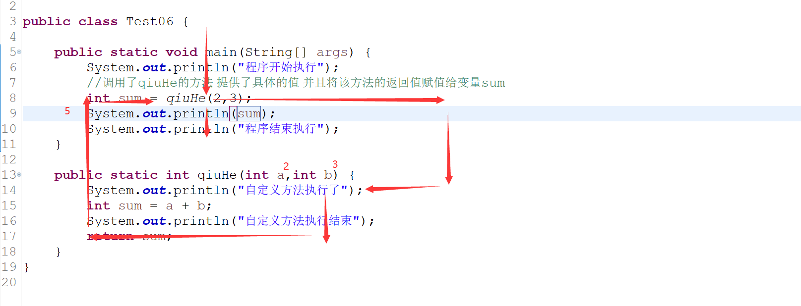
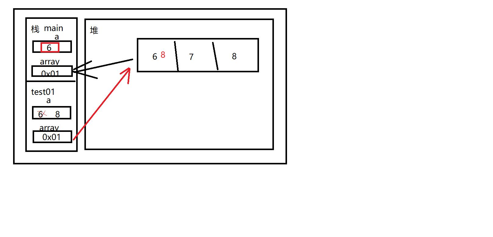

# 方法


## 一、简介

将所有的代码全部写在`main`方法中

+ 降低了代码的**可读性**
+ 有可能造成**冗余代码**过多
+ 变量的定义不够使用

对代码进行**分类和提取**

为了提高代码的复用性以及可读性，我们将main中的代码按照一定的需求**提取**出来

写在**自定义方法中**

+ 在Java类中，一个类中可以定义多个方法，但是JVM虚拟机只会运行`main`方法中的内容

## 二、方法的定义方式

+ 我们将方法想象成一个人**可以做的某件事情**


+ 自定义方法实际上就是在申明当前这个人**可以做什么事**
  + 做的是什么事情
    + **方法名**
  + 做这件事情需要调用者提供哪些信息
    + **参数列表**
  + 这件事情返回了什么类型的结果给调用者
    + **返回值类型**
  + 这件事情具体应该怎么做
    + **方法体（执行代码）**

```java
package net.wanhe.j2se.day05;

public class Test05 {
	
	//public static 返回值类型 方法名(参数列表){方法体}
	public static void main(String[] args) {
		
	}
	
	/*
	 * 定义一个方法可以求两个整数之和
	 * 返回值类型
	 *    指定当前方法运行结束后是否需要返回一个结果
	 *    如果是  则申明该返回结果的数据类型
	 *         如果一个方法申明了有返回值，那么在方法的执行过程中必须使用reutrn关键字返回一个具体的值
	 *         且返回的值必须和申明的返回值类型保持一致
	 *    如果否  则使用关键字void表示当前方法无返回值
	 * 方法名
	 * 	     申明当前方法是做什么事情
	 * 	     定义要求和变量名一致
	 * 参数列表
	 * 	     在定义方法时 申明该方法在执行过程中需要调用者提供的内容
	 *    定义参数列表时 我们只申明变量不提供的具体的值
	 *    具体的值应该由调用者来提供
	 *    多个参数之间以,隔开
	 * 方法体
	 * 	     根据当前方法的需求指定具体应该怎么做
	 */
	public static int qiuHe(int a,int b) {
		int sum = a + b;
		//返回的不是变量本身 返回的是变量中的值
		return sum;
	}
}
```

## 三、方法的调用

+ Java程序只会去运行`main`方法中的内容
+ 要想让自定义方法执行 需要在`main`方法中**调用自定义方法**

```java
package net.wanhe.j2se.day05;

public class Test06 {
	
	public static void main(String[] args) {
		System.out.println("程序开始执行");
		//调用了qiuHe的方法 提供了具体的值 并且将该方法的返回值赋值给变量sum
		int sum = qiuHe(2,3);
		System.out.println(sum);
		System.out.println("程序结束执行");
	}

	public static int qiuHe(int a,int b) {
		System.out.println("自定义方法执行了");
		int sum = a + b;
		System.out.println("自定义方法执行结束");
		return sum;
	}
}
```



## 四、自定义方法的注意事项

+ 方法中可以调用方法，不能定义方法，方法之间只有兄弟关系
+ **一个方法只完成一个功能，方便后期使用和扩展**
+ 如果一个方法申明了返回值类型，那么方法中一定要用`return`关键字返回具体的值
+ 定义一个方法
  + 明确这个方法**是干什么的，以此来确定方法名**
  + 明确**方法的执行过程中，需要用到什么未知的不确定的内容，以此来确定参数列表**
  + 明确**方法执行结束后，受否需要返回一个结果，以此来确定返回值类型**


## 五、综合练习

1、定义一个方法求指定整数的指定幂（a的b次方）

2、定义一个方法求指定的int类型数组中的所有的数据的和

3、定义一个方法将指定的int类型的数组中的所有数据按照指定的格式在控制台输出打印

`[1,2,3,4]`

4、定义一个方法判断指定的整数是否是水仙花数

5、定义一个方法找出指定的int类型的数组中存储的数据的最大值

6、定义一个方法对指定的int类型的数组中的数据按照从小到大的顺序进行排序

7、定义一个方法求指定整数的绝对值

```java
package net.wanhe.j2se.day05;

public class Test07 {
	
	public static void main(String[] args) {
		int result1 = qiuMi(2, 3);
		System.out.println(result1);
		int[] array = {1,6,3,4};
		int sum = sum(array);
		System.out.println(sum);
		print(array);
		boolean f = isShuiXianShua(153);
		System.out.println(f);
		int max = max(array);
		System.out.println(max);
		sort(array);
		print(array);
		int abs = abs(-3);
		System.out.println(abs);
	}
	
	/*
	 * 定义一个方法求指定整数的指定幂（a的b次方）
	 */
	public static int qiuMi(int a,int b) {
		int result = 1;
		for(int i = 0;i < b;i++) {
			result *= a;
		}
		return result;
	}

	/*
	 * 定义一个方法求指定的int类型数组中的所有的数据的和
	 */
	public static int sum(int[] array) {
		int result = 0;
		for(int i = 0;i < array.length;i++) {
			result += array[i];
		}
		return result;
		
	}
	
	/*
	 * 定义一个方法将指定的int类型的数组中的所有数据按照指定的格式在控制台输出打印
	 */
	public static void print(int[] array) {
		System.out.print("[");
		for(int i = 0;i < array.length;i++) {
			System.out.print(array[i]);
			if(i != array.length - 1) {
				System.out.print(",");
			}
		}
		System.out.println("]");
		
	}
	
	/*
	 * 定义一个方法判断指定的整数是否是水仙花数
	 */
	public static boolean isShuiXianShua(int a) {
		int gw = a % 10;
		int sw = a / 10 % 10;
		int bw = a / 100;
		if(qiuMi(gw,3) + qiuMi(sw,3) + qiuMi(bw,3) == a) {
			return true;
		}
		return false;
	}
	
	/*
	 * 定义一个方法找出指定的int类型的数组中存储的数据的最大值
	 */
	public static int max(int[] array) {
		sort(array);
		return array[array.length - 1];
	}

	/*
	 * 定义一个方法对指定的int类型的数组中的数据按照从小到大的顺序进行排序
	 */
	public static void sort(int[] array) {
		for(int i = 0;i < array.length - 1;i++) {
			for(int j = 0;j < array.length - i - 1;j++) {
				if(array[j] > array[j+1]) {
					int temp = array[j];
					array[j] = array[j+1];
					array[j+1] = temp;
				}
			}
		}
		
	}
	
	/*
	 * 定义一个方法求指定整数的绝对值
	 */
	public static int abs(int a) {
		return a > 0 ? a : 0 - a;
	}

}
```

## 六、参数列表

+ 在申明方法时，定义了参数列表，只申明了变量，没有具体的值，这样的参数 我们称之为**形式参数**，简称**形参**
+ 在调用方法时，参数列表中指定具体的值是什么，这样的参数 我们称之为**实际参数**，简称**实参**

```java
package net.wanhe.j2se.day05;

public class Test08 {
	
	public static void main(String[] args) {
		int a = 6;
		test01(a);
		System.out.println(a);//6 
		int[] array = {6,7,8};
		test02(array);
		System.out.println(array[0]);//6 8
	}
	
	public static void test01(int a) {
		a = 8;
	}
	
	public static void test02(int[] array) {
		array[0] = 8;
	}

}
```



## 七、return

+ return具有结束方法的作用
+ return关键字在一个方法中可以使用多次
+ 如果一个方法没有返回值类型，可以不使用return
+ return可以单独使用

## 八、方法的重载

+ 在一个类中，方法名是可以重复的，但是参数列表不能相同
+ 根据方法名 + 参数列表 才可以锁定唯一的方法
+ 方法的重载
  + 方法名相同
  + 参数列表不同
    + 个数不同
    + 参数类型不同

```java
package net.wanhe.j2se.day05;

public class Test09 {
	
	public static void main(String[] args) {
		test01(3,3.2);
	}
	
	public static void test01(double a,int b) {
		
	}
	
	public static void test01(int a,double b) {
		
	}

}
```

## 九、方法的递归

+ 在方法中调用自己本身
+ 使用递归一定要加上适当的条件

## 十、学生管理系统-方法版本

+ 控制程序运行的方法
+ 展示菜单获取用户输入的选项
+ 添加学生
+ 删除学生

```java
package net.wanhe.j2se.day06;

import java.util.Scanner;

public class Test01 {
	
	public static void main(String[] args) {
		run();
	}
	
	/*
	 * 控制程序运行流程
	 */
	public static void run() {
		String[] stus = new String[20];
		boolean flag = true;
		while(flag) {
			//展示系统菜单获取用户输入的选项
			int chooise = printMenu();
			switch(chooise) {
				case 1:
					//查看学生信息
					showStuDetail(stus);
					break;
				case 2:
					//添加学生
					addStu(stus);
					break;
				case 3:
					//删除学生
					delStu(stus);
					break;
				case 4:
					System.out.println("谢谢您的使用");
					flag = false;
					break;
				default:
					System.out.println("请选择正确的选项");
			}
		}
		
	}
	
	/*
	 * 展示系统菜单获取用户输入的选项
	 */
	public static int printMenu() {
		Scanner sc = new Scanner(System.in);
		System.out.println("----学生管理---");
		System.out.println("1.查看学生信息");
		System.out.println("2.添加学生");
		System.out.println("3.删除学生");
		System.out.println("4.退出系统");
		System.out.println("请选择:");
		int chooise = sc.nextInt();
		return chooise;
	}
	
	/*
	 * 展示所有学生的信息
	 */
	public static void showStuDetail(String[] stus) {
		for(int i = 0;i < stus.length;i++) {
			if(stus[i] != null) {
				System.out.println("学号:" + (i + 1) + "  姓名:" + stus[i]);
			}
		}
	}
	
	/*
	 * 添加学生
	 */
	public static void addStu(String[] stus) {
		Scanner sc = new Scanner(System.in);
		System.out.println("请输入学号:");
		int no = sc.nextInt();
		if(no < 1 || no > stus.length) {
			System.out.println("请输入正确的学号（1-）"+stus.length);
			return;
		}
		if(stus[no-1] != null) {
			System.out.println("该学号已被使用");
			return;
		}
		System.out.println("请输入学生姓名:");
		String name = sc.next();
		stus[no - 1] = name;
		System.out.println("添加成功");
	}
	
	/*
	 * 删除学生的方法
	 */
	public static void delStu(String[] stus) {
		Scanner sc = new Scanner(System.in);
		System.out.println("请输入学号:");
		int no = sc.nextInt();
		if(no < 1 || no > stus.length) {
			System.out.println("请输入正确的学号（1-）"+stus.length);
			return;
		}
		if(stus[no-1] == null) {
			System.out.println("该学号无人使用");
			return;
		}
		stus[no - 1] = null;
		System.out.println("删除成功");
	}
	
}
```

## 十一、酒店管理系统-方法版本

```java
package net.wanhe.j2se.day06;

import java.util.Scanner;

public class Test02 {
	
	public static void main(String[] args) {
		run();
	}
	
	/*
	 * 控制程序的运行流程
	 */
	public static void run() {
		String[][] rooms = new String[6][5];
		boolean flag = true;
		while(flag) {
			//展示菜单获取用户输入的值
			int chooise = printMenu();
			switch(chooise) {
				case 1:
					//查看房间信息
					showRoomDetail(rooms);
					break;
				case 2:
					//办理入住
					addUser(rooms);
					break;
				case 3:
					//办理退房
					delUser(rooms);
					break;
				case 4:
					System.out.println("谢谢使用");
					flag = false;
					break;
				default:
					System.out.println("请输入正确的选项");
			}
		}
	}

	/*
	 * 打印菜单获取用户输入的选项
	 */
	public static int printMenu() {
		Scanner sc = new Scanner(System.in);
		System.out.println("--酒店管理系统--");
		System.out.println("1.查看房间信息");
		System.out.println("2.办理入住");
		System.out.println("3.办理退房");
		System.out.println("4.退出系统");
		System.out.println("请选择:");
		int chooise = sc.nextInt();
		return chooise;
	}
	
	/*
	 * 展示房间信息
	 */
	public static void showRoomDetail(String[][] rooms) {
		for(int i = 0;i < rooms.length;i++) {
			for(int j = 0;j < rooms[i].length;j++) {
				System.out.print("0" + (i+1) + "0" + (j+1) + ":" 
						+ (rooms[i][j] == null ? "空" : rooms[i][j]) + "   ");
			}
			System.out.println();
		}
	}
	
	/*
	 * 办理入住
	 */
	public static void addUser(String[][] rooms) {
		Scanner sc = new Scanner(System.in);
		System.out.println("请输入房间号:");
		int roomNo = sc.nextInt();
		//根据房间号获取对应的下标
		int i = roomNo / 100 - 1;
		int j = roomNo % 100 - 1;
		//判断房间号是否合法
		if(i < 0 || i > 5 || j < 0 || j > 4) {
			System.out.println("请输入正确的房间号");
			return;
		}
		//判断房间是否有人入住
		if(rooms[i][j] != null) {
			System.out.println("该房间已有人入住");
			return;
		}
		//办理入住
		System.out.println("请输入入住人姓名:");
		String name = sc.next();
		rooms[i][j] = name;
		System.out.println("办理入住成功");
	}
	
	/*
	 * 办理退房
	 */
	public static void delUser(String[][] rooms) {
		Scanner sc = new Scanner(System.in);
		System.out.println("请输入房间号:");
		int roomNo = sc.nextInt();
		//根据房间号获取对应的下标
		int i = roomNo / 100 - 1;
		int j = roomNo % 100 - 1 ;
		//判断房间号是否合法
		if(i < 0 || i > 5 || j < 0 || j > 4) {
			System.out.println("请输入正确的房间号");
			return;
		}
		//判断房间是否有人入住
		if(rooms[i][j] == null) {
			System.out.println("该房间无人入住");
			return;
		}
		rooms[i][j] = null;
		System.out.println("办理退房成功");
	}

}
```

