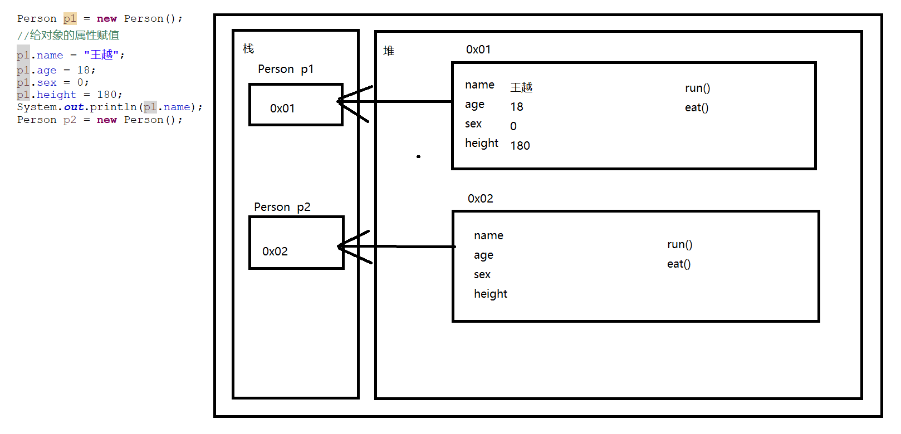
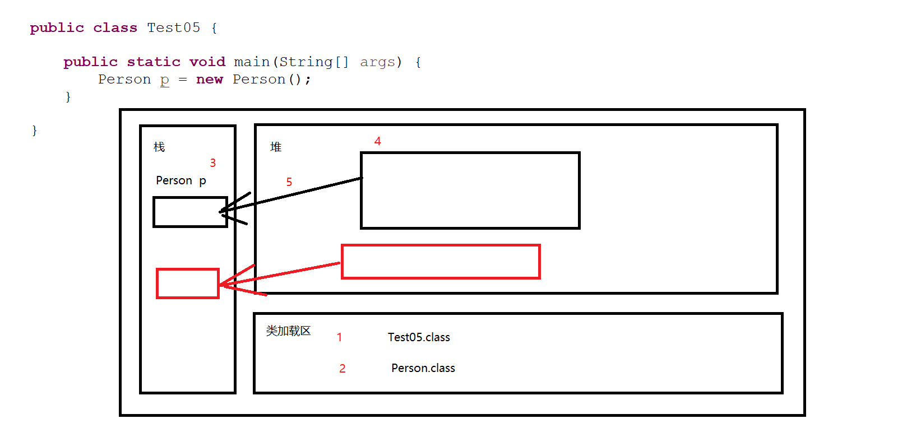
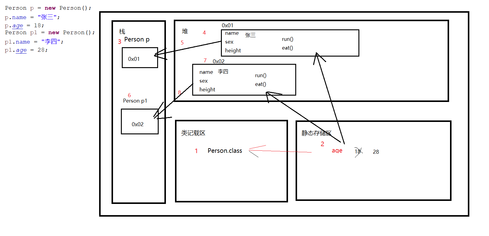

# 面向对象

## 一、简介

+ 不是一个具体的语法，而是一种**编程思想**
+ 面向过程和面向对象
  + 面向过程 整个程序的运行流程全部参与 都是由自己来完成和实现的
  + 面向对象
    + 当我们需要实现某一个功能时去找可以做这件事情的人
    + 如果找到了直接让这个人来做事
    + 如果没找到，自已创建一个人，教会他做这件事
      + 这个教的过程仍然是面向过程的
+ 面向对象的优势
  + **高内聚，低耦合**
  + 将不同的业务拆分开来，将相同的职能聚集在一起
  + 使用面向对象的变成思想进行开发不会简化代码，只会让代码变得更多更复杂
    + 方便**合作开发**
    + 将代码的结果变得更加松散，方便后期升级和维护
+ Java是一门面向对象的语言
+ **一切皆对象，现实生活中的一切事物都可以在Java中通过对象来表示**

## 二、类与对象

+ 类
  + 在Java中我们通过类来描述现实生活中一个事物的共同特征，是一种抽象的描述
+ 对象
  + 实际存在的**某类事物的一个个体**，是一个具体的东西
+ 对象是类的具体的实例

## 三、class类

+ 在Java中,class类并不是随便定义的
  + 类是JVM虚拟机运行的基本单位
  + 从面向对象的编程思想而言，自定义类是在**描述现实生活中的一类事物**
  + 从程序的角度而言，自定义类是在自定义**数据类型**

```java
package net.wanhe.j2se.day06;

/*
 * 创建了一个类用于描述现实生活中的人这一类事物
 */
public class Person {
	
	//我们通过在类中直接申明变量来描述当前这一类事物的 特征
	//这种特殊的变量我们称之为类的属性
	String name;
	
	int age;
	
	int sex;
	
	double height;
	
	//我们通过在类中定义方法来描述当前这一类事物的 行为
	public void run() {
		System.out.println("正在跑步");
	} 
	
	public void eat() {
		System.out.println("正在干饭");
	}
	

}

```

## 四、创建对象

+ 从面向对象的思想上 我们定义类用来描述一类事物
+ 从程序的角度而言 我们定义类就是**自定义数据类型**



```java
package net.wanhe.j2se.day06;

public class Test03 {
	
	public static void main(String[] args) {
		int a = 3;
		String b = "123";
		
		//1、申明了一个Person类型的变量
		//2、创建了一个Person对象
		//3、将该对象赋值给变量p1
		Person p1 = new Person();
		//给对象的属性赋值
		p1.name = "王越";
		p1.age = 18;
		p1.sex = 0;
		p1.height = 180;
		System.out.println(p1.name);
		Person p2 = new Person();
		System.out.println(p2.name);
		System.out.println(p2.age);
		
		//让p1这个人做run这件事
		p1.run();
		System.out.println(p1);
		System.out.println(p2);
	}

}
```

## 五、构造方法

+ 本质仍然是一个方法
+ 无法直接调用，只有在创建对象时，JVM虚拟机会去调用
+ 指定一个对象被创建时需要做的事情
+ **创建对象必须要执行构造方法**
+ 构造方法的定义要求
  + 没有static和返回值类型
  + 方法名必须和类名完全相同

```java
package net.wanhe.j2se.day06;

/*
 * 创建了一个类用于描述现实生活中的人这一类事物
 */
public class Person {
	
	//我们通过在类中直接申明变量来描述当前这一类事物的 特征
	//这种特殊的变量我们称之为类的属性
	String name;
	
	int age;
	
	int sex;
	
	double height;
	
	/*
	 * 构造方法
	 * 在一个类中 如果程序员没有指定任何构造方法
	 * 		那么JVM虚拟机在编译当前java文件时，会自动给当前类提供一个空的无参的构造方法
	 * 如果我们提供了构造方法 那么虚拟机将不会提供
	 * 每一个类至少会有一个构造方法
	 * 构造方法可以重载
	 * 构造方法无法后期调用，只能创建对象时执行一次
	 * 开发规范要求 每一个类至少要有一个无参构造
	 * 		如果我们自己提供了构造方法 那么一定要保证这个类中有一个无参构造
	 * 构造方法一般用于做一些初始化数据的操作
	 */
	public Person() {
		System.out.println("构造方法被执行了");
	}
	
	public Person(String name,int age,int sex,double height) {
		//将参数name的值赋值给当前正在被创建的空间的name属性
		this.name = name;
		this.age = age;
		this.sex = sex;
		this.height = height;
	}
	
	//我们通过在类中定义方法来描述当前这一类事物的 行为
	public void run() {
		System.out.println("正在跑步");
	} 
	
	public void eat() {
		System.out.println("正在干饭");
	}
	

}

```

## 六、this

+ **this关键字指当前正在执行的空间本身**
+ **当参数名和对象的属性名重名时，我们使用`this`来进行区分**
+ 提高代码的可读性

## 七、类加载和static

### 1、类加载

+ class类是Java中最基本的组成结构
+ 当JVM虚拟机运行代码时，需要将即将运行的类加载到**类加载区**中
+ 这个加载的过程我们称之为**类加载**
+ 类加载的过程**只执行一次**
+ 哪些情况下会导致类加载
  + 执行main方法时，main方法所在的类被加载
  + 第一次创建对象时，对象所属的类会被加载
  + 第一次通过类名调用静态属性和静态方法时，使用的类会被加载
  + `Class.forName("完整类名");`
    + 完整类名指定的类会被加载



### 2、static

+ 静态的
+ 修饰符
  + 可以修饰方法和属性
  + 被该关键字修饰的内容会被提升到**静态存储区**中
+ 类加载的时候，JVM虚拟机会将**被加载的类中所有被static修饰的内容**加载到**静态存储区**中



+ 被static修饰的属性的特点
  + 优先于对象存在
  + 被所有的对象共享
  + 可以直接通过类名调用
  + **静态属性**
  + 没有被static修饰的属性我们称之为**成员属性**
+ **静态方法和静态属性特点一致**
+ 静态属性和成员属性的区别
  + 存放的位置
    + 静态属性随着类加载记载到**静态存储区**中
    + 成员属性随着对象被创建记载到**堆**中
  + 生命周期
    + 成员属性随着对象的生命周期
    + 静态属性随着类的生命周期
+ 属性和方法的调用关系
  + 静态属性
  + 静态方法
  + 成员属性
  + 成员方法

```java
package net.wanhe.j2se.day06;

/*
 * 创建了一个类用于描述现实生活中的人这一类事物
 */
public class Person {
	
	//我们通过在类中直接申明变量来描述当前这一类事物的 特征
	//这种特殊的变量我们称之为类的属性
	String name;
	
	static int age;
	
	int sex;
	
	double height;
	
	/*
	 * 构造方法
	 * 在一个类中 如果程序员没有指定任何构造方法
	 * 		那么JVM虚拟机在编译当前java文件时，会自动给当前类提供一个空的无参的构造方法
	 * 如果我们提供了构造方法 那么虚拟机将不会提供
	 * 每一个类至少会有一个构造方法
	 * 构造方法可以重载
	 * 构造方法无法后期调用，只能创建对象时执行一次
	 * 开发规范要求 每一个类至少要有一个无参构造
	 * 		如果我们自己提供了构造方法 那么一定要保证这个类中有一个无参构造
	 * 构造方法一般用于做一些初始化数据的操作
	 */
	public Person() {
		System.out.println("构造方法被执行了");
	}
	
	public Person(String name,int age,int sex,double height) {
		//将参数name的值赋值给当前正在被创建的空间的name属性
		this.name = name;
		this.age = age;
		this.sex = sex;
		this.height = height;
	}
	
	//我们通过在类中定义方法来描述当前这一类事物的 行为
	public void run() {
		System.out.println(this.name + "正在跑步");
	} 
	
	public void eat() {
		System.out.println("正在干饭");
	}
	
	public void test01() {
		System.out.println(name);
		System.out.println(age);
		test01();
	}
	
	public static void test02() {
		System.out.println(name);
		System.out.println(age);
		test01();
	}
}
```

## 八、学生管理系统-面向对象版本

+ 定义一个类描述学生管理系统
  + StuSystem

```java
package net.wanhe.j2se.day06;

import java.util.Scanner;

/*
 * 描述学生管理系统
 */
public class StuSystem {
	
	//存储学生对象的数组 每一个格子中存储的都是一个具体的人（学生）
	static Student[] stus = new Student[20];
	
	Scanner sc = new Scanner(System.in);
	
	/*
	 * 控制程序运行流程
	 */
	public void run() {
		boolean flag = true;
		while(flag) {
			//展示系统菜单获取用户输入的选项
			int chooise = printMenu();
			switch(chooise) {
				case 1:
					//查看学生信息
					showStuDetail();
					break;
				case 2:
					//添加学生
					addStu();
					break;
				case 3:
					//删除学生
					delStu();
					break;
				case 4:
					System.out.println("谢谢您的使用");
					flag = false;
					break;
				default:
					System.out.println("请选择正确的选项");
			}
		}
		
	}
	
	/*
	 * 展示系统菜单获取用户输入的选项
	 */
	public int printMenu() {
		System.out.println("----学生管理---");
		System.out.println("1.查看学生信息");
		System.out.println("2.添加学生");
		System.out.println("3.删除学生");
		System.out.println("4.退出系统");
		System.out.println("请选择:");
		int chooise = sc.nextInt();
		return chooise;
	}
	
	/*
	 * 展示所有学生的信息
	 */
	public void showStuDetail() {
		for(int i = 0;i < stus.length;i++) {
			if(stus[i] != null) {
				//stus[i] 存储的是一个学生对象 在堆中的地址
				System.out.println("学号:" + (i + 1) 
						+ "  姓名:" + stus[i].name
						+ "  年龄:" + stus[i].age
						+ "  电话:" + stus[i].phone
						+ "  地址:" + stus[i].address);
			}
		}
	}
	
	/*
	 * 添加学生
	 */
	public void addStu() {
		System.out.println("请输入学号:");
		int no = sc.nextInt();
		if(no < 1 || no > stus.length) {
			System.out.println("请输入正确的学号（1-）"+stus.length);
			return;
		}
		if(stus[no-1] != null) {
			System.out.println("该学号已被使用");
			return;
		}
		//获取学生信息
		System.out.println("请输入学生姓名:");
		String name = sc.next();
		System.out.println("请输入学生年龄:");
		int age = sc.nextInt();
		System.out.println("请输入学生电话:");
		String phone = sc.next();
		System.out.println("请输入学生地址:");
		String address = sc.next();
		//将学生信息存储到数组中
		Student s = new Student(name,age,phone,address);
		stus[no - 1] = s;
		System.out.println("添加成功");
	}
	
	/*
	 * 删除学生的方法
	 */
	public void delStu() {
		System.out.println("请输入学号:");
		int no = sc.nextInt();
		if(no < 1 || no > stus.length) {
			System.out.println("请输入正确的学号（1-）"+stus.length);
			return;
		}
		if(stus[no-1] == null) {
			System.out.println("该学号无人使用");
			return;
		}
		stus[no - 1] = null;
		System.out.println("删除成功");
	}
	
}
```

+ 定义一个类描述学生
  + Student

```java
package net.wanhe.j2se.day06;

/*
 * 用于描述学生
 */
public class Student {
	
	String name;
	
	int age;
	
	String phone;
	
	String address;
	
	public Student() {
		
	}

	//shift + alt + s
	public Student(String name, int age, String phone, String address) {
		super();
		this.name = name;
		this.age = age;
		this.phone = phone;
		this.address = address;
	}
}
```

+ 定义一个类测试运行学生系统
  + Test

```java
package net.wanhe.j2se.day06;

public class Test {
	
	public static void main(String[] args) {
		//创建一个学生管理系统对象
		StuSystem system = new StuSystem();
		//让该对象去执行
		system.run();
	}

}
```

## 九、代码块

+ `{}`
  + 创建对象时执行
  + 优先于构造方法执行
  + 一般用于做一些统一的（任何对象都拥有的东西）初始化操作
  + 构造方法可以重载，有很多个，但是**代码块只有一个**
  + 不论执行什么构造方法，代码块的内容必定会执行
+ `static{}`
  + 只执行一次
  + **类加载的时候执行**
  + 程序一启动就要执行的代码 放在静态代码块

## 十、创建对象的完整过程

+ 类加载
  + 加载静态属性和静态方法
  + 执行静态代码块中的内容
+ 创建对象
  + 在堆中开辟空间
  + 加载成员属性和成员方法
  + 执行代码块中的内容
  + 执行构造方法
  + 生成地址