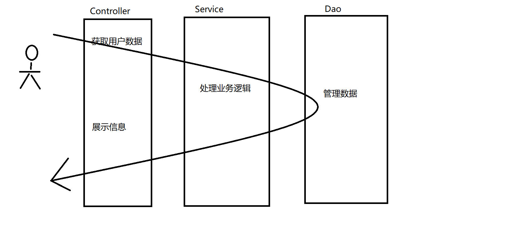
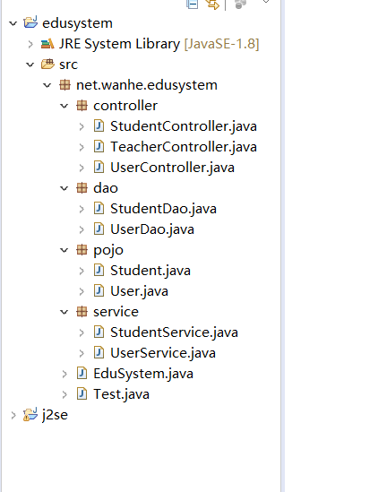

# 三层架构


## 一、简介

+ 三层架构不是知识点，而是一种思想
+ 我们开发需要使用面向对象的思想进行开发
+ 我们搭建项目也应该使用面向对象的思想去搭建
+ 我们发现在一个项目中，每一个功能都可以分成3个部分
  + 获取用户数据
  + 处理业务逻辑
  + 存储数据
+ 所以我们采用面向对象的思想搭建项目 将项目中的每一个功能都分成3部去共同完成
+ 这种项目搭建方式我们称之为**三层架构**

## 二、三层架构

+ Controller/Action
  + 获取用户数据
  + 将处理结果展示给用户
+ Service
  + **处理业务逻辑**
+ Dao(Data Access Object)
  + 数据访问对象
  + 以对象的形式操作存储数据
  + **管理数据**



## 三、搭建项目

+ 创建一个新的项目

+ 建包

+ Controller

  ```java
  package net.wanhe.edusystem;

  import java.util.Scanner;

  /**
   * 描述当前项目中负责获取用户数据的模块
   */
  public class Controller {
  	
  	Scanner sc = new Scanner(System.in);
  	
  	Service service = new Service();
  	
  	/*
  	 * 添加学生(获取用户信息)
  	 */
  	public void addStu() {
  		//获取用户信息
  		System.out.println("请输入学号:");
  		int no = sc.nextInt();
  		System.out.println("请输入姓名:");
  		String name = sc.next();
  		System.out.println("请输入年龄:");
  		int age = sc.nextInt();
  		System.out.println("请输入电话:");
  		String phone = sc.next();
  		System.out.println("请输入地址:");
  		String address = sc.next();
  		//将获取到的信息交给service
  		Student stu = new Student(no,name,age,phone,address);
  		service.addStu(stu);
  	}
  	
  	/*
  	 * 展示系统菜单获取用户输入的选项
  	 */
  	public int printMenu() {
  		System.out.println("----学生管理---");
  		System.out.println("1.查看学生信息");
  		System.out.println("2.添加学生");
  		System.out.println("3.删除学生");
  		System.out.println("4.退出系统");
  		System.out.println("请选择:");
  		int chooise = sc.nextInt();
  		return chooise;
  	}

  	/*
  	 * 删除学生
  	 */
  	public void delStu() {
  		System.out.println("请输入学号:");
  		int no = sc.nextInt();
  		service.delStu(no);
  		
  	}

  	/*
  	 * 展示所有的学生信息
  	 */
  	public void showStuDetail() {
  		Student[] stus = service.findAllStus();
  		for(int i = 0;i < stus.length;i++) {
  			if(stus[i] != null) {
  				//stus[i] 存储的是一个学生对象 在堆中的地址
  				System.out.println("学号:" + (i + 1) 
  						+ "  姓名:" + stus[i].name
  						+ "  年龄:" + stus[i].age
  						+ "  电话:" + stus[i].phone
  						+ "  地址:" + stus[i].address);
  			}
  		}
  	}

  }
  ```

+ Service

  ```java
  package net.wanhe.edusystem;

  /**
   * 描述当前项目中负责处理业务逻辑的模块
   */
  public class Service {
  	
  	Dao dao = new Dao();
  	
  	/*
  	 * 添加学生(处理业务逻辑)
  	 */
  	public void addStu(Student stu) {
  		//获取容器的容量
  		int size = dao.size();
  		if(stu.no < 1 || stu.no > size) {
  			System.out.println("请输入正确的学号（1-）"+size);
  			return;
  		}
  		//根据学号获取学生的信息
  		Student s = dao.findByNo(stu.no);
  		if(s != null) {
  			System.out.println("该学号已被使用");
  			return;
  		}
  		//添加学生
  		dao.insert(stu);
  		System.out.println("添加成功");
  	}

  	/*
  	 * 删除学生
  	 */
  	public void delStu(int no) {
  		//获取容器的容量
  		int size = dao.size();
  		if(no < 1 || no > size) {
  			System.out.println("请输入正确的学号（1-）"+size);
  			return;
  		}
  		//根据学号获取学生的信息
  		Student s = dao.findByNo(no);
  		if(s == null) {
  			System.out.println("该学号未使用");
  			return;
  		}
  		//删除学生
  		dao.delete(no);
  		System.out.println("删除成功");
  	}

  	/*
  	 * 获取所有的学生信息
  	 */
  	public Student[] findAllStus() {
  		Student[] stus = dao.findAllStus();
  		return stus;
  	}

  }
  ```

+ Dao

  ```java
  package net.wanhe.edusystem;

  /**
   * 描述当前项目中负责管理数据的模块
   */
  public class Dao {
  	
  	//用于存储项目数据的容器
  	static Student[] stus = new Student[20];
  	
  	/*
  	 * 获取容器的长度
  	 */
  	public int size() {
  		return stus.length;
  	}
  	
  	/*
  	 * 根据学号获取学生信息
  	 */
  	public Student findByNo(int no) {
  		return stus[no - 1];
  	}
  	
  	/*
  	 * 添加学生
  	 */
  	public void insert(Student stu) {
  		stus[stu.no - 1] = stu;
  	}

  	/*
  	 * 删除学生
  	 */
  	public void delete(int no) {
  		stus[no - 1] = null;
  	}

  	/*
  	 * 查询所有学生信息
  	 */
  	public Student[] findAllStus() {
  		return stus;
  	}

  }
  ```

+ EduSystem

  ```java
  package net.wanhe.edusystem;

  public class EduSystem {
  	
  	Controller controller = new Controller();
  	
  	/*
  	 * 程序的运行
  	 */
  	public void run() {
  		boolean flag = true;
  		while(flag) {
  			//展示系统菜单获取用户输入的选项
  			int chooise = controller.printMenu();
  			switch(chooise) {
  				case 1:
  					//查看学生信息
  					controller.showStuDetail();
  					break;
  				case 2:
  					//添加学生
  					controller.addStu();
  					break;
  				case 3:
  					//删除学生
  					controller.delStu();
  					break;
  				case 4:
  					System.out.println("谢谢您的使用");
  					flag = false;
  					break;
  				default:
  					System.out.println("请选择正确的选项");
  			}
  		}
  	}

  }

  ```

## 四、教育管理系统-三层版本

+ 程序一启动，展示如下菜单

  > ----用户页面---
  >
  > 1、注册
  >
  > 2、登录
  >
  > 请选择:

  + 注册无论成功还是失败都要继续展示当前菜单
  + 登录失败仍然展示当前菜单
  + 登录成功展示**教育管理系统菜单**（结束当前循环）
  + 注册
    + 请输入账号
    + 请输入密码
    + 请确认密码
    + 两次密码是否一致
    + 账号是否已注册
  + 登录
    + 请输入账号
    + 请输入密码
    + 账号是否存在
    + 密码是否正确

  > User
  >
  > ​      loginName
  >
  > ​      password
  >
  > User[] users = new User[];

+ 教育管理系统菜单

  > ----教育管理系统---
  >
  > 1、学生管理
  >
  > 2、教师管理
  >
  > 3、退出系统
  >
  > 请选择:

  + 1、展示学生管理菜单

    > ----学生管理----
    >
    > 1、查看学生信息
    >
    > 2、添加学生
    >
    > 3、删除学生
    >
    > 4、返回上一级

  + 2、展示教师管理菜单

    > ----学生管理----
    >
    > 1、查看学生信息
    >
    > 2、添加学生
    >
    > 3、删除学生
    >
    > 4、返回上一级
    >
    > Teacher
    >
    > ​	name
    >
    > ​        phone
    >
    > ​        address




