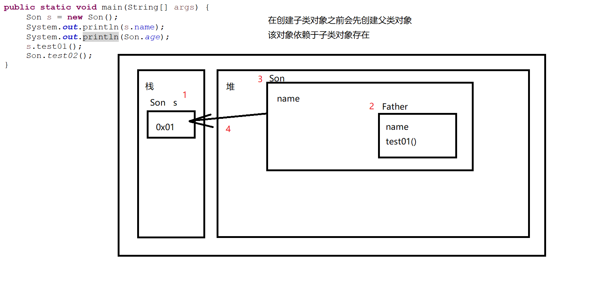
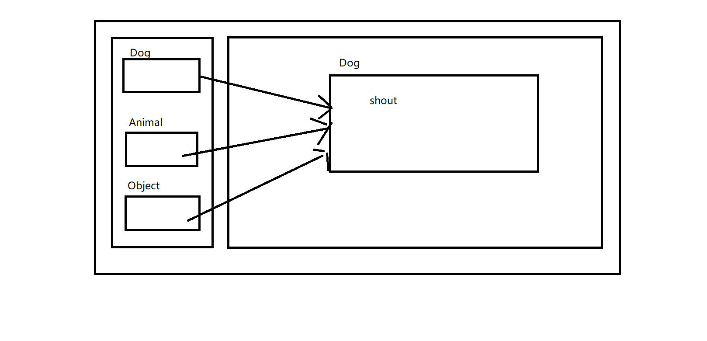

# 面向对象的三大特征


## 一、简介

+ Java就是一门描述生活的语言
+ 通过代码来代替现实生活中的一切行为
+ 在Java中，面向对象有三大特征
  + 封装
  + 继承
  + 多态

## 二、封装

+ 包装、打包
+ 将一个事物的内部信息**隐藏起来，不允许外部直接访问**
+ 对外提供**访问方式，提供我们想要让别人看到的信息**

### 1、访问权限符

+ 在Java中一共提供了4种访问权限
+ `public`
  + 公共的
  + 在一个Java项目中的任意位置都可以访问
+ `private`
  + 私有的
  + 只能在当前类中访问

|          | public | protected | 默认的  | private |
| -------- | ------ | --------- | ---- | ------- |
| 当前类      | √      | √         | √    | √       |
| 同一个包不同类中 | √      | √         | √    |         |
| 不同包子类    | √      | √         |      |         |
| 不同包中     | √      |           |      |         |

### 2、封装的开发规范

+ 为了让Java类更加贴近现实生活
+ Java开发规范要求，**实体类中**所有的属性都要做**封装处理**
+ 封装处理
  + 所有的实体类属性必须私有化
  + 所有的属性一般情况下，都要对外提供访问和设置（get/set）方式
  + get/set方法要求
    + 必须是get/set + 属性名首字母大写
    + 如果属性是boolean类型 那么不使用get而是使用is
  + **其它类酌情处理**

```java
package net.wanhe.j2se.day09;

//- 所有的实体类属性必须私有化
//- 所有的属性一般情况下，都要对外提供访问和设置（get/set）方式
//- get/set方法要求
//  - 必须是get/set + 属性名首字母大写
//  - 如果属性是boolean类型 那么不使用get而是使用is

public class Person {
	
	private String name;
	
	private int age;
	
	private int height;
	
	private int weight;
	
	private boolean man;
	
	public boolean isMan() {
		return man;
	}
	
	public void setMan(boolean man) {
		this.man = man;
	}
	
	public String getName() {
		return name;
	}
	
	public void setName(String name) {
		this.name = name;
	}
	
	public int getAge() {
		return age;
	}
	
	public void setAge(int age) {
		this.age = age;
	}
	
	public int getHeight() {
		return height;
	}
	
	public void setHeight(int height) {
		this.height = height;
	}
	
	public int getWeight() {
		return weight;
	}
	
	public void setWeight(int weight) {
		this.weight = weight;
	}
}
```

### 3、单例模式

+ Java中一共提出了23种**设计模式**
+ 设计模式
  + 不是什么新的知识点
  + 通过某些方案对代码进行应用，达到某些特殊的需求
  + 模板
    + 在今后的开发中 当我们需要实现某些特殊的功能时
    + 基本上都可以参照23种设计模式去运用
+ **单例模式**是Java23种设计模式之一
  + 在**整个程序的运行期间**，某一类型的对象**有且只有一个**
  + Person、Student....
  + 无论通过什么方式去获取当前类型的对象 取到的对象永远是同一个
+ 单例模式的思路
  + 构造方法私有化
  + 提供获取对象的方式

```java
package net.wanhe.j2se.day09;

//- 所有的实体类属性必须私有化
//- 所有的属性一般情况下，都要对外提供访问和设置（get/set）方式
//- get/set方法要求
//  - 必须是get/set + 属性名首字母大写
//  - 如果属性是boolean类型 那么不使用get而是使用is

public class Person {
	
	private String name;
	
	private int age;
	
	private int height;
	
	private int weight;
	
	private boolean man;
	
	//饿汉式
//	private static Person p = new Person();
	
	//懒汉式
	private static Person p;
	
	/*
	 * 构造方法私有化
	 */
	private Person() {
	}
	
	/*
	 * 提供了获取对象的方式
	 */
	public static Person getPerson() {
		if(p == null) {
			p = new Person();
		}
		return p;
	}

	public String getName() {
		return name;
	}

	public void setName(String name) {
		this.name = name;
	}

	public int getAge() {
		return age;
	}

	public void setAge(int age) {
		this.age = age;
	}

	public int getHeight() {
		return height;
	}

	public void setHeight(int height) {
		this.height = height;
	}

	public int getWeight() {
		return weight;
	}

	public void setWeight(int weight) {
		this.weight = weight;
	}

	public boolean isMan() {
		return man;
	}

	public void setMan(boolean man) {
		this.man = man;
	}
}
```

## 三、继承

### 1、继承的定义

**在Java中，我们通过`extends`让一个类继承一个已有的类**

+ 使用`extends`的类被我们称之为**子类**，被继承的类被我们称之为**父类**
+ 子类继承父类，可以得到父类中所有的属性和方法（构造方法除外）
+ 同时子类也可以添加属于自己的属性和方法
+ 在Java中只有**单继承**关系
  + 一个类只可以有一个**直接父类**
  + 一个父类可以有多个子类
+ **所有的类默认继承了`Object`**
  + 在JDK中，内置提供了一个类`Object`
  + 所有的类**默认**都继承了该类

```java
package net.wanhe.j2se.day10;

/*
 * 定义了一个Son类继承了Father
 */
public class Son extends Father {
	

}

```

### 2、创建子类对象的过程



### 3、super

+ `this`指当前正在执行的空间本身
+ `super`指当前空间的父类空间,父类对象
+ 该关键字只能在子类对象中使用
+ 用于区分子类对象和父类对象
+ `super()`

```java
	public Son() {
//		super(); 调用父类的无参构造
//		该代码必须放在子类构造方法的第一行执行
//		该代码可以不写 哪怕不写 JVM虚拟机在编译时也会自动提供一个调用父类无参构造的方法
		System.out.println("执行了子类的构造方法");
	}
```

### 4、方法的重写

+ `Override`
+ 子类对父类的方法进行覆盖（重写）
+ 重写的要求
  + 必须要有**继承**关系
  + 返回值类型相同
  + 方法名相同
  + 参数列表相同
  + 子类重写的方法的**开放程度（访问权限）**不能比父类小
  + 子类重写的方法**抛出的异常**不能比父类大

```java
	@Override//标注该方法是一个重写方法
	public void test01() {
		
	}
```

## 四、多态

### 1、多态的使用方式

+ 一个事物可以有多种表现形态
  + 必须要有**继承关系**
  + 子类对象可以以父类的形式进行表示

```java
package net.wanhe.j2se.day10;

public class Test02 {
	
	public static void main(String[] args) {
		//创建了一个Dog类型的对象存放到一个Dog类型的变量中
		Dog dog = new Dog();
		//创建一个Dog类型的对象存放到一个Animal类型的变量中
		Animal a1 = new Dog();
		//同一个空间可以有多种表现形式（变量可以申明多种类型）
		Object o = new Dog();
		//做事的对象本身不变  变的是变量的申明方式
		dog.shout();//汪汪汪
		a1.shout();//汪汪汪
		
		Animal a2 = new Animal();
		a2.shout();//叫
		
		Animal a3 = new Dog();
		Animal a4 = new Cat();
		shout(a4);
//		申明父类类型的变量指向子类对象
//		只能调用父类中申明的方法和属性 无法调用子类对象独有的方法
//		o.shout();
		
	}
	
	/*
	 * 多态的应用
	 * 打印动物的叫声
	 * 方法的多态
	 * 		同一个方法 根据传入的参数 运行结果在发生改变
	 * 		继承关系
	 * 		方法的重写
	 */
	public static void shout(Animal a) {
		a.shout();
	}

}
```



### 2、引用类型之间的转换

+ **空间本身不变，变得是变量的数据类型**

```java
package net.wanhe.j2se.day10;

public class Test03 {
	
	public static void main(String[] args) {
		Dog d = new Dog();
		//将子类类型的变量自动转换成父类类型的变量
      		//向上转型
		Animal a = d;
		//将父类类型的变量强制转换成子类类型的变量
		//存在风险  类型转换异常
      		//向下转型
		d = (Dog)a;
		
//		Animal a1 = new Cat();
//		d = (Dog)a1;
	}
}
```

### 3、instanceof

```java
package net.wanhe.j2se.day10;

public class Test04 {
	
	public static void main(String[] args) {
		Animal a = new Dog();
		//是否为
		//判断指定的变量指向的空间是否为指定的类型
		System.out.println(a instanceof Cat);
		if(a instanceof Dog) {
			Dog d = (Dog)a;
		}
	}

}

```

## 五、抽象

### 1、abstract

+ 在实际开发中，我们可能只希望定义方法但是不给出具体的实现

```java
package net.wanhe.j2se.day10;

/**
 * 如果一个类中定义了抽象方法
 * 那么这个类必须是抽象类
 * @author fft
 *
 */
public abstract class Test05 {
	
	/*
	 * 当我们定义一个方法时，不确定具体的实现是什么
	 * 或者我们希望别人给出具体的实现
	 * 此时我们可以将该方法定义为 抽象方法
	 * abstract 抽象 修饰符
	 * 被该关键字修饰的方法 被称为 抽象方法
	 * 抽象方法
	 * 		只申明了方法 没有具体的实现
	 */
	public abstract void test01();
	
	public abstract int test02();
	
	public abstract void test03(int a,int b);

}

```

### 2、抽象的特征

+ 抽象类无法被创建对象
+ 抽象方法没有具体的实现 无法被调用

### 3、抽象类的作用

+ **希望被继承，对于父类没有被实现的方法进行重写**
+ 便于版本的迭代
+ 如果一个类继承了抽象类，但是没有对父类中所有的抽象方法进行重写，那么这个类仍然是一个抽象类
+ 抽象类中可以有普通方法，也可以有抽象方法
+ 抽象类中不一定有抽象方法
+ 抽象方法一定在抽象类中

## 六、接口

### 1、interface

```java
package net.wanhe.j2se.day10;

/*
 * 当一个类中所有的方法都是抽象方法时
 * 此时我们可以将这个类定义为 接口
 */
public interface Test08 {
	
	void test01();
	
	int test02();
	
	void test03(int a,int b);

}

```

### 2、接口的特点

+ **接口中只能定义抽象方法和常量**
+ 无法被创建对象
+ **希望被实现**
+ 抽象类是单继承，接口是多实现
  + 一个类只能继承一个抽象类，但是可以实现多个接口

### 3、implements

+ `实现`
+ 让一个类实现一个接口
+ 多个接口用`,`隔开

```java
package net.wanhe.j2se.day10;

public class Test09 implements Test08 {

	@Override
	public void test01() {
		// TODO Auto-generated method stub
		
	}

	@Override
	public int test02() {
		// TODO Auto-generated method stub
		return 0;
	}

	@Override
	public void test03(int a, int b) {
		// TODO Auto-generated method stub
		
	}

}

```

## 七、final

+ `最终的`
+ 修饰符
+ 类
  + 不能被继承
+ 方法
  + 不能被重写
+ 属性
  + 在定义时就需要指定值
  + 一旦定义完成 该属性的值就不能被**修改**了
  + 如果一个属性同时被`static`和`final`修饰，我们称之为**常量**