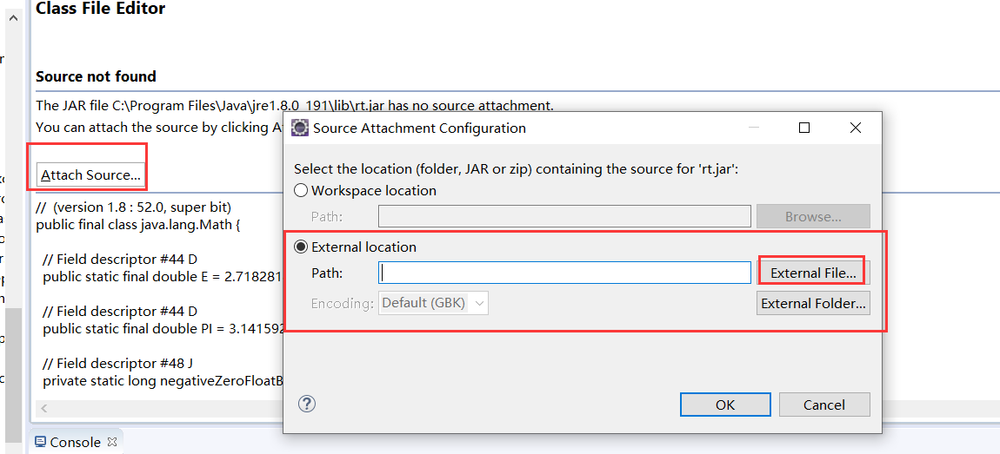
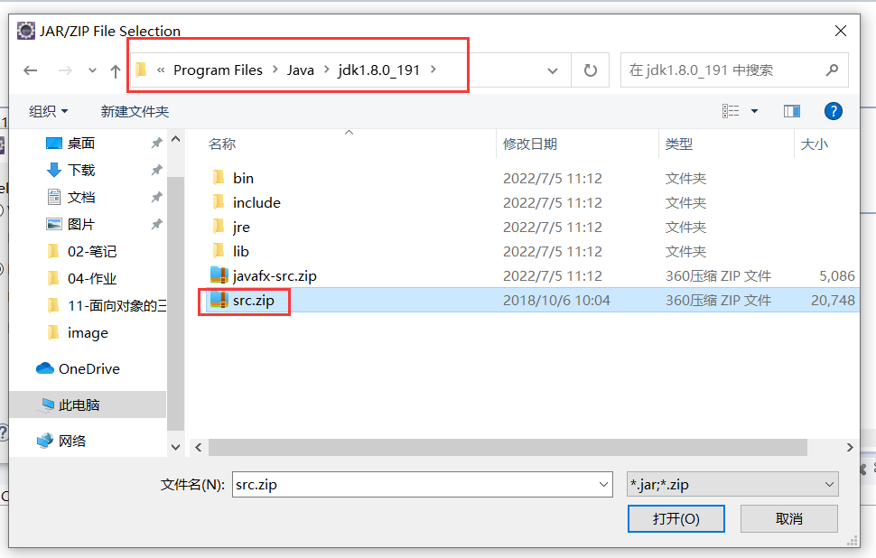
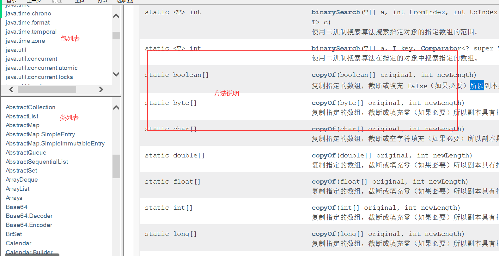
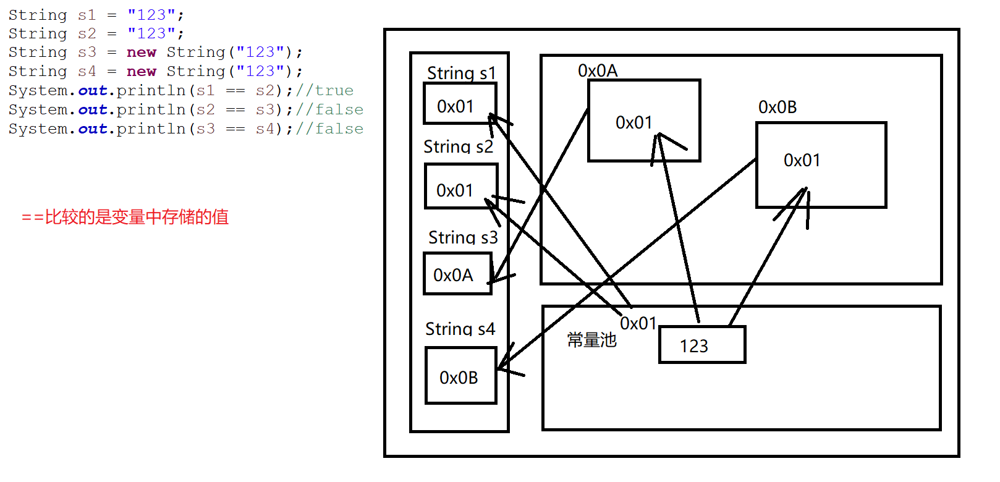
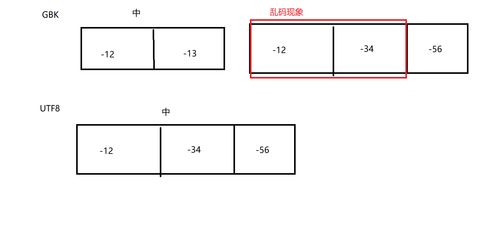

# 常用类


## 一、简介

+ JDK提供了很多类帮助我们完成一些需求


+ 有哪些类
+ 可以做什么
+ 怎么用这些类

## 二、Scanner

+ `java.util.Scanner`

```java
package net.wanhe.j2se.day11;

public class Test01 {
	
	public static void main(String[] args) {
		//该类提供了一个给用户在控制台输入的工具
		//存放在java.util包中  java.util.Scanner
		//该类是JDK提供的
		//在同一个项目中，类名是可以重复的，但是在同一个包中类名不能重复
		//所以说包名.类名（完整类名）是不会重复的
		//使用一个类时我们需要通过导包来申明这个类在类一个包中
		//两种情况不需要导包
		//   -当前包中的类
		//   -java.lang包中的类不需要导包
		//该类没有提供无参构造
		java.util.Scanner sc = new java.util.Scanner(System.in);
		sc.next();
		sc.nextInt();
		sc.nextDouble();
		Scanner sc1 = new Scanner();
	}

}

```

## 三、Random

+ `java.util.Random`

```java
package net.wanhe.j2se.day11;

import java.util.Random;

public class Test02 {
	
	public static void main(String[] args) {
		//创建一个用于随机生成数据的对象
		Random r = new Random();
		//随机生成一个boolean类型的值
		boolean b = r.nextBoolean();
		System.out.println(b);
		//在int类型的表数范围以内随机生成一个整数
		int num = r.nextInt();
		System.out.println(num);
		//在0到指定的整数之间随机生成一个整数[0,x)
		int num1 = r.nextInt(5);
		System.out.println(num1);
	}

}

```

+ 自己完成一个随机点名的小程序

```java
package net.wanhe.j2se.day11;

import java.util.Random;

public class Test03 {
	
	public static void main(String[] args) {
		String[] names = {"张三","李四","王五"};
		Random r = new Random();
		int index = r.nextInt(names.length);
		System.out.println(names[index]);
	}

}

```

## 四、Math

+ `java.lang.Math`
+ 构造方法被私有化了，无法创建对象
+ 该类中提供了大量的静态方法进行一些数学计算的





```java
package net.wanhe.j2se.day11;

public class Test04 {
	
	public static void main(String[] args) {
		//找两数之间的最小值
		int min = Math.min(3,4);
		//找两数之间的最大值
		int max = Math.max(4, 5);
		//求a的b次方
		double pow = Math.pow(2, 2);
		System.out.println(pow);
		//开平方
		double sqrt = Math.sqrt(9);
		System.out.println(sqrt);
		//开立方
		double cbrt = Math.cbrt(27);
		System.out.println(cbrt);
		//求绝对值
		int abs = Math.abs(5);
		System.out.println(abs);
	}

}

```

## 五、Arrays

+ `java.util.Arrays`
+ 提供了大量的静态方法，用于操作数组

```java
package net.wanhe.j2se.day11;

import java.util.Arrays;

public class Test05 {
	
	public static void main(String[] args) {
		int[] array = {1,56,2134,23,354};
		//将一个指定的数组中的数据以字符串的形式展示
		String string = Arrays.toString(array);
		System.out.println(string);
		
		//对指定的数组中的数据进行从小到大排序
		Arrays.sort(array);
		System.out.println(Arrays.toString(array));
		
		//1.创建一个指定长度（第二个参数）的新数组
		//2.将指定数组中的内容依次拷贝到新数组中
		//(如果新数组比旧数组长，拷贝结束后，剩余的格子用默认值填充)
		//(如果新数组比旧数组短，拷贝到哪就到哪)
		int[] newArray = Arrays.copyOf(array, 2);
		System.out.println(Arrays.toString(newArray));
		
		//比较两个指定的数组是否完全相同
		//(长度一样，对应下标中的值一一相同)
		boolean equals = Arrays.equals(array, newArray);
		System.out.println(equals);
		
		
	}

}

```

## 六、API文档

+ 怎么创建对象
+ 有哪些方法
+ 怎么用



## 七、String

### 1、常用方法

```java
package net.wanhe.j2se.day11;

import java.util.Arrays;

public class Test06 {
	
	public static void main(String[] args) {
		String str = "dA  abcdaASDA   SDsdasd";
		System.out.println(str);
		//根据指定的下标搜索字符串中对应位置的字符
		char charAt = str.charAt(2);
		System.out.println(charAt);
		
		//1.创建一个新的字符串对象将该字符串对象拼接到已有的str对象的末尾
		String s = "123";
		String s1 = str + s;
		String s2 = str.concat(s);
		System.out.println(s1);
		System.out.println(s2);
		//2.将str中的所有小写字母全部变为大写字母
		String upperCase = str.toUpperCase();
		System.out.println(upperCase);
		//3.将str中的所有大写字母全部变为小写字母
		String lowerCase = str.toLowerCase();
		System.out.println(lowerCase);
		//4.判断字符串对象str中的内容是否是以abc开头
		boolean startsWith = str.startsWith("abc");
		System.out.println(startsWith);
		//5.判断字符串对象str中的内容是否是以abc结尾
		boolean endsWith = str.endsWith("abc");
		System.out.println(endsWith);
		//6.判断字符串对象str中的内容是否包含abc
		boolean contains = str.contains("abc");
		System.out.println(contains);
		//7.将字符串对象str中的内容中的字符a全部替换成1
		String replace = str.replace("a", "1");
		System.out.println(replace);
		//8.将去除字符串str中的首位空格(只能去除首尾空格 中间的空格无法去除)
		String trim = str.trim();
		System.out.println(trim);
		//str.replace(" ", "");
		//9.将字符串str中的内容按照字母d进行分割
		//asdfgdh --->  ["as","fg","h"]
		//abcdasda  --> a ---> 4 3
		String[] split = str.split("d");
		System.out.println(Arrays.toString(split));
		System.out.println("abcdasda".split("a").length);
		//10.获取字符串str的长度
		int length = str.length();
		System.out.println(length);
		//11.找到指定字符在字符串中第一次出现的位置(区分大小写的)
		int indexOf = str.indexOf("a");
		System.out.println(indexOf);
		//12.找到指定字符在字符串中最后一次出现的位置
		int lastIndexOf = str.lastIndexOf("a");
		System.out.println(lastIndexOf);
		//13.从指定的位置开始截取字符串，截取到末尾
		//abcdefg   ---> 2  --> cdefg
		String substring = str.substring(3);
		System.out.println(substring);
		//14.从指定的位置开始截取字符串，截取到指定的位置结束(左闭右开)
		String substring1 = str.substring(3,5);
		System.out.println(substring1);
		//15.判断字符串对象str是否是空字符串 ""
		boolean empty = str.isEmpty();
		System.out.println(empty);
		//16.将字符串对象str转换成字符数组
		char[] charArray = str.toCharArray();
		System.out.println(Arrays.toString(charArray));
		
	}
}
```

### 2、常量池

+ 常量池和JAVA中的**常量**没有任何关系
+ JDK对String对象进行了优化，在创建对象时，不需要使用new关键字
+ **在Java中，所有被`""`定义的内容都被存放在常量池中**
+ **控制台输出打印变量中的值 展示的是开发者想要让你看到的值 并不代表这就是变量中真正存储的值**



### 3、字符集

+ 计算机本身并不是别文字，计算机只认识十进制的数字
+ 此时，计算机制定了一张表格，指定了数字和文字的**展示关系**
+ 这样的一张表格我们称之为字符集
+ UTF8
  + Linux操作系统的默认字符集
+ GBK
  + Windows操作系统的默认字符集
+ 这两个字符集对中文的解析方式不一致
+ 解决乱码的方案
  + 在整个项目的运行环境中保证字符集统一
  + 一般建议使用utf8

```java
package net.wanhe.j2se.day11;

import java.util.Arrays;

public class Test08 {
	
	public static void main(String[] args) {
		String str = "中";//[-42, -48] GBK
		//[-28, -72, -83] utf8
		//获取组成当前中文的字节数组
		byte[] bytes = str.getBytes();
		System.out.println(Arrays.toString(bytes));
	}

}

```




### 4、正则表达式

+ 一种特殊的字符串
+ 匹配指定的字符串是否符合要求

#### 4-1、特殊字符

在Java中有些字符串具有两种含义

+ 普通含义
+ 特殊含义

```java
package net.wanhe.j2se.day11;

public class Test09 {
	
	public static void main(String[] args) {
		//普通含义    字符t   字符n  字符\   "
		//特殊含义    tab键     换行        转义            定义
		// \ 对后面的字符进行转义（当前含义---> 另一种含义）
		System.out.println("1\"a");
	}

}
```

#### 4-2、匹配字符串

```java
package net.wanhe.j2se.day11;

public class Test10 {
	
	public static void main(String[] args) {
		//匹配字符串仍然是以字符串组成 只是定义的字符串比较特殊
		//指定字符串只能是a或者b或者c
//		String regex = "[abc]";
		//指定字符串只能是a或者b或者c组成至少1次最多5次
//		String regex = "[abc]{1,5}";
		//指定字符串只能是a或者b或者c组成 只能出现3次
//		String regex = "[abc]{3}";
		//指定字符串只能是a或者b或者c组成 只能出现3次必须以中字结尾
		String regex = "[abc]{3}中";
		String str = "abc中";
		//将当前字符串的内容和正则表达式进行匹配
		boolean matches = str.matches(regex);
		System.out.println(matches);
	}

}

```

## 八、Object

+ `java.lang.Object`
+ **所有的类都默认继承了Object**
+ `Object`拥有的方法，所有的类都拥有

### 1、常用方法

+ `toString`

  ```java
  package net.wanhe.j2se.day12;

  public class Test01 {
  	
  	public static void main(String[] args) {
  		Person p = new Person("张三",23,180);
  		//将一个对象的信息以字符串的形式进行展示
  		//返回的是一个字符串 该字符串中的内容存储的是程序员指定展示的对象的信息
  		//如果不重写 默认调用的是Object提供的方法 返回的是当前对象在堆中的地址
  		//一般我们重写该方法 返回当前对象的信息
  		String string = p.toString();
  		System.out.println(string);
  		//控制台打印并不是直接将变量中存储的值展示
  		//而是调用了变量的toString方法将该方法返回的字符串内容在控制台输入打印
  		System.out.println(p);
  	}

  }
  ```

+ `equals`

+ `hashCode`

  + 返回当前对象的Hash值
  + Hash值是一个int类型的数值，每一个对象都有一个Hash值，不能相同
  + **Java开发规范要求如果判断两个对象是同一个对象，那么这两个对象的地址可以不一样，但是Hash值必须相同**

  ```java
  package net.wanhe.j2se.day12;

  public class Test02 {
  	
  	public static void main(String[] args) {
  		Person p1 = new Person("张三",23,170,1);
  		Person p2 = new Person("张三",23,170,1);
  		//p1和p2这两个对象不是同一个空间所以地址不一样
  		//从实际开发角度而言 这两个对象的IDcode相同 应该是同一个人
  		//综上所述，如果我们指定以上两个对象是同一个对象那么这两个对象的Hash值必须相同，地址可以不一样
  		System.out.println(p1 == p2);
  		System.out.println(p1.equals(p2));
  		System.out.println(p1.hashCode());
  		System.out.println(p2.hashCode());
  	}

  }

  ```

  ```java
  package net.wanhe.j2se.day12;

  public class Person extends Object {
  	
  	private String name;
  	
  	private int age;
  	
  	private int height;
  	
  	private int IDcode;
  	
  	public Person() {
  		
  	}

  	public Person(String name, int age, int height) {
  		super();
  		this.name = name;
  		this.age = age;
  		this.height = height;
  	}

  	public Person(String name, int age, int height, int iDcode) {
  		super();
  		this.name = name;
  		this.age = age;
  		this.height = height;
  		IDcode = iDcode;
  	}

  	public String getName() {
  		return name;
  	}

  	public void setName(String name) {
  		this.name = name;
  	}

  	public int getAge() {
  		return age;
  	}

  	public void setAge(int age) {
  		this.age = age;
  	}

  	public int getHeight() {
  		return height;
  	}

  	public void setHeight(int height) {
  		this.height = height;
  	}
  	
  	public int getIDcode() {
  		return IDcode;
  	}

  	public void setIDcode(int iDcode) {
  		IDcode = iDcode;
  	}

  	@Override
  	public String toString() {
  		return "Person [name=" + name + ", age=" + age + ", height=" + height + "]";
  	}

  	/*
  	 * 重写equals必须重写hashCode
  	 * 如果判断两个对象相同那么这两个对象的Hash值必须相同
  	 */
  	@Override
  	public int hashCode() {
  		final int prime = 31;
  		int result = 1;
  		result = prime * result + IDcode;
  		return result;
  	}

  	/*
  	 * 如果不重写equals方法 那么底层仍然使用==比较
  	 * ==比较的是变量中存储的地址
  	 * 我们需要重写equlas方法指定当前对象的比较规则
  	 */
  	@Override
  	public boolean equals(Object obj) {
  		if (this == obj)
  			return true;
  		if (obj == null)
  			return false;
  		if (getClass() != obj.getClass())                                                                                                                                                                                                                                                                                                                                                                                                                                                             
  			return false;
  		Person other = (Person) obj;
  		if (IDcode != other.IDcode)
  			return false;
  		return true;
  	}
  }
  ```

+ `finalize`

  + Java中每一个对象都拥有该方法
  + 该方法不是给我们用的，是给JVM虚拟机用的，由JVM虚拟机来调用
  + **垃圾回收机制**
    + 当JVM虚拟机判断当前对象在栈中没有引用时（引用计数=0），虚拟机会调用当前对象的该方法进行垃圾回收

## 九、包装类

在日常开发中，我们会遇到想要使用基本类型的数据，但是定义的变量需要使用**引用类型**

此时，我们需要使用当前数据类型对应的包装类

在Java中，8种基本数据类型都有一个对应的引用类型

这些引用类型我们称之为**包装类**

| 基本数据类型  | 包装类       |
| ------- | --------- |
| byte    | Byte      |
| short   | Short     |
| int     | Integer   |
| long    | Long      |
| float   | Float     |
| double  | Double    |
| char    | Character |
| boolean | Boolean   |

### 1、基本数据类型和引用类型的区别

+ 默认值不同
  + 包装类默认值是null
  + 基本数据类型类型默认值是0相关的内容
+ 包装类提供了更多的操作数据的方法

### 2、自动拆箱和自动装箱

+ 自动拆箱
  + 包装类转换成基本数据类型
+ 自动装箱
  + 基本数据类型转换成包装类

### 3、字符串转数值

+ 在今后的开发过程中，我们会遇到如下情况
  + 我们获取到一个字符串，该字符串中记录的是纯数字
  + 我们需要将这个字符串的值赋值给int类型的变量

```java
package net.wanhe.j2se.day12;

public class Test04 {
	
	public static void main(String[] args) {
		String str = "123";
		//将一个纯数字组成的字符串转换成int类型的值
		//注意 字符串中的内容必须是纯数字
		int a = Integer.parseInt(str);
		System.out.println(a);
	}

}
```

+ Java开发中建议尽量使用**包装类**

## 十、StringBuffer/StringBuilder

+ 使用方式完全相同
  + StringBuffer线程安全 效率低
  + StringBuilder线程不安全 效率高
+ 该对象用于拼接字符串
  + 在拼接字符串的过程中先结果不直接存放到内存中
  + 而是先存放到缓冲区中
  + 当前所有字符串拼接结束后，将缓冲区中的内容一次性存放到内存中

```java
package net.wanhe.j2se.day12;

public class Test06 {
	
	public static void main(String[] args) {
		//7
		StringBuffer buffer = new StringBuffer()
				.append("a")
				.append("b")
				.append("c")
				.append("d")
				.append("e")
				.append("f");
		System.out.println(buffer);
		//11
		String s = "a" + "b" + "c" + "d" + "e" + "f";
	}
}
```

