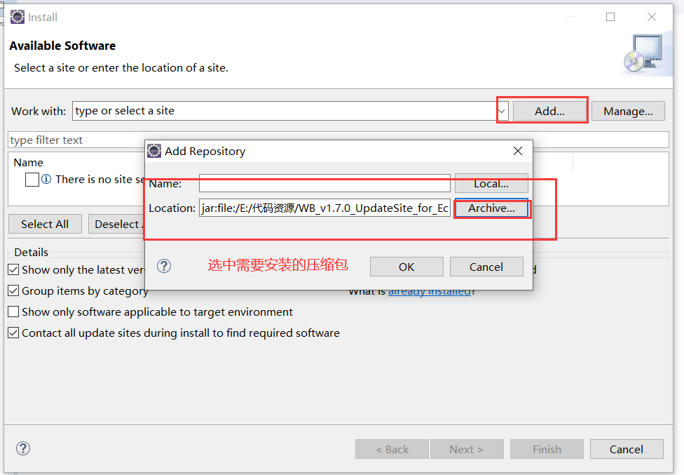
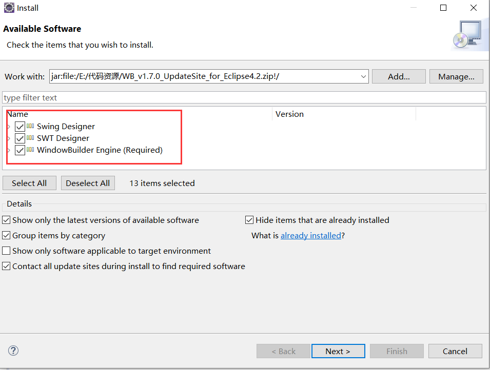
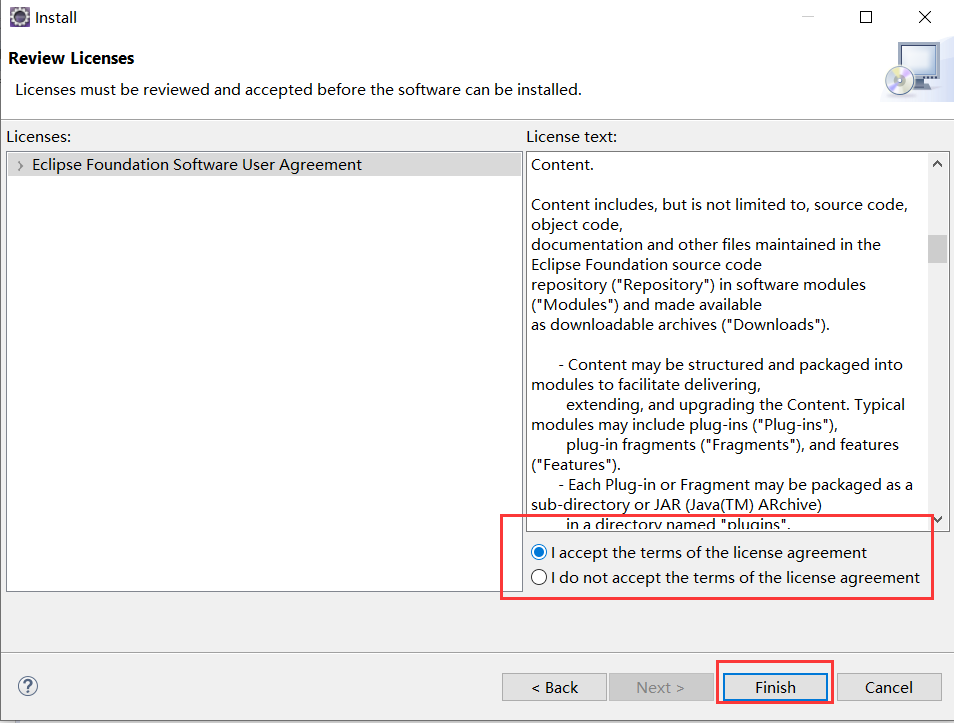
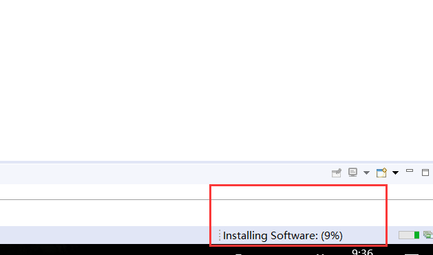
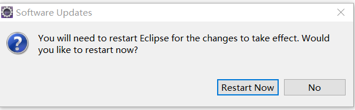
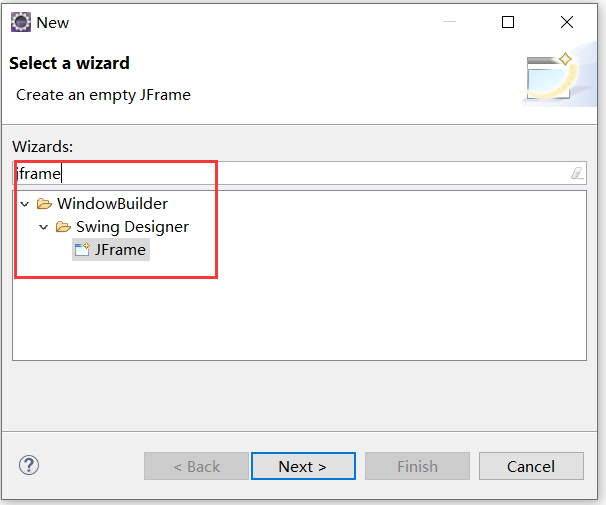
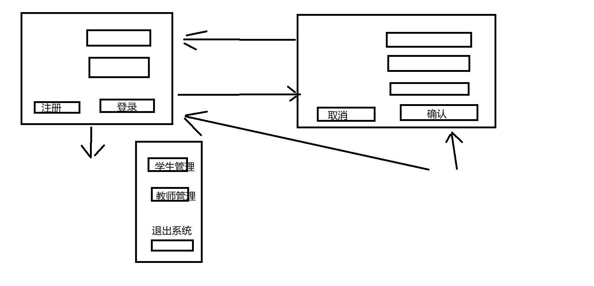

# Swing


## 一、简介

+ Swing是JDK内置提供的**一系列的类**
+ 这一个体系的类，都是用来**绘制图形化界面**的
+ 图形化界面
  + 客户端
  + 提供给**用户操作与使用**的页面
+ Java在最开始的时候 不但需要处理业务逻辑 也需要完成**客户端**
+ 发展到目前而言 Java的核心作用被浓缩到**业务逻辑**
+ 所以对于绘制页面的代码 我们能用就行
  + 目前我们可以使用一些相关的插件帮我们自动生成绘制页面的代码

## 二、安装插件

### 1、准备插件

`WB_v1.7.0_UpdateSite_for_Eclipse4.2.zip`

+ 不需要解压缩
+ 存放在一个非中文无空格的目录中

### 2、在eclipse中安装插件

+ help  ---> install new software













## 三、绘制页面

### 1、Jframe

```java
package net.wanhe.j2se.day13;

import java.awt.BorderLayout;
import java.awt.EventQueue;

import javax.swing.JFrame;
import javax.swing.JPanel;
import javax.swing.border.EmptyBorder;

/*
 * 创建了一个Jframe的子类
 * Jfarame就是一个窗口对象
 */
public class LoginFrame extends JFrame {

	private JPanel contentPane;

	/*
	 * 该构造方法指定了当前窗口对象的信息
	 */
	public LoginFrame() {
		//设置当前窗口的标题
		setTitle("登录");
		//设置关闭该窗口时退出程序
		setDefaultCloseOperation(JFrame.EXIT_ON_CLOSE);
		//设置窗口弹出的位置距离屏幕左边的距离
		//设置窗口弹出的位置距离屏幕上边的距离
		//设置窗口的长度
		//设置窗口的高度
		setBounds(500, 250, 700, 450);
		contentPane = new JPanel();
		contentPane.setBorder(new EmptyBorder(5, 5, 5, 5));
		contentPane.setLayout(new BorderLayout(0, 0));
		setContentPane(contentPane);
	}

}

```

```java
package net.wanhe.j2se.day13;

public class Test01 {
	
	public static void main(String[] args) {
		
		//创建一个窗口对象
		LoginFrame f = new LoginFrame();
		//在当前计算机中打开这个窗口对象
		f.setVisible(true);
		
	}

}
```

### 2、JPanel

+ 面板对象
+ 存放所有的组件
  + 今后我们绘制页面需要用到的所有的元素全部放在**面板**上

### 3、JTextField

+ 文本框对象
+ 当我们**第一次**向JPanel面板中存放元素之前，需要使用【absoult layout】点击清空该面板

```java
		//创建一个文本框对象
		textField = new JTextField();
		//设置文本框中的文字样式
		textField.setFont(new Font("楷体", Font.PLAIN, 20));
		//设置文本框的位置和大小
		textField.setBounds(276, 78, 250, 43);
		//将文本框对象添加到面板对象中
		contentPane.add(textField);
		textField.setColumns(10);
```

### 4、JPasswordField

+ 使用方式和文本框完全一致
+ 用户输入的内容**密文展示**

```java
		passwordField = new JPasswordField();
		passwordField.setFont(new Font("楷体", Font.PLAIN, 20));
		passwordField.setBounds(276, 179, 250, 43);
		contentPane.add(passwordField);
```

### 5、JLabel

+ 设置标签

```java
		JLabel label = new JLabel("账号:");
		label.setFont(new Font("楷体", Font.PLAIN, 24));
		label.setBounds(142, 76, 120, 43);
		contentPane.add(label);
		
		JLabel label_1 = new JLabel("密码:");
		label_1.setFont(new Font("楷体", Font.PLAIN, 24));
		label_1.setBounds(142, 179, 120, 43);
		contentPane.add(label_1);
```

### 6、JButton

```java
		JButton btnNewButton = new JButton("登录");
		//给当前按钮对象绑定 点击事件
		//指定 点击该对象需要做的事情
		btnNewButton.addActionListener(new ActionListener() {
			//指定需要做的事情
			public void actionPerformed(ActionEvent e) {
				System.out.println("点击了我");
				
			}
		});
		btnNewButton.setFont(new Font("楷体", Font.PLAIN, 25));
		btnNewButton.setBounds(389, 300, 137, 35);
		contentPane.add(btnNewButton);
```

### 7、获取文本框数据

```java
				//获取用户在文本框中输入的数据
				String loginName = textField.getText();
				String password = passwordField.getText();
				System.out.println(loginName);
				System.out.println(password);
```

### 8、消息提示框

```java
				//弹出消息提示
				JOptionPane.showMessageDialog(contentPane, "密码错误");
```

### 9、关闭当前页面

```java
				//关闭当前窗口
				dispose();
```

## 四、教育管理系统




## 五、绘制表格

### 1、JScollPanel

+ 滚动面板
  + 当面板中的数据过多时，该面板右侧会自动生成**滚动条**
+ 我们的表格对象必须放在滚动面板中

```java
		JScrollPane scrollPane = new JScrollPane();
		scrollPane.setBounds(14, 13, 823, 532);
		contentPane.add(scrollPane);
```

### 2、JTable

+ 表格对象
+ 表格是由表头和行列数据组成
+ JTable对象必须放在滚动面板的右下角

### 3、初始化表格数据

```java
	/*
	 * 初始化表格
	 */
	public void initTable() {
		//表头
		String[] headers = {"学号","姓名","年龄","联系方式","地址"};
		//表格中的数据
		Object[][] datas = {
				{1,"管超",24,"123456","江苏常州"},
				{2,"陈海波",24,"123456","江苏常州"},
				{3,"王越",24,"123456","江苏常州"}
			};
		//将表头和表中的数据打包成一个模型
		DefaultTableModel model = new DefaultTableModel(datas, headers);
		//将模型添加到表格对象中
		table.setModel(model);
	}
```

### 4、设置表格样式

```java
		//创建一个表格对象
		table = new JTable();
		//设置表格样式
		table.setRowHeight(40);//设置行高
		table.setFont(new Font("楷体", Font.PLAIN, 24));
		//设置表头
		JTableHeader header = table.getTableHeader();//从表格中获取表头对象
		header.setPreferredSize(new Dimension(1,40));//设置表头高度
		header.setBackground(Color.PINK);//设置表头的背景色
		header.setFont(new Font("楷体", Font.PLAIN, 26));
```

## 六、获取用户选中的行

```java
				//获取用户选中的行号 从0开始 如果没有选中的行 则取到的值为-1
				int row = table.getSelectedRow();
				if(row == -1) {
					JOptionPane.showMessageDialog(contentPane, "请选择需要删除的信息");
					return;
				}
				//获取指定的单元格中的信息
				int no = (Integer)table.getValueAt(row, 0);
```

## 七、确认框

```java
				//确认是否删除
				int chooise = JOptionPane.showConfirmDialog(contentPane, "您确定要删除嘛？");
				if(chooise == 0) {
					//获取指定的单元格中的信息
					int no = (Integer)table.getValueAt(row, 0);
					stuService.delStu(no);
					//重新初始化表格中的内容
					initTable();
				}
```

## 八、禁用文本框

```java
		//禁用该文本框对象
		textField.disable();
```

## 九、分页查询

### 1、简介

+ 不将所有的数据一次性全部展示而是只展示固定数量的数据
+ 将所有的数据分成很多页来进行展示
+ 提高了用户体验度
+ 提高了代码运行效率

### 2、分析

+ 分页查询的页面需要哪些数据
  + 当前页需要展示的数据
    + dao
    + Object[]  datas
  + 当前是第几页
    + 用户输入
    + Integer pageNo
  + 一页展示多少条数据
    + 自己定义
    + Integer pageSize
  + 数据的总数量
    + dao
    + Integer count
  + 总共有多少页
    + 计算(count % pageSize == 0 ? count / pageSize : count / pageSize + 1)
    + Integer num

### 3、实现

+ 将一个分页查询的页面想象成是一个对象
+ 我们定义一个`PageUtil`类用来描述分页查询的页面

```java
package net.wanhe.edusystem.util;

/*
 * 用来描述一个分页页面
 */
public class PageUtil {
	
	private Object[] datas;
	
	private Integer pageNo;
	
	private Integer pageSize;
	
	private Integer count;
	
	private Integer num;
	
	public PageUtil(Object[] datas,Integer pageNo,Integer count) {
		this.datas = datas;
		this.pageSize = 5;
		this.pageNo = pageNo;
		this.count = count;
		this.num = count % pageSize == 0 ? count / pageSize : count / pageSize + 1;
	}

	public Object[] getDatas() {
		return datas;
	}

	public Integer getPageNo() {
		return pageNo;
	}

	public Integer getNum() {
		return num;
	}
}
```

