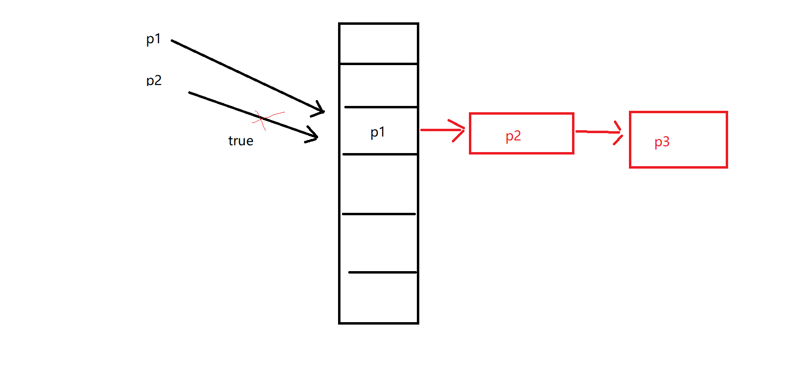

# 集合


## 一、简介

+ 将一系列相同类型的数据聚集在一起
+ **在Java中集合用于存储一系列相同类型的数据，类似于数组**
+ 集合和数组的区别
  + **都是用来存储数据的**
  + 数组是定长的
  + 集合是可变长的，集合的长度根据存储的数据的数量在自动发生改变
  + 集合提供了比数组更加丰富的对数据进行操作的方法
+ **集合 不是具体的某一个类，而是一系列类的统称**
+ 所有的集合类都存放在`java.util`包中

## 二、集合的体系结构

### 1、集合的体系结构

+ Collection
  + List
    + ArrayList
    + LinkedList
    + Vector
    + Stack
  + Set
    + HashSet
    + TreeSet
+ Map
  + HashMap
  + TreeMap
  + HashTable
  + Properties

### 2、Collection和Map的区别

+ Collection对数据的存储采用的是**线性结构，类似于数组**
+ Map集合对数据的存储采用的是**键值对结构**
  + 键值对
    + 对于数据的存储是由（key和value）成对进行存储的

### 3、List和Set的区别

+ List	
  + 有序的集合，数据存放的位置和放入的顺序一致
  + **可以存放重复的元素**
+ Set
  + 无序的集合，数据存放的位置和放入的顺序不一致
  + **不可以存放重复的元素**

## 三、ArrayList

### 1、常用方法

```java
package net.wanhe.j2se.day15;

import java.util.ArrayList;

public class Test01 {
	
	public static void main(String[] args) {
		/*
		 * 集合对象在创建时可以存储 任意 类型的数据
		 * 我们可以在创建集合对象时通过指定 泛型 来指定当前集合存储的数据类型
		 * 泛型
		 * 	对某一个类的代码编写时进行 约束
		 * 	泛型只参与编译 不参与运行
		 * 	只能指定引用类型
		 */
		ArrayList<Integer> list = new ArrayList<Integer>();
		//该对象的toString方法被重写了
		System.out.println(list);
		//1.添加指定的元素
		list.add(3);
		list.add(6);
		list.add(2);
		list.add(6);
		System.out.println(list);
		//2.向指定的位置插入元素
		list.add(2, 8);
		System.out.println(list);
		//3.将指定集合中的数据 全部添加到当前集合中
		ArrayList<Integer> newList = new ArrayList<>();
		newList.add(45);
		newList.add(64);
		list.addAll(newList);
		System.out.println(list);
		//4.根据指定的下标输出元素
		list.remove(2);
		//删除数组中第一个出现的相同的元素
		list.remove(new Integer(2));
		System.out.println(list);
		//5.修改集合中指定下标的元素
		list.set(3, 90);
		System.out.println(list);
		//6.获取指定下标中的元素
		Integer i = list.get(0);
		System.out.println(i);
		//7.获取集合的长度
		int size = list.size();
		System.out.println(size);
		//8.判断集合中是否包含指定的元素
		boolean contains = list.contains(90);
		System.out.println(contains);
		//9.返回指定元素在集合中第一次出现的位置
		int indexOf = list.indexOf(90);
		System.out.println(indexOf);
		//10.判断当前集合是否为空
		boolean empty = list.isEmpty();
		System.out.println(empty);
		//11.情况集合中的元素
		list.clear();
		System.out.println(list);

	}
}
```

### 2、集合的遍历方式

```java
package net.wanhe.j2se.day15;

import java.util.ArrayList;

public class Test02 {
	
	public static void main(String[] args) {
		ArrayList<Integer> list = new ArrayList<Integer>();
		
		list.add(23);
		list.add(24);
		list.add(25);
		list.add(26);
		
		for(int i = 0;i < list.size();i++) {
			System.out.println(list.get(i));
		}
	}

}

```

### 3、综合练习

+ 自定义集合内容`[1,2,3,6,6,6,6,6,7]`
+ 通过代码将集合中的`数字6`从集合中全部删除

```java
package net.wanhe.j2se.day15;

import java.util.ArrayList;

public class Test03 {
	
	public static void main(String[] args) {
		ArrayList<Integer> list = new ArrayList<Integer>();
		list.add(6);
		list.add(6);
		list.add(6);
		list.add(6);
		list.add(6);
		list.add(6);
		list.add(6);
		
//		for(int i = 0;i < list.size();i++) {
//			if(list.get(i) == 6) {
//				list.remove(i);
//				i--;
//			}
//		}
		
//		for(int  i = list.size() - 1;i >= 0;i--) {
//			if(list.get(i) == 6) {
//				list.remove(i);
//			}
//		}
		
		while(list.contains(6)) {
			int indexOf = list.indexOf(6);
			list.remove(indexOf);
			
		}

		System.out.println(list);
	}

}
```

## 四、LinkedList

+ **LinkedList和ArrayList使用方式几乎一致**
+ ArrayList和LinkedList的区别
  + 数据结构
    + ArrayList采用的是数组结构
    + LinkedList采用的是链表结构
  + 操作性能
    + ArrayList查询的性能更高
    + LinkedList更新数据的性能更高

## 五、Vector

+ **Vetor和ArrayList使用方式完全一致**
+ Vector和ArrayList的区别
  + ArrayList线程不安全，存储效率高
  + Vector线程安全，存储效率低

## 六、Stack

+ `栈集合`

```java
package net.wanhe.j2se.day15;

import java.util.Stack;

public class Test05 {
	
	public static void main(String[] args) {
		Stack<Integer> s = new Stack<Integer>();
		
		//栈集合有特殊的用法
		//先进后出
		//进栈
		s.push(3);
		s.push(4);
		s.push(5);
		s.push(6);
		//出栈
		Integer pop = s.pop();
		System.out.println(pop);
		Integer pop1 = s.pop();
		System.out.println(pop1);
		Integer pop2 = s.pop();
		System.out.println(pop2);
		Integer pop3 = s.pop();
		System.out.println(pop3);
		Integer pop4 = s.pop();
		System.out.println(pop4);
	}

}

```

## 七、HashSet

### 1、常用方法

```java
package net.wanhe.j2se.day15;

import java.util.HashSet;

public class Test06 {
	
	public static void main(String[] args) {
		//存放元素的顺序和存储的顺序不一致
		//不能存放重复的元素
		//Set集合没有下标的概念
		//Set集合一般用于对数据进行去重
		HashSet<Integer> set = new HashSet<Integer>();
		set.add(3);
		set.add(2);
		set.add(1);
		set.add(56);
		set.add(53);
		set.add(123);
		set.add(12);
		set.add(12);
		set.add(7);
		System.out.println(set);
	}

}

```

### 2、哈希散列表

+ HashSet集合是如何寻找元素存放的位置的
+ **HashSet集合是根据`哈希散列表`安排元素存放到位置的**
+ 每一个对象都有一个属于自己的Hash值
+ HashSet集合中会根据待添加对象的Hash值经过Hash算法得到当前对象在哈希散列表中存放的位置

```java
package net.wanhe.j2se.day15;

import java.util.HashSet;

public class Test07 {
	
	public static void main(String[] args) {
		//1.当我们向HashSet集合中存放数据时（调用了add方法）,该方法中会自动调用待添加对象的Hashcode方法，得到该对象的hash值
		//2.方法中得到hash值后会根据hash算法对这个值进行计算 得到当前 待添加对象在哈希散列表中应该存放的位置
		//3.如果该位置没有元素 则直接将待添加对象放入
		//4.如果该位置有元素 则调用待添加对象的equals方法和当前位置中已经存在的元素进行比较
		//5.如果比较的结果为true，则直接将待添加元素丢弃
		//6.如果比较的结果为false，则将待添加对象以链表的形式链接在当前位置后面
		//从实际开发角度而言 如果两个对象是同一个对象 那么hash值必须相同
		//如果hash值不同 这两个对象肯定不是同一个对象
		Person p1 = new Person("张三");
		Person p2 = new Person("李四");
		Person p3 = new Person("李四");
		HashSet<Person> set = new HashSet<>();
		set.add(p1);
		set.add(p2);
		set.add(p3);
		System.out.println(set);	
	}
}
```



## 八、迭代器

+ 迭代器的作用
  + 用于遍历集合对象
+ `public interface Collection<E> extends Iterable<E>`
  + 只要是`Iterable`的子类都拥有**迭代器**
+ 在迭代器中没有下标的概念

```java
package net.wanhe.j2se.day15;

import java.util.HashSet;
import java.util.Iterator;

public class Test08 {
	
	public static void main(String[] args) {
		HashSet<Integer> set = new HashSet<Integer>();
		set.add(1);
		set.add(2);
		set.add(3);
		
		//获取当前集合对象的迭代器
		Iterator<Integer> iterator = set.iterator();
		
		//我们可以将迭代器想象成是一根指针  默认指向当前集合的第一个格子上方
		//hasNext判断指针当前位置下方的格子是否有数据
		//迭代器循环中不能使用集合原生的删除方法
		//如果要删除数据 可以使用迭代器提供的删除方法
		while(iterator.hasNext()) {
			//将指针向后移动一位
			//获取当前指针指向的格子中的数据
			Integer num = iterator.next();
			System.out.println(num);
			//删除当前指针指向的格子中的数据
			iterator.remove();
		}
		System.out.println(set);
	}

}

```

## 九、foreach

```java
package net.wanhe.j2se.day15;

import java.util.HashSet;
import java.util.Iterator;

public class Test09 {
	
	public static void main(String[] args) {
		HashSet<Integer> set = new HashSet<Integer>();
		
		set.add(3);
		set.add(2);
		set.add(1);
		set.add(4);
		
//		Iterator<Integer> iterator = set.iterator();
//		while(iterator.hasNext()) {
//			Integer num = iterator.next();
//			System.out.println(num);
//		}
		
		/*
		 * 增强for  foreach
		 * 对迭代器进行的优化 只能遍历拥有迭代器的对象
		 * Integer num : set
		 * Integer num 定义一个变量用于接收每一次循环指针指向的值
		 * set 需要被遍历的集合对象
		 * foreach中不能做删除操作
		 */
		for(Integer num : set) {
			System.out.println(num);
		}
	}
}
```

## 十、TreeSet

### 1、HashSet和TreeSet

+ 数据结构不同
  + HashSet采用的是哈希散列表
  + TreeSet采用的是树形结构
+ 操作性能
  + HashSet存储值的性能更优
  + TreeSet比较值的性能更优
+ 存储的值的区别
  + HashSet可以存null
  + TreeSet不可以存放null

```java
package net.wanhe.j2se.day15;

import java.util.TreeSet;

public class Test10 {
	
	public static void main(String[] args) {
		//树形结构 排序
		//1.第一个添加的元素直接存放到集合中
		//2.第二个添加的元素会和第一个元素进行比较大小
		//3.如果大则放到第一个元素后面。否则存放到第一个元素之前
		//4.如果一样大则直接舍弃第二个元素
		//5.第三个元素依次和第一个第二个进行比较
		//6.依次类推进行排序
		TreeSet<Integer> set = new TreeSet<Integer>();
		set.add(345);
		set.add(12);
		set.add(1);
		set.add(3);
		set.add(7);
		set.add(7);
		System.out.println(set);
	}

}

```

### 2、Comparable

+ TreeSet中存储的对象必须是可以被比较大小的
+ 实现Compareable接口的类可以被比大小
+ 重写`compareTo`方法定义比大小的规则

```java
package net.wanhe.j2se.day15;

public class Person implements Comparable<Person> {
	
	private String name;
	
	private Integer age;
	
	public Person() {
		
	}

	public Person(String name) {
		super();
		this.name = name;
	}
	
	public Person(String name, Integer age) {
		super();
		this.name = name;
		this.age = age;
	}

	public String getName() {
		return name;
	}

	public void setName(String name) {
		this.name = name;
	}
	
	public Integer getAge() {
		return age;
	}

	public void setAge(Integer age) {
		this.age = age;
	}

	@Override
	public String toString() {
		return "Person [name=" + name + "]";
	}

	@Override
	public int hashCode() {
		final int prime = 31;
		int result = 1;
		result = prime * result + ((name == null) ? 0 : name.hashCode());
		return result;
	}

	@Override
	public boolean equals(Object obj) {
		if (this == obj)
			return true;
		if (obj == null)
			return false;
		if (getClass() != obj.getClass())
			return false;
		Person other = (Person) obj;
		if (name == null) {
			if (other.name != null)
				return false;
		} else if (!name.equals(other.name))
			return false;
		return true;
	}

	@Override
	public int compareTo(Person o) {
		System.out.println("执行了compareTo");
		if(this.age > o.getAge()) {
			return 1;
		}
		if(this.age < o.getAge()) {
			return -1;
		}
		return 0;
	}
}
```

## 十一、HashMap

### 1、常用方法

```java
package net.wanhe.j2se.day16;

import java.util.HashMap;

public class Test01 {
	
	public static void main(String[] args) {
		HashMap<String, String> map = new HashMap<String,String>();
		//存放元素
		map.put("name", "张三");
		map.put("age", "123");
		System.out.println(map);
		//删除元素  删除指定的key
//		map.remove("name");
		//获取值  如果指定的key不存在 则返回null
		String value = map.get("aaa");
		System.out.println(value);
		//修改  key是唯一的  当我们添加已经存在的key时 新添加的value值会将原有的value覆盖
		map.put("name", "李四");
		System.out.println(map);
	}

}

```

### 2、总结

+ **key值是无序的，不可以重复，所有的特点和HashSet完全一致**
+ 一个key对应一个value，value可以重复，并且可以是null

### 3、Map的遍历

```java
package net.wanhe.j2se.day16;

import java.util.HashMap;
import java.util.Map.Entry;
import java.util.Set;

public class Test02 {
	
	public static void main(String[] args) {
		HashMap<String, String> map = new HashMap<String,String>();
		map.put("1", "张三");
		map.put("2", "李四");
		map.put("3", "王五");
		map.put("4", "赵七");
		//从map集合中获取key组成的set集合
		Set<String> keySet = map.keySet();
		for(String key : keySet) {
			System.out.println("key:" + key + "  value:" + map.get(key));
		}
		
		//Entry 将每一个键值对都封装成一个Entry对象
		Set<Entry<String, String>> entrySet = map.entrySet();
		for(Entry<String, String> e : entrySet) {
			System.out.println(e.getKey());
			System.out.println(e.getValue());
		}
		
	}

}

```

## 十二、TreeMap

+ key和TreeSet的原理一致
+ 存放数据时会对key进行大小比较
+ Key的数据类型必须可以被比大小
+ key不能为null，value可以为null

## 十三、Hashtable

+ HashMap线程不安全，效率高
+ HashTable线程安全，效率低

## 十四、Properties

+ 本身的使用方式和Map集合一致

```java
package net.wanhe.j2se.day18;

import java.io.FileInputStream;
import java.io.IOException;
import java.io.InputStream;
import java.util.ArrayList;
import java.util.Properties;

public class Test01 {
	
	public static void main(String[] args) {
		//一般使用Properties集合我们keyvalue默认都是直接使用String类型
		//该集合一般用于加载 配置文件（properties文件）
		//properties文件要求 每一行的内容必须是key=value的格式
		//Properties集合可以直接将properties文件中的数据加载到集合中
		Properties p = new Properties();
		InputStream is = Test01.class.getClassLoader().getResourceAsStream("test.properties");
		try {
			System.out.println(p);
			p.load(is);
			System.out.println(p.getProperty("user"));
		} catch (IOException e) {
			e.printStackTrace();
		}
		
	}
}
```

