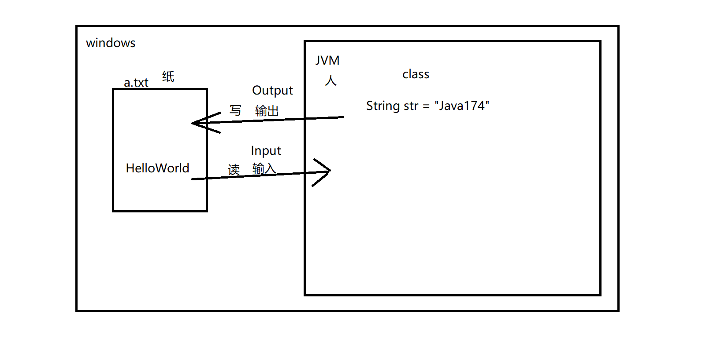

# I/O流


## 一、简介

+ JDK提供的一系列的类
+ 这些类**对计算机中的文件进行读写操作**
+ 输入/输出流（Input/Output）
+ 流
  + 数据流
  + 将数据以流的形式进行传输
+ I/O流是数据的传输工具



我们需要在Java代码中通过代码来表示计算机中的某一个文件

## 二、文件操作

### 1、File

+ `java.io.File`
+ 用来表示计算机中的某一个文件
+ **该类是唯一一个可以用于表示计算机中文件的类**
+ 此处表示的文件可以是文件也可以是目录（文件夹）

### 2、常用方法

```java
package net.wanhe.j2se.day16;

import java.io.File;
import java.io.IOException;

public class Test03 {
	
	public static void main(String[] args) {
		//创建一个File对象 用来描述本地计算机中指定的文件
		//该对象没有无参构造
		//在创建对象时需要指定描述的文件的绝对路径
		//该对象既可以表示一个目录也可以用于表示文件
		File file = new File("C:\\Users\\Administrator\\Desktop\\a");
		//该对象创建成功了 并不代表指定的文件真是存在
		//toString被重写了 打印的是指定的路径
		System.out.println(file);
		
		//判断当前File对象描述的文件在计算机中是否真实存在
		boolean exists = file.exists();
		System.out.println(exists);
		//获取当前文件的字节大小
		long length = file.length();
		System.out.println(length);
		//获取文件名
		String name = file.getName();
		System.out.println(name);
		//获取文件的绝对路径
		String path = file.getPath();
		System.out.println(path);
		//获取文件所在的文件夹的路径
		String parent = file.getParent();
		System.out.println(parent);
		//判断当前File对象描述的内容是否是一个文件
		boolean file2 = file.isFile();
		System.out.println(file2);
		//判断当前File对象描述的内容是否是一个目录
		boolean directory = file.isDirectory();
		System.out.println(directory);
		
//		try {
//			//创建文件 只能创建文件  不能创建目录
//			file.createNewFile();
//			System.out.println("文件创建成功");
//		} catch (IOException e) {
//			e.printStackTrace();
//		}
		
		//创建单层目录
//		file.mkdir();
		//逐层创建目录
//		file.mkdirs();
		
		//获取当前File描述的目录中所有的子目录和文件
		File[] files = file.listFiles();
		for(File f : files) {
			System.out.println(f);
			
		}
		
	}
}
```

### 3、综合练习

+ 自定义方法将指定文件夹中所有的文件名在控制台输出

```java
package net.wanhe.j2se.day16;

import java.io.File;

public class Test04 {
	
	public static void main(String[] args) {
		File f = new File("C:\\Users\\Administrator\\Desktop\\a");
		print(f);
		
	}
	
	public static void print(File file) {
		//获取当前文件夹中所有的子目录和子文件
		File[] files = file.listFiles();
		for(File f : files) {
			if(f.isFile()) {
				System.out.println(f.getName());
			}
			if(f.isDirectory()) {
				print(f);
			}
		}
		
	}

}

```

## 三、I/O流

### 1、IO流的分类

+ 方向
  + 输入流
    + 从外部（文件）流入到程序中
    + 对应的是**读**的操作
  + 输出流
    + 将程序内部的信息输出到文件中
    + 对应的是**写**的操作
+ 类型
  + 字节流
    + 将数据转换成字节进行传输
  + 字符流
    + 将数据转换成字符进行传输

### 2、IO流的体系结构

+ 字节输入流
  + InputStream
+ 字节输出流
  + OutputStream
+ 字符输入流
  + Reader
+ 字符输出流
  + Writer
+ 我们今后用到的几乎所有的流都是从以上4个类中派生出来的

## 四、FileInput/OutputStream

### 1、FileOutputStream

+ **文件字节输出流**
+ 将JVM中的数据以字节的形式输出到指定的本地文件中

```java
package net.wanhe.j2se.day16;

import java.io.File;
import java.io.FileNotFoundException;
import java.io.FileOutputStream;
import java.io.IOException;

public class Test05 {
	
	public static void main(String[] args) {
		FileOutputStream fos = null;
		try {
			//1.准备需要输出的内容
			String str = "Java174";
			//2.准备输出目标 指定输出到哪一个文件
			File f = new File("C:\\Users\\Administrator\\Desktop\\a.txt");
			//3.在JVM虚拟机和目标文件之间开辟一个通信管道
			//第二个参数 是否追加 如果不指定 默认不追加做覆盖的操作
			fos = new FileOutputStream(f,true);
			//4.将需要传输的数据转换成字节的形式
			byte[] bytes = str.getBytes();
			//5.传输数据
			fos.write(bytes);
			System.out.println("传输成功");
		} catch (FileNotFoundException e) {
			e.printStackTrace();
		} catch (IOException e) {
			e.printStackTrace();
		} finally {
			//6.关闭资源
			try {
				if(fos != null) {
					fos.close();
				}
			} catch (IOException e) {
				e.printStackTrace();
			}
		}
	}

}
```

### 2、FileInputStream

- **文件字节输入流**
- 将本地文件中的内容读取到JVM虚拟机中

```java
package net.wanhe.j2se.day16;

import java.io.File;
import java.io.FileInputStream;
import java.io.FileNotFoundException;
import java.io.IOException;
import java.util.Arrays;

public class Test06 {
	
	public static void main(String[] args) {
		FileInputStream fis = null;
		try {
			//1.指定需要读取的文件
			File f = new File("C:\\Users\\Administrator\\Desktop\\a.txt");
			//2.在本地文件和JVM虚拟机之间开辟通信管道
			fis = new FileInputStream(f);
			//3.准备一个容器用于存储读到的数据
			byte[] bytes = new byte[5];
			//4.读取数据
			//将读到的字节存放到指定的容器中
			//返回了读到的字节的数量
			//如果没读完 第二次会接着上一次读到的位置继续读
			//如果读完了再返回-1
			int length = 0;
			while((length = fis.read(bytes)) != -1) {
				//5.将字节转换成字符串
				String str = new String(bytes,0,length);
				System.out.print(str);
			}
		} catch (FileNotFoundException e) {
			e.printStackTrace();
		} catch (IOException e) {
			e.printStackTrace();
		} finally {
			try {
				//6.关闭资源
				if(fis != null) {
					fis.close();
				}
			} catch (IOException e) {
				e.printStackTrace();
			}
		}
	}
}
```

## 五、综合练习

+ 复制粘贴桌面上的a.txt
  + 指定需要复制的文件
  + 在复制的文件的同一个目录中生成一个新的文件
  + 文件名 （原文件名 - 副本）
  + 将复制的文件的内容读出来写到副本中

```java
package net.wanhe.j2se.day17;

import java.io.File;
import java.io.FileInputStream;
import java.io.FileOutputStream;
import java.io.IOException;

public class Test01 {
	
	public static void main(String[] args) {
		File f = new File("C:\\Users\\Administrator\\Desktop\\a.txt");
		copy(f);
		
	}
	
	public static void copy(File file) {
		FileInputStream fis = null;
		FileOutputStream fos = null;
		try {
			//1.获取文件的完整路径
			String path = file.getPath();
			//C://a.txt
			//C://a - 副本.txt
			//2.根据原文件名得到新的文件名
			String newPath = path.substring(0,path.lastIndexOf(".")) 
					+ " - 副本" + path.substring(path.lastIndexOf("."));
			//3.通过新的文件名构建一个文件对象
			File newFile = new File(newPath);
			//4.创建文件
			newFile.createNewFile();
			//5.读取旧文件中的内容
			byte[] bytes = new byte[10];
			fis = new FileInputStream(file);
			fos = new FileOutputStream(newFile);
			int length = 0;
			while((length = fis.read(bytes)) != -1) {
				//6.将读到的数据写到新文件中
				fos.write(bytes,0,length);
			}
		} catch (IOException e) {
			e.printStackTrace();
		} finally {
			//7.关闭资源
			try {
				if(fis != null) {
					fis.close();
				}
				if(fos != null) {
					fos.close();
				}
			} catch (IOException e) {
				e.printStackTrace();
			}		
		}
	}
}
```

+ 已知桌面上有一个a.txt文件，将该文件分割到桌面上的a文件夹中
+ 将a文件夹中的文件重新合并为a.txt

```java
package net.wanhe.j2se.day17;

import java.io.File;
import java.io.FileInputStream;
import java.io.FileNotFoundException;
import java.io.FileOutputStream;
import java.io.IOException;

public class Test02 {
	
	public static void main(String[] args) {
		File f = new File("C:\\Users\\Administrator\\Desktop\\a.png");
		File dir = new File("C:\\Users\\Administrator\\Desktop\\a");
//		split(f);
		heBing(dir);
	}
	
	public static void heBing(File dir) {
		FileOutputStream fos = null;
		try {
			//1.获取当前文件夹中所有的文件
			File[] files = dir.listFiles();
			//2.在当前文件夹所在的目录中创建一个新的文件
			String dirPath = dir.getParent();
			//3.新的文件 文件名必须和文件夹名称一致 后缀必须和文件夹中的子文件的后缀一致
			String fileName = dir.getName() + files[0].getName().substring(files[0].getName().lastIndexOf("."));
			String newPath = dirPath + "\\" + fileName;
			File newFile = new File(newPath);
			newFile.createNewFile();
			//4.将读到的内容写到新文件中
			fos = new FileOutputStream(newFile);
			//5.读取文件夹中的文件 将读到的内容写到新文件中
			for(int i = 0;i < files.length;i++) {
				FileInputStream fis = null;
				try {
					String path = files[0].getParent() + "\\" + i + files[0].getName().substring(files[0].getName().lastIndexOf("."));
					File f = new File(path);
					fis = new FileInputStream(f);
					byte[] bytes = new byte[10240];
					int length = 0;
					while((length = fis.read(bytes)) != -1) {
						fos.write(bytes,0,length);
					}
				} catch (Exception e) {
					e.printStackTrace();
				} finally {
					try {
						if(fis != null) {
							fis.close();
						}
					} catch (IOException e) {
						e.printStackTrace();
					}
				}
			}
		} catch (IOException e) {
			e.printStackTrace();
		} finally {
			try {
				if(fos != null) {
					fos.close();
				}
			} catch (IOException e) {
				e.printStackTrace();
			}
		}
		
	}
	
	public static void split(File file) {
		FileInputStream fis = null;
		try {
			//1.在原文件所在的目录下需要创建一个新的用于存储分割文件的文件夹
			String dirPath = file.getParent() + "//" + file.getName().substring(0,file.getName().lastIndexOf("."));
			//2.创建文件夹对象
			File dir = new File(dirPath);
			dir.mkdir();
			//3.读取原文件
			fis = new FileInputStream(file);
			byte[] bytes = new byte[10240];
			int length = 0;
			int index = 0;
			while((length = fis.read(bytes)) != -1) {
				FileOutputStream fos = null;
				try {
					//4.在分割文件夹中创建一个新的文件
					String newPath = dirPath + "//" + index++ 
							+ file.getPath().substring(file.getPath().lastIndexOf("."));
					File newFile = new File(newPath);
					newFile.createNewFile();
					//5.将读到的内容写到该文件中
					fos = new FileOutputStream(newFile);
					fos.write(bytes,0,length);
				} catch (Exception e) {
					e.printStackTrace();
				} finally {
					//6.关闭资源
					try {
						if(fos != null) {
							fos.close();
						}
					} catch (IOException e) {
						e.printStackTrace();
					}
				}
				
			}
		} catch (IOException e) {
			e.printStackTrace();
		} finally {
			//6.关闭资源
			try {
				if(fis != null) {
					fis.close();
				}
			} catch (IOException e) {
				e.printStackTrace();
			}
		}
		//7.将原文件删除
		file.delete();
	}

}

```

## 六、FileReader/Writer

### 1、FileWriter

+ **文件字符输出流**

```java
package net.wanhe.j2se.day17;

import java.io.FileWriter;
import java.io.IOException;

public class Test03 {
	
	public static void main(String[] args) {
		FileWriter fw = null;
		try {
			String str = "helloWorld";
			fw = new FileWriter("C:\\Users\\Administrator\\Desktop\\a.txt");
			fw.write(str);
		} catch (IOException e) {
			// TODO Auto-generated catch block
			e.printStackTrace();
		} finally {
			try {
				if(fw != null) {
					fw.close();
				}
			} catch (IOException e) {
				// TODO Auto-generated catch block
				e.printStackTrace();
			}
		}
	}

}

```

### 2、FileReader

+ **文件字符输入流**

```java
package net.wanhe.j2se.day17;

import java.io.FileNotFoundException;
import java.io.FileReader;
import java.io.IOException;
import java.util.Arrays;

public class Test04 {
	
	public static void main(String[] args) {
		FileReader fr = null;
		try {
			fr = new FileReader("C:\\Users\\Administrator\\Desktop\\a.txt");
			char[] chars = new char[20];
			int length = 0;
			while((length = fr.read(chars)) != -1) {
				System.out.println(Arrays.toString(chars));
				String s = new String(chars,0,length);
			}
		} catch (FileNotFoundException e) {
			e.printStackTrace();
		} catch (IOException e) {
			e.printStackTrace();
		} finally {
			try {
				if(fr != null) {
					fr.close();
				}
			} catch (IOException e) {
				e.printStackTrace();
			}
		}
	}
}
```

## 七、桥梁流

+ 将字节流转换成字符流
+ 在今后的开发过程中 我们使用别人提供的流 拿到的是字节流
+ 然而我们想用的是字符流
+ 此时我们可以使用**桥梁流**将字节流转换成字符流
+ InputStreamReader
  + 字节转字符输入流
+ OutputStreamWriter
  + 字节转字符输出流

```java
package net.wanhe.j2se.day17;

import java.io.FileInputStream;
import java.io.FileNotFoundException;
import java.io.FileOutputStream;
import java.io.IOException;
import java.io.OutputStreamWriter;

public class Test05 {
	
	public static void main(String[] args) {
		String str = "12312312321";
		FileOutputStream fos = null;
		OutputStreamWriter osw = null;
		try {
			fos = new FileOutputStream("C:\\Users\\Administrator\\Desktop\\a.txt");
			//将以上字节流转换成字符流
			osw = new OutputStreamWriter(fos);
			osw.write(str);
		} catch (FileNotFoundException e) {
			e.printStackTrace();
		} catch (IOException e) {
			e.printStackTrace();
		} finally {
			try {
				//从外往里关
				if(osw != null) {
					osw.close();
				}
				if(fos != null) {
					fos.close();
				}
			} catch (IOException e) {
				e.printStackTrace();
			}
			
		}
	}

}

```

## 八、缓冲流

+ **缓冲区**
+ BufferedInputStream
+ BufferedOutStream
+ BufferedReader
+ BufferWriter

```java
package net.wanhe.j2se.day17;

import java.io.BufferedReader;
import java.io.FileNotFoundException;
import java.io.FileReader;
import java.io.IOException;

public class Test06 {
	
	public static void main(String[] args) {
		BufferedReader br = null;
		FileReader fr = null;
		try {
			fr = new FileReader("C:\\Users\\Administrator\\Desktop\\a.txt");
			br = new BufferedReader(fr);
			//一次读一行 如果读完了则返回null
			String str = "";
			while((str = br.readLine()) != null) {
				System.out.println(str);
			}
		} catch (FileNotFoundException e) {
			e.printStackTrace();
		} catch (IOException e) {
			e.printStackTrace();
		} finally {
			try {
				if(br != null) {
					br.close();
				}
				if(fr != null) {
					fr.close();
				}
				
			} catch (IOException e) {
				// TODO Auto-generated catch block
				e.printStackTrace();
			}
		}
	}
}
```

## 九、对象流

+ 将Java中的对象的信息以流的形式进行输入输出
+ 使用对象流操作的对象必须具备**可以被序列化的能力**

```java
package net.wanhe.j2se.day17;

import java.io.Serializable;

public class Person implements Serializable {
	
	/**
	 * 当前对象的版本号
	 */
	private static final long serialVersionUID = 1L;

	private String name;
	
	private Integer age;

	public String getName() {
		return name;
	}

	public void setName(String name) {
		this.name = name;
	}

	public Integer getAge() {
		return age;
	}

	public void setAge(Integer age) {
		this.age = age;
	}
	
	public Person() {
		
	}

	public Person(String name, Integer age) {
		super();
		this.name = name;
		this.age = age;
	}
	
	

}
```

### 1、ObjectOutputStream

+ 对象字节输出流
+ **序列化**

```java
package net.wanhe.j2se.day17;

import java.io.File;
import java.io.FileNotFoundException;
import java.io.FileOutputStream;
import java.io.IOException;
import java.io.ObjectOutputStream;

public class Test07 {
	
	public static void main(String[] args) {
		FileOutputStream fos = null;;
		ObjectOutputStream oos = null;
		try {
			Person p = new Person("张三",23);
			
			File file = new File("C:\\Users\\Administrator\\Desktop\\a.txt");
			fos = new FileOutputStream(file);
			oos = new ObjectOutputStream(fos);
			//将对象以字节的形式输出到指定的文帝文件中
			oos.writeObject(p);
		} catch (IOException e) {
			// TODO Auto-generated catch block
			e.printStackTrace();
		} finally {
			try {
				if(oos != null) {
					oos.close();
				}
				if(fos != null) {
					fos.close();
				}
			} catch (IOException e) {
				e.printStackTrace();
			}
		}
		
	}

}
```

### 2、ObjectInputStream

+ 对象字节输入流
+ **反序列化**

```java
package net.wanhe.j2se.day17;

import java.io.File;
import java.io.FileInputStream;
import java.io.FileNotFoundException;
import java.io.IOException;
import java.io.ObjectInputStream;

public class Test08 {
	
	public static void main(String[] args) {
		File file = new File("C:\\Users\\Administrator\\Desktop\\a.txt");
		try {
			FileInputStream fis = new FileInputStream(file);
			ObjectInputStream ois = new ObjectInputStream(fis);
			//将文件中存储的内容反序列化成Java对象
			Person p = (Person)ois.readObject();
			System.out.println(p.getName());
			System.out.println(p.getAge());
			
		} catch (IOException e) {
			e.printStackTrace();
		} catch (ClassNotFoundException e) {
			e.printStackTrace();
		}
		
	}
}
```

## 十、教育管理系统-IO版本

```java
package net.wanhe.edusystem.dao.impl;

import java.io.File;
import java.io.FileInputStream;
import java.io.FileNotFoundException;
import java.io.FileOutputStream;
import java.io.IOException;
import java.io.ObjectInputStream;
import java.io.ObjectOutputStream;
import java.util.ArrayList;
import java.util.Arrays;
import java.util.List;

import net.wanhe.edusystem.dao.StudentDao;
import net.wanhe.edusystem.pojo.Student;

/**
 * 描述当前项目中负责管理数据的模块
 */
public class StudentDaoImpl implements StudentDao {
	
	//用于存储项目数据的容器
	private static List<Student> stus;
	
	private static File file = new File("C:\\Users\\Administrator\\Desktop\\stus.txt");
	
	//当程序启动时加载指定的文件 将存储的信息读取出来
	static {
		//读取指定的文件
		FileInputStream fis = null;
		ObjectInputStream ois = null;
		try {
			if(file.length() == 0) {
				stus = new ArrayList<Student>();
			}else {
				fis = new FileInputStream(file);
				ois = new ObjectInputStream(fis);
				stus = (List<Student>)ois.readObject();
			}
		} catch (Exception e) {
			e.printStackTrace();
		} finally {
			try {
				if(ois != null) {
					ois.close();
				}
				if(fis != null) {
					fis.close();
				}
			} catch (IOException e) {
				e.printStackTrace();
			}
		}
	}
	
	public Student findByNo(int no) {
		for(Student s : stus) {
			if(s.getNo() == no) {
				return s;
			}
		}
		return null;
	}
	
	public void insert(Student stu) {
		stus.add(stu);
		
		//将发生改变的集合更新到本地文件中
		FileOutputStream fos = null;
		ObjectOutputStream oos = null;
		try {
			fos = new FileOutputStream(file);
			oos = new ObjectOutputStream(fos);
			oos.writeObject(stus);
		} catch (Exception e) {
			e.printStackTrace();
		} finally {
			try {
				if(oos != null) {
					oos.close();
				}
				if(fos != null) {
					fos.close();
				}
			} catch (IOException e) {
				e.printStackTrace();
			}
		}
	}

	public void delete(int no) {
		//寻找需要删除的学号所在的下标
		for(int i = 0;i < stus.size();i++) {
			if(stus.get(i).getNo() == no) {
				stus.remove(i);
			}
		}
		
		//将发生改变的集合更新到本地文件中
		FileOutputStream fos = null;
		ObjectOutputStream oos = null;
		try {
			fos = new FileOutputStream(file);
			oos = new ObjectOutputStream(fos);
			oos.writeObject(stus);
		} catch (Exception e) {
			e.printStackTrace();
		} finally {
			try {
				if(oos != null) {
					oos.close();
				}
				if(fos != null) {
					fos.close();
				}
			} catch (IOException e) {
				e.printStackTrace();
			}
		}
	}

	public List<Student> findAllStus() {
		return stus;
	}

	@Override
	public void modify(Student s) {
		for(int i = 0;i < stus.size();i++) {
			if(stus.get(i).getNo() == s.getNo()) {
				stus.set(i, s);
			}
		}
		
		//将发生改变的集合更新到本地文件中
		FileOutputStream fos = null;
		ObjectOutputStream oos = null;
		try {
			fos = new FileOutputStream(file);
			oos = new ObjectOutputStream(fos);
			oos.writeObject(stus);
		} catch (Exception e) {
			e.printStackTrace();
		} finally {
			try {
				if(oos != null) {
					oos.close();
				}
				if(fos != null) {
					fos.close();
				}
			} catch (IOException e) {
				e.printStackTrace();
			}
		}
	}

	@Override
	public Integer count() {
		return stus.size();
	}

	@Override
	public Student[] findByPage(Integer pageNo) {
		//21
		// pageNo  pageSize  (pageNo - 1) * pageSize
		// 1       5         0-4
		// 2       5         5-9
		// 3       5         10-14
		// 4       5         15-19
		// 5                 20-24
		Student[] newArray = new Student[5];
		int j = 0;
		for(int i = (pageNo - 1) * 5;i < ((pageNo - 1) * 5 + 5 > stus.size() ? stus.size() : (pageNo - 1) * 5 + 5);i++) {
			newArray[j++] = stus.get(i);
		}
		return Arrays.copyOf(newArray, j);
	}
}
```

## 十一、文件操作工具类

```java
package net.wanhe.edusystem.util;

import java.io.File;
import java.io.FileInputStream;
import java.io.FileOutputStream;
import java.io.IOException;
import java.io.ObjectInputStream;
import java.io.ObjectOutputStream;
import java.util.ArrayList;
import java.util.List;

import net.wanhe.edusystem.pojo.Student;

/*
 * 文件操作的工具类
 */
public class FileUtil {
	
	/*
	 * 更新数据的方法
	 */
	public static void save(Object obj,File file) {
		//将发生改变的集合更新到本地文件中
		FileOutputStream fos = null;
		ObjectOutputStream oos = null;
		try {
			fos = new FileOutputStream(file);
			oos = new ObjectOutputStream(fos);
			oos.writeObject(obj);
		} catch (Exception e) {
			e.printStackTrace();
		} finally {
			try {
				if(oos != null) {
					oos.close();
				}
				if(fos != null) {
					fos.close();
				}
			} catch (IOException e) {
				e.printStackTrace();
			}
		}
		
	}
	
	/*
	 * 查询数据的方法
	 */
	public static Object give(File file) {
		//读取指定的文件
		FileInputStream fis = null;
		ObjectInputStream ois = null;
		try {
			fis = new FileInputStream(file);
			ois = new ObjectInputStream(fis);
			Object obj = ois.readObject();
			return obj;
		} catch (Exception e) {
			e.printStackTrace();
		} finally {
			try {
				if(ois != null) {
					ois.close();
				}
				if(fis != null) {
					fis.close();
				}
			} catch (IOException e) {
				e.printStackTrace();
			}
		}
		return null;
		
	}

}

```

## 十二、获取src下的资源

```java
	//当程序启动时加载指定的文件 将存储的信息读取出来
	static {
		//在指定的类所在的文件夹（bin）中获取指定的资源
		String path = StudentDaoImpl.class.getClassLoader().getResource("stus.txt").toString();
		file = new File(path.substring(6));
		if(file.length() == 0) {
			stus = new ArrayList<Student>();
		}else {
			stus = (List<Student>)FileUtil.give(file);
		}
	}
```

