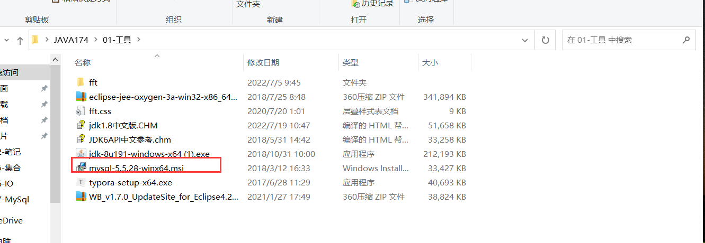
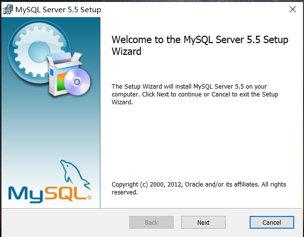
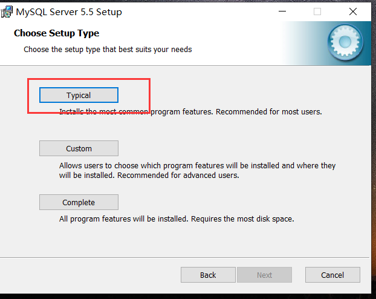
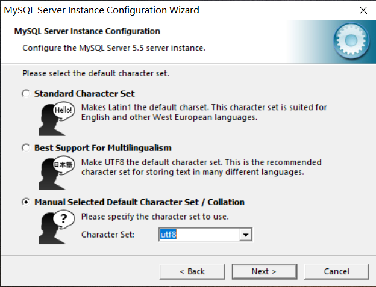
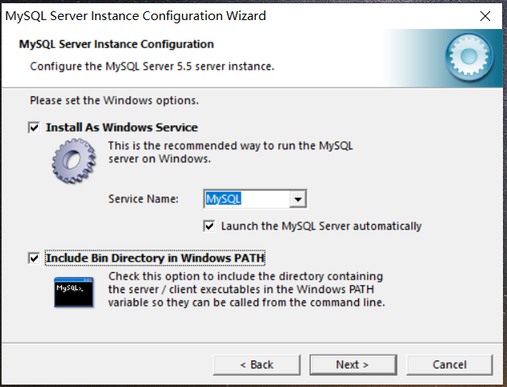
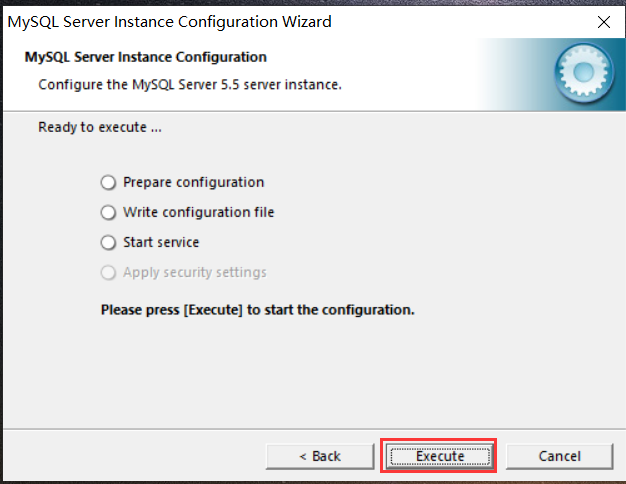
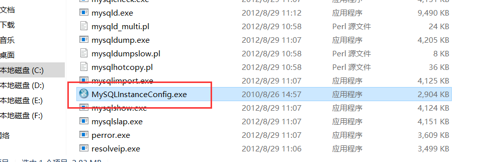
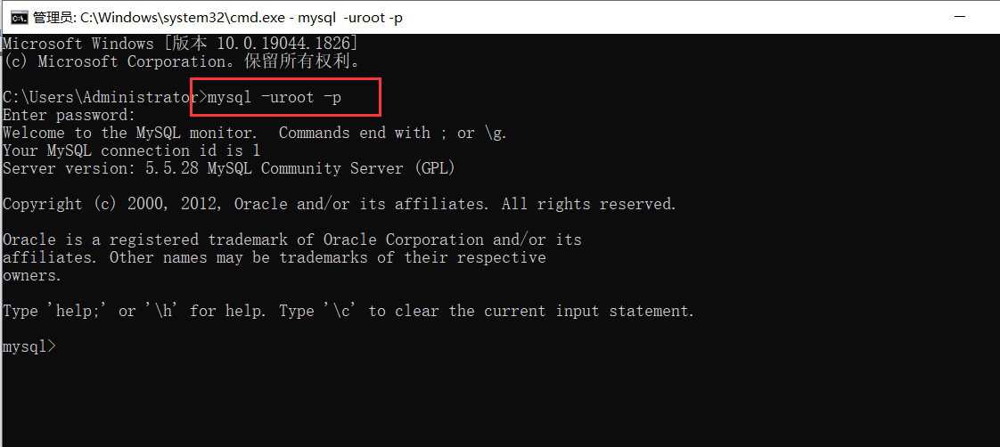
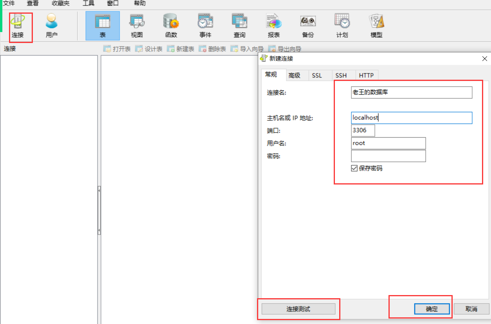

# MySql


## 一、简介

### 1、数据库

+ 存放数据的仓库，是一个**持久化（可以永久的存储数据）设备**
+ 用数据库存储数据
  + 可以存储大量的数据并且方便**检索（查询）**
  + 实现**数据共享**
    + 在A电脑中安装的数据库 B电脑也可以访问（两台电脑必须在同一个局域网中）
  + 通过**各种组合和分析**将不同的数据组织在一起 组成新的数据

### 2、数据库的产品

+ SqlServer、Oracle（甲骨文）、MySql......
+ MySql
  + 相对简单（操作简单、易上手），是一个**轻量级**的数据库
  + 开源的、免费的
  + 遵循SQL规范（增（insert）删（delete）改（update）查（select））

### 3、MySql的组成元素

+ 将MySql产品想象成是Excel表格
+ 在该产品中有**多个库**组成
  + 一个库就相当于是一个Excel文件
  + 一般一个库记录当前项目中所有的数据
+ 一个库由多个**表**组成
  + 一个表就相当于是一个文件中的**工作簿**
  + 一般一个表记录了当前项目中一个模块的数据
+ 每一张表都是由**字段**组成
  + 列
  + 单元格 存储数据

## 二、安装MySQL

### 1、安装








### 2、配置










## 三、数据库的操作

### 1、使用MySql

```
mysql -uroot -p
```



### 2、库的查询

**所有的MySql命令必须以`;`结尾**

```sql
show databases;
```

+ 展示当前系统中所有的数据库
+ 默认库不要动，我们使用自己的库

### 3、库的创建

```sql
create database 库名;
```

### 4、库的删除

```sql
drop database 库名;
```

### 5、使用库

```sql
use 库名;
```

## 四、表的操作

### 1、表的查询

```sql
show tables;
```

### 2、表的创建

+ 在创建表的时候需要指定该表中 有哪些**字段（列）**
+ 以及这些列存储的数据的类型

```sql
create table 表命(
	字段名 字段类型,
  	   字段名 字段类型,
  	   字段名 字段类型
);
```

+ 字段名
  + 全部大写
  + 多个单词之间以`_`隔开
+ 字段类型
  + 数值型
    + int
    + bigint
    + double
  + 字符串
    + char(n)  n表示存储的数据的长度必须是n
    + varchar(n) n表示存储的数据的长度不能超过n
    + text 超大文本 字符串内容过长时 建议使用text

```sql
create table t_student(
	no int,
  	   name varchar(20),
  	   age int,
          phone char(11),
  	   address text
);
```

### 3、查看表的详情

```sql
desc 表名;
```

### 4、表的删除

```sql
drop table 表名;
```

### 5、表的修改

```sql
alter table 表名  --此处的内容根据需求变更--
```

+ 修改表名
  + rename 新的表名;
+ 添加字段
  + add(text1 int,text2 char(10));
+ 删除字段
  + drop column 字段名;
+ 修改字段
  + change 旧字段名 新的字段名 新的字段类型;

## 五、数据的操作

### 1、设置视图字符集

+ 每一次重启MySQL产品都要设置

```sql
set names gbk;
```

### 2、添加数据

```sql
insert into 表名(字段名,字段名,字段名) values(字段值,字段值,字段值);
```

```java
insert into t_stu(no,name,age,phone,address) values(1,"张三",12,"12345678901","江苏南京");
insert into t_stu(no,age,phone) values(1,12,"12345678901");
insert into t_stu(no,age,phone) values(1,12,"12345678901"),(2,23,"123");
```

+ 字段值必须和字段名**一一对应**
+ 没有指定值的字段会使用**默认值**进行填充
+ values后面可以更多个`()`一次添加多行数据

### 3、查询数据

```sql
select * from t_stu;--从指定的表中查询所有的信息
select no,name from t_stu;--从指定的表中查询指定的列的信息
select * from t_stu where no = 1;--从指定的表中查询符合条件的信息
select no,name from t_stu where no = 1;--从指定的表中查询符合条件的指定的列的信息
```

### 4、删除数据

```sql
delete from 表名 where 条件;--删除符合条件的数据
```

### 5、修改数据

```sql
update 表名 set 字段名=字段值 where 条件;
```

## 六、综合练习

+ 新建数据库empsystem，在数据库中创建以下两张表，并自由添加数据


+ 部门表t_dept
  + id 部门编号
  + name 部门名称
+ 员工表t_emp
  + id 员工编号
  + name 员工名称
  + age 员工年龄
  + dept_id 所述部门编号


+ dept_id的值应该是部门表中id字段已经拥有的值
+ name必填 不能为空
+ id不能重复 不能为空 自动递增  唯一表示一行数据

## 七、字段的常用约束

+ 限制器 让字段的值必须符合限制器的要求

| 约束    | 效果                                      | 语法                                       |
| ----- | --------------------------------------- | ---------------------------------------- |
| 非空约束  | 该字段中的值不能为空                              | not null                                 |
| 唯一约束  | 该字段的值不能重复                               | unique                                   |
| 主键约束  | 该字段用于唯一的表示一行数据（非空+唯一）                   | primary key                              |
| 自增长约束 | 该字段的类型必须是int 该字段的值会自动递增                 | auto_incrementt                          |
| 外键约束  | 指定被约束的字段的值必须是另外一张表的某个字段已经拥有的值（绑定的必须是主键） | foreign key(被约束的字段) references 指定的表名(字段名) |

```sql
drop database empsystem;
create database empsystem;
use empsystem;
create table t_dept(
	id int primary key auto_increment,
	name varchar(20) unique not null
);
create table t_emp(
	id int primary key auto_increment,
	name varchar(20) not null,
	phone varchar(11) not null unique,
	age int default 20,
	dept_id int,
	foreign key(dept_id) references t_dept(id)
);
```

## 八、综合练习

+ 参照教育管理系统创建数据库和表

## 九、分页查询

+ `limit m,n`
+ m 从第几条数据开始查
+ n 往后查几条
+ m = (pageNo - 1) * pageSize
+ n = pageSize

## 十、模糊查询

+ like
  + `像`
+ `%`
  + 匹配0个或多个
+ `_`
  + 匹配1个

## 十一、排序

+ `order by 字段名`
  + 指定查询结果根据哪个字段名排序
+ `desc`
  + 对排序结果进行倒序

## 十二、查询条件拼接

```sql
select * from t_emp where age = 16 and dept_id = 1;--且
select * from t_emp where age = 16 or dept_id = 2;--或
select * from t_emp where age = 16 xor dept_id = 2;--必须满足一个不满足另外一个
select * from t_emp where age between 1 and 15;--在1到15之间
select * from t_emp where age is null;--和null做比较
select * from t_emp where age in (1,2,3,4,16);--选择
```

## 十三、Navicat

+ 辅助操作数据库的工具

