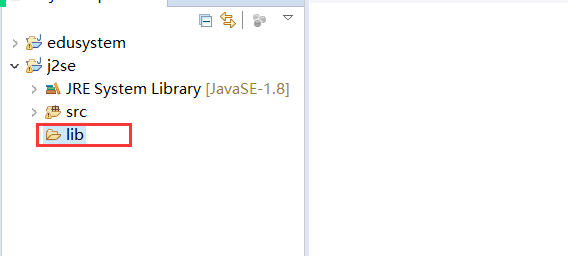
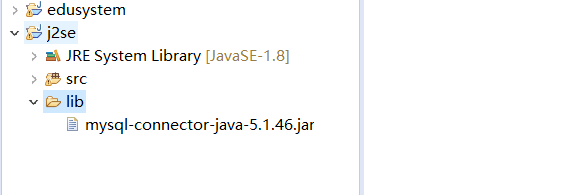
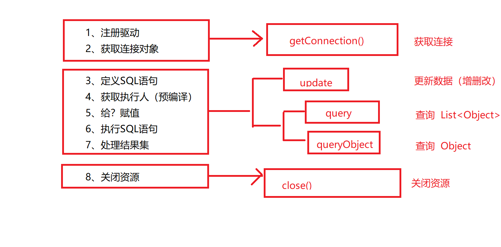
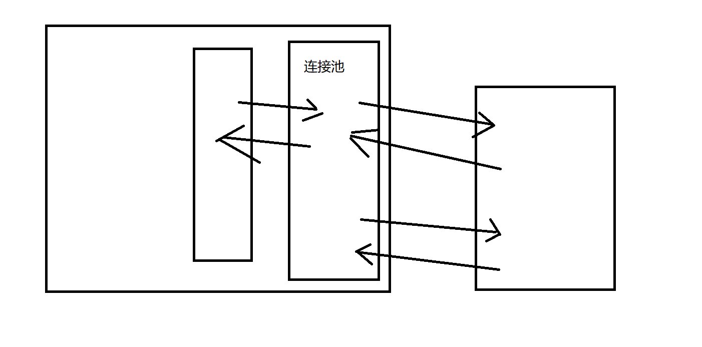

# JDBC


## 一、简介

Java DataBase Connection

+ Java连接操作数据库技术
+ 我们通过Java代码连接并操作数据库，**JDBC是唯一手段**
+ Java中提供的JDBC是一系列的**接口**，没有具体的**实现**
  + 具体的实现由**数据库厂商自己提供**

> 因为数据库产品过多，Java不可能为每一个产品都定义一套连接方案
>
> JDK只提供了接口，定义了规范
>
> 任何一家数据库厂商想要让Java来连接它，就需要提供符合规范的的产品
>
> 给出具体的实现（JDBC的实现类）
>
> 列入:
>
> 我们想要使用JDBC连接MySQL数据库
>
> 就需要安装MySql提供的JDBC的实现类
>
> 这些实现类不是JDK原有的，而是由第三方提供的
>
> 我们称之为**第三方Jar包**

## 二、JDBC连接MySQL

### 1、导入第三方Jar包

+ 在需要连接使用MySql的项目中创建一个lib文件夹



+ 将第三方Jar包存放到lib文件夹中



+ 将lib文件夹中的Jar包导入到项目依赖中
  + 右击 --->  [build path] ---> [add to build path]

### 2、连接数据库

```java
package net.wanhe.j2se.day20;

import java.sql.Connection;
import java.sql.DriverManager;
import java.sql.SQLException;

public class Test01 {
	
	public static void main(String[] args) {
		//指定需要连接的是哪一台电脑上的数据库产品中的哪一个数据库
		String url = "jdbc:mysql://localhost:3306/empsystem?useUnicode=true&characterEncoding=utf8";
		String username = "root";
		String password = "";
		try {
			//1.注册驱动
			//让MySQL提供的JAR包中的一个核心类进行类加载
			Class.forName("com.mysql.jdbc.Driver");
			//2.获取连接对象
			Connection conn = DriverManager.getConnection(url,username,password);
			System.out.println(conn);
			System.out.println("连接成功");
		} catch (Exception e) {
			e.printStackTrace();
		}
	}

}

```

### 3、使用JDBC执行更新数据（增、删、改）的操作

```java
package net.wanhe.j2se.day20;

import java.sql.Connection;
import java.sql.DriverManager;
import java.sql.SQLException;
import java.sql.Statement;

public class Test01 {
	
	public static void main(String[] args) {
		//指定需要连接的是哪一台电脑上的数据库产品中的哪一个数据库
		String url = "jdbc:mysql://localhost:3306/empsystem?useUnicode=true&characterEncoding=utf8";
		String username = "root";
		String password = "";
		
		Connection conn = null;
		Statement state = null;
		try {
			//1.注册驱动
			//让MySQL提供的JAR包中的一个核心类进行类加载
			Class.forName("com.mysql.jdbc.Driver");
			//2.获取连接对象
			conn = DriverManager.getConnection(url,username,password);
			System.out.println("连接成功");
			//3.定义sql语句
			String sql = new StringBuffer()
					.append(" insert into ")
					.append(" t_dept ")
					.append(" (name) ")
					.append(" values ")
					.append(" ('研发组') ")
					.toString();
			System.out.println(sql);
			//4.获取执行人
			state = conn.createStatement();
			//5.执行sql语句
			int rows = state.executeUpdate(sql);
			//6.处理执行结果
			System.out.println("执行成功" + rows + "行收到了影响");
		} catch (Exception e) {
			e.printStackTrace();
		} finally {
			//7.关闭资源
			try {
				if(state != null) {
					state.close();
				}
				if(conn != null) {
					conn.close();
				}
			} catch (SQLException e) {
				// TODO Auto-generated catch block
				e.printStackTrace();
			}
		}
	}

}

```

### 4、使用JDBC执行查询数据的操作

```java
package net.wanhe.j2se.day20;

import java.sql.Connection;
import java.sql.DriverManager;
import java.sql.ResultSet;
import java.sql.SQLException;
import java.sql.Statement;
import java.util.ArrayList;
import java.util.List;

public class Test02 {
	
	public static void main(String[] args) {
		String url = "jdbc:mysql://localhost:3306/empsystem?useUnicode=true&characterEncoding=utf8";
		String username = "root";
		String password = "";
		
		ResultSet rs = null;
		Statement state = null;
		Connection conn = null;
		try {
			Class.forName("com.mysql.jdbc.Driver");
			conn = DriverManager.getConnection(url,username,password);
			String sql = new StringBuffer()
					.append(" select ")
					.append(" * ")
					.append(" from ")
					.append(" t_emp ")
					.toString();
			state = conn.createStatement();
			//执行查询的sql语句 获取到结果集
			rs = state.executeQuery(sql);
			//处理结果集 将结果集中的数据转换成Java中的集合对象
			List<Emp> emps = new ArrayList<Emp>();
			//1.判断当前指针指向的下一行是否有数据
			//2.将指针向下移动一行
			while(rs.next()) {
				//获取当前指针指向的行指定的列的数据
				int id = rs.getInt("id");
				String name = rs.getString("name");
				String phone = rs.getString("phone");
				int age = rs.getInt("age");
				int deptId = rs.getInt("dept_id");
				Emp emp = new Emp(id,name,phone,age,deptId);
				emps.add(emp);
				System.out.println(emp);
			}
		} catch (ClassNotFoundException e) {
			e.printStackTrace();
		} catch (SQLException e) {
			e.printStackTrace();
		} finally{
			try {
				if(rs != null) {
					rs.close();
				}
				if(state != null) {
					state.close();
				}
				if(conn != null) {
					conn.close();
				}
			} catch (SQLException e) {
				e.printStackTrace();
			}
			
		}
	}

}

```

## 三、教育管理系统JDBC版本

```java
package net.wanhe.edusystem.dao.impl;

import java.sql.Connection;
import java.sql.DriverManager;
import java.sql.ResultSet;
import java.sql.SQLException;
import java.sql.Statement;

import net.wanhe.edusystem.dao.UserDao;
import net.wanhe.edusystem.pojo.User;

public class UserDaoImpl implements UserDao {
	
	private String url = "jdbc:mysql://localhost:3306/edusystem?useUnicode=true&characterEncoding=utf8";
	
	private String username = "root";
	
	private String password = "";
	
	/*
	 * 根据账号名查询对应的用户信息
	 */
	public User findUserByLoginName(String loginName) {
		Connection conn = null;
		Statement state = null;
		ResultSet rs = null;
		try {
			Class.forName("com.mysql.jdbc.Driver");
			conn = DriverManager.getConnection(url,username,password);
			String sql = new StringBuffer()
					.append(" select ")
					.append(" * ")
					.append(" from ")
					.append(" t_user ")
					.append(" where ")
					.append(" login_name = '")
					.append(loginName)
					.append("' ")
					.toString();
			System.out.println(sql);
			state = conn.createStatement();
			rs = state.executeQuery(sql);
			while(rs.next()) {
				int id = rs.getInt("id");
				String loginName1 = rs.getString("login_name");
				String password = rs.getString("password");
				User user = new User(id,loginName1,password);
				return user;
			}
		} catch (ClassNotFoundException e) {
			e.printStackTrace();
		} catch (SQLException e) {
			e.printStackTrace();
		} finally {
			try {
				if(rs != null) {
					rs.close();
				}
				if(state != null) {
					state.close();
				}
				if(conn != null) {
					conn.close();
				}
			} catch (SQLException e) {
				e.printStackTrace();
			}
		}
		return null;
	}

	/*
	 * 添加用户
	 */
	public void insert(User user) {
		Connection conn = null;
		Statement state = null;
		try {
			Class.forName("com.mysql.jdbc.Driver");
			conn = DriverManager.getConnection(url,username,password);
			String sql = new StringBuffer()
					.append(" insert into ")
					.append(" t_user ")
					.append(" (login_name,password) ")
					.append(" values ")
					.append(" ('"+user.getLoginName()+"','"+user.getPassword()+"') ")
					.toString();
			System.out.println(sql);
			state = conn.createStatement();
			state.executeUpdate(sql);
		} catch (ClassNotFoundException e) {
			e.printStackTrace();
		} catch (SQLException e) {
			e.printStackTrace();
		} finally {
			try {
				if(state != null) {
					state.close();
				}
				if(conn != null) {
					conn.close();
				}
			} catch (SQLException e) {
				e.printStackTrace();
			}
		}
	}
}
```

## 四、SQL注入

+ 使用字符串拼接SQL语句时
+ 拼接得到的SQL语句改变了原有的含义
  + 使SQL语句执行结果和计划的不一致
+ 这种现象我们称之为**SQL注入**

## 五、PreparedStatement

+ 对SQL语句进行预编译操作

```java
package net.wanhe.edusystem.dao.impl;

import java.sql.Connection;
import java.sql.DriverManager;
import java.sql.PreparedStatement;
import java.sql.ResultSet;
import java.sql.SQLException;
import java.sql.Statement;

import net.wanhe.edusystem.dao.UserDao;
import net.wanhe.edusystem.pojo.User;

public class UserDaoImpl implements UserDao {
	
	private String url = "jdbc:mysql://localhost:3306/edusystem?useUnicode=true&characterEncoding=utf8";
	
	private String username = "root";
	
	private String password = "";
	
	/*
	 * 根据账号名查询对应的用户信息
	 */
	public User findUserByLoginName(String loginName) {
		Connection conn = null;
		PreparedStatement state = null;
		ResultSet rs = null;
		try {
			Class.forName("com.mysql.jdbc.Driver");
			conn = DriverManager.getConnection(url,username,password);
			String sql = new StringBuffer()
					.append(" select ")
					.append(" * ")
					.append(" from ")
					.append(" t_user ")
					.append(" where ")
					.append(" login_name = ? ")
					.toString();
			state = conn.prepareStatement(sql);
			state.setString(1, loginName);
			rs = state.executeQuery();
			while(rs.next()) {
				int id = rs.getInt("id");
				String loginName1 = rs.getString("login_name");
				String password = rs.getString("password");
				User user = new User(id,loginName1,password);
				return user;
			}
		} catch (ClassNotFoundException e) {
//			e.printStackTrace();
		} catch (SQLException e) {
//			e.printStackTrace();
		} finally {
			try {
				if(rs != null) {
					rs.close();
				}
				if(state != null) {
					state.close();
				}
				if(conn != null) {
					conn.close();
				}
			} catch (SQLException e) {
				e.printStackTrace();
			}
		}
		
		return null;
		
	}

	/*
	 * 添加用户
	 */
	public void insert(User user) {
		Connection conn = null;
		PreparedStatement state = null;
		try {
			Class.forName("com.mysql.jdbc.Driver");
			conn = DriverManager.getConnection(url,username,password);
			//? 占位符  表示当前位置有值 只是展示不确定值是多少
			String sql = new StringBuffer()
					.append(" insert into ")
					.append(" t_user ")
					.append(" (login_name,password) ")
					.append(" values ")
					.append(" (?,?) ")
					.toString();
			//PreparedStatement是Statement的子类
			//该类在获取时就需要指定执行的sql语句是什么
			//该类会在获取时对指定的sql语句进行 预编译
			state = conn.prepareStatement(sql);
			//给？赋值
			//整个Java的学习过程中 只有此处?是从1开始
			state.setString(1, user.getLoginName());
			state.setString(2, user.getPassword());
			state.executeUpdate();
		} catch (ClassNotFoundException e) {
//			e.printStackTrace();
		} catch (SQLException e) {
//			e.printStackTrace();
		} finally {
			try {
				if(state != null) {
					state.close();
				}
				if(conn != null) {
					conn.close();
				}
			} catch (SQLException e) {
				e.printStackTrace();
			}
		}
	}
}
```

## 六、JDBCUtil



```java
package net.wanhe.edusystem.jdbc;

import java.sql.Connection;
import java.sql.DriverManager;
import java.sql.PreparedStatement;
import java.sql.ResultSet;
import java.sql.SQLException;

public class JDBCUtil {
	
	private static String url = "jdbc:mysql://localhost:3306/edusystem?useUnicode=true&characterEncoding=utf8";
	
	private static String username = "root";
	
	private static String password = "";
	
	/*
	 * 获取连接对象
	 */
	public static Connection getConnection() throws ClassNotFoundException, SQLException {
		Class.forName("com.mysql.jdbc.Driver");
		Connection conn = DriverManager.getConnection(url,username,password);
		return conn;
	}
	
	/*
	 * 关闭资源
	 */
	public static void close(ResultSet rs,PreparedStatement state,Connection conn) throws SQLException {
		if(rs != null) {
			rs.close();
		}
		if(state != null) {
			state.close();
		}
		if(conn != null) {
			conn.close();
		}
	}

}
```

## 七、JDBCTemplate

```java
package net.wanhe.edusystem.jdbc;

import java.sql.Connection;
import java.sql.PreparedStatement;
import java.sql.ResultSet;
import java.sql.SQLException;
import java.util.ArrayList;
import java.util.List;

/**
 * JDBC模板
 * @author 方方土
 */
public class JDBCTemplate {
	
	/*
	 * 执行更新的sql语句
	 */
	public void update(String sql,Object[] datas) {
		Connection conn = null;
		PreparedStatement state = null;
		try {
			//获取连接
			conn = JDBCUtil.getConnection();
			//回去执行人 对sql语句进行预编译
			state = conn.prepareStatement(sql);
			//给？赋值
			setParams(state,datas);
			//执行sql语句
			state.executeUpdate();
		} catch (ClassNotFoundException e) {
			e.printStackTrace();
		} catch (SQLException e) {
			e.printStackTrace();
		} finally {
			//关闭资源
			try {
				JDBCUtil.close(null, state, conn);
			} catch (SQLException e) {
				e.printStackTrace();
			}
		}
	}
	
	/*
	 * 执行查询的sql语句
	 */
	public List query(String sql,Object[] datas,RowMapper mapper) {
		Connection conn = null;
		PreparedStatement state = null;
		ResultSet rs = null;
		List list = new ArrayList<>();
		try {
			conn = JDBCUtil.getConnection();
			state = conn.prepareStatement(sql);
			setParams(state, datas);
			rs = state.executeQuery();
			//处理结果集
			while(rs.next()) {
				//获取对象
				Object obj = mapper.toObject(rs);
				//将对象存放到集合中
				list.add(obj);
			}
		} catch (ClassNotFoundException e) {
			e.printStackTrace();
		} catch (SQLException e) {
			e.printStackTrace();
		} finally {
			try {
				JDBCUtil.close(rs, state, conn);
			} catch (SQLException e) {
				e.printStackTrace();
			}
		}
		return list;
	}

	/*
	 * 查询一个对象
	 */
	public Object queryObject(String sql,Object[] datas,RowMapper mapper) {
		List list = query(sql, datas, mapper);
		return list.isEmpty() ? null : list.get(0);
	}
	
	/*
	 * 给？赋值
	 */
	private void setParams(PreparedStatement state,Object[] datas) throws SQLException {
		if(datas != null) {
			for(int i = 0;i < datas.length;i++) {
				state.setObject(i+1, datas[i]);
			}
		}
	}

}

```

+ RowMapper

```java
package net.wanhe.edusystem.jdbc;

import java.sql.ResultSet;
import java.sql.SQLException;

/*
 * 指定表中的行和Java中对象的映射关系
 * 指定表中的每一行数据如何转换成Java中的对象
 */
public interface RowMapper {
	
	Object toObject(ResultSet rs) throws SQLException;

}

```

## 八、使用JDBC工具类

```java
package net.wanhe.edusystem.dao.impl;

import java.sql.Connection;
import java.sql.DriverManager;
import java.sql.PreparedStatement;
import java.sql.ResultSet;
import java.sql.SQLException;
import java.sql.Statement;
import java.util.List;

import net.wanhe.edusystem.dao.UserDao;
import net.wanhe.edusystem.jdbc.JDBCTemplate;
import net.wanhe.edusystem.jdbc.impl.UserRowMapperImpl;
import net.wanhe.edusystem.pojo.User;

public class UserDaoImpl implements UserDao {
	
	private JDBCTemplate jdbcTemplate = new JDBCTemplate();
	
	
	/*
	 * 根据账号名查询对应的用户信息
	 */
	public User findUserByLoginName(String loginName) {
		String sql = new StringBuffer()
				.append(" select ")
				.append(" * ")
				.append(" from ")
				.append(" t_user ")
				.append(" where ")
				.append(" login_name = ? ")
				.toString();
		return (User)jdbcTemplate.queryObject(sql, new Object[] {loginName}, new UserRowMapperImpl());
	}

	/*
	 * 添加用户
	 */
	public void insert(User user) {
		String sql = new StringBuffer()
				.append(" insert into ")
				.append(" t_user ")
				.append(" (login_name,password) ")
				.append(" values ")
				.append(" (?,?) ")
				.toString();
		jdbcTemplate.update(sql, new Object[] {
				user.getLoginName(),
				user.getPassword()
		});
	}

}

```

```java
package net.wanhe.edusystem.jdbc.impl;

import java.sql.ResultSet;
import java.sql.SQLException;

import net.wanhe.edusystem.jdbc.RowMapper;
import net.wanhe.edusystem.pojo.User;

public class UserRowMapperImpl implements RowMapper {

	@Override
	public Object toObject(ResultSet rs) throws SQLException {
		int id = rs.getInt("id");
		String loginName = rs.getString("login_name");
		String password = rs.getString("password");
		User user = new User(id,loginName,password);
		return user;
	}
}
```

## 九、加载本地配置文件

```java
	private static Properties p = new Properties();
	
	static {
		try {
			InputStream is = JDBCUtil.class.getClassLoader().getResourceAsStream("database.properties");
			p.load(is);
		} catch (IOException e) {
			e.printStackTrace();
		}
	}
	
	/*
	 * 获取连接对象
	 */
	public static Connection getConnection() throws ClassNotFoundException, SQLException {
		Class.forName("com.mysql.jdbc.Driver");
		Connection conn = DriverManager.getConnection(
				p.getProperty("url"),
				p.getProperty("username"),
				p.getProperty("password"));
		return conn;
	}
```

## 十、数据库连接池

+ 数据源

### 1、思想

+ 每一次需要执行SQL语句时，像数据库获取一个连接对象
  + 效率过低
+ 我们希望在**程序空闲**的时候，提前准备好**一些可用的连接**
  + 当我们需要使用时，不再直接向数据库索要连接对象
  + 而是获取提前准备好的连接直接使用
  + **效率更高**
  + 我们将这些提前准备好的连接对象存放在**数据库连接池**中
+ 数据源不需要我们自己实现，市面上有可能产品都帮我们实现好了，我们直接拿来用就可以了



### 2、使用

```java
package net.wanhe.j2se.day21;

import java.sql.Connection;
import java.sql.DriverManager;
import java.sql.SQLException;
import java.util.Properties;

import javax.sql.DataSource;

import org.apache.commons.dbcp.BasicDataSource;
import org.apache.commons.dbcp.BasicDataSourceFactory;

public class Test01 {
	
	public static void main(String[] args) {
		
		String url = "jdbc:mysql://localhost:3306/empsystem?useUnicode=true&characterEncoding=utf8";
		
		String username = "root";
		
		String password = "";
		
//		try {
//			Class.forName("com.mysql.jdbc.Driver");
//			Connection conn = DriverManager.getConnection(url,username,password);
//			System.out.println(conn);
//		} catch (ClassNotFoundException e) {
//			// TODO Auto-generated catch block
//			e.printStackTrace();
//		} catch (SQLException e) {
//			// TODO Auto-generated catch block
//			e.printStackTrace();
//		}
		
//		//方式一
//		try {
//			//创建一个数据源对象
//			//该对象会在程序空闲的时候问数据库索要连接对象
//			BasicDataSource ds = new BasicDataSource();
//			//告诉数据源需要连接的数据库的信息
//			ds.setDriverClassName("com.mysql.jdbc.Driver");
//			ds.setUrl(url);
//			ds.setUsername(username);
//			ds.setPassword(password);
//			//我们不再向数据库索要连接 而是从数据源中获取
//			Connection conn = ds.getConnection();
//			System.out.println(conn);
//		} catch (SQLException e) {
//			// TODO Auto-generated catch block
//			e.printStackTrace();
//		}
		
		//方式二
		try {
			Properties p = new Properties();
			//将数据库连接信息加载到Properties集合中
			p.load(Test01.class.getClassLoader().getResourceAsStream("test.properties"));
			//使用数据源工厂帮助我们创建数据源对象
			//该工程会自动读取Properties集合中的连接内容
			//Properties集合中的key必须和数据源对象中的属性名一致
			DataSource ds = BasicDataSourceFactory.createDataSource(p);
			//获取连接
			Connection conn = ds.getConnection();
			System.out.println(conn);
		} catch (Exception e) {
			// TODO Auto-generated catch block
			e.printStackTrace();
		}
		
	}

}

```

