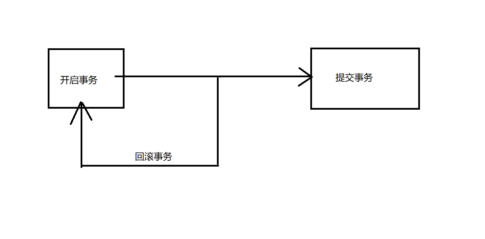

# 事务


## 一、简介

事务这个概念是属于属于**数据库**的

事务用于表示一个**不可再分**的操作

一个事务由多个环节组成，在这些环节中

+ 只要有一个环节出错，结果就是错误的，应该**重新开始**
+ 只有所有的环节全部成功，这个结果才是成功的
+ 一旦失败，当前事务应该从头开始（**回滚**）
+ 事务成功结束后，应该**提交事务（存档）**



## 二、MySql事务

+ 对于MySql而言，默认设置是**自动提交事务**
  + 也是就是说在MySql中默认一个SQL语句就是一个事务
  + 每执行一个SQL语句就会自动提交
+ 开启事务
  + 关闭MySQL的自动提交
  + `set autocommit = false`
+ 提交事务
  + `commit;`
  + `set autocommit = true`
+ 回滚事务
  + `rollback;`


## 三、四大特征

+ 原子性
  + 不可再分，一个事务中的步骤要么全部成功，要么全部失败
+ 一致性
  + 事务中的数据是保持一致的
+ 隔离性
  + 同一时间，一个事务只有一个人可以操作
+ 永久性
  + 一个事务一旦提交，在数据库中的存储是永久的

## 四、JDBC事务

+ 开启事务

```java
//开启事务
conn.setAutoCommit(false);
```

+ 提交事务

```java
			//提交事务
			conn.commit();
```

+ 回滚事务

```java
//回滚事务
conn.rollback();
```

## 五、综合练习

```java
package net.wanhe.j2se.day29;

import java.sql.Connection;
import java.sql.DriverManager;
import java.sql.PreparedStatement;
import java.sql.SQLException;
import java.util.ArrayList;
import java.util.List;

public class Test02 {
	
	public static void main(String[] args) {
		List<String> deptNames = new ArrayList<String>();
		deptNames.add("Java1");
		deptNames.add("Java2");
		deptNames.add("Java3");
		deptNames.add("Java4");
		deptNames.add("Java5");
		deptNames.add("Java6");
		Connection conn = null;
		PreparedStatement state = null;
		try {
			//将集合中的数据添加到数据库中t_dept表中 在合适的位置加上事务
			int i = 0;
			conn = DriverManager.getConnection("jdbc:mysql://localhost:3306/empsystem?useUnicode=true&characterEncoding=utf8","root","");
			conn.setAutoCommit(false);
			for(String name : deptNames) {
				i++;
				if(i == 3) {
					int a = 1 / 0;
				}
				Class.forName("com.mysql.jdbc.Driver");
				String sql = new StringBuffer()
						.append(" insert into ")
						.append(" t_dept ")
						.append(" (name) ")
						.append(" values ")
						.append(" (?) ")
						.toString();
				state = conn.prepareStatement(sql);
				state.setString(1, name);
				state.executeUpdate();
				
			}
			conn.commit();
		} catch (Exception e) {
			System.out.println("报错了");
			try {
				conn.rollback();
			} catch (SQLException e1) {
				e1.printStackTrace();
			}
			e.printStackTrace();
		} finally {
			try {
				if(conn != null) {
					conn.close();
				}
				if(state != null) {
					state.close();
				}
			} catch (SQLException e) {
				e.printStackTrace();
			}
			
		}
	}
}
```

## 六、事务工具类

+ 在实际项目中service中的一个方法就是一个完整的事务
+ 在该方法中所有的环节要么全部成功要么全部失败
+ service方法执行之前应该**开启事务**
+ service方法执行成功应该**提交事务**
+ service方法执行失败应该**回滚事务**
+ **在一个完整的事务操作中，所有涉及的连接对象应该是同一个连接**
  + 开启事务 获取连接对象
  + 当前事务执行过程中所用到的连接对象应该是同一个
  + 提交或者回滚事务才将该链接舍弃

```java
package net.wanhe.edusystem.util;

import java.sql.Connection;
import java.sql.SQLException;

import net.wanhe.edusystem.jdbc.JDBCUtil;

/*
 * 事务工具类
 */
public class TrancManagerUtil {
	
	/*
	 * 开启事务
	 */
	public static void begin() throws SQLException, ClassNotFoundException {
		Connection conn = JDBCUtil.getConnection();
		conn.setAutoCommit(false);
	}
	
	/*
	 * 提交事务
	 */
	public static void commit() throws SQLException, ClassNotFoundException {
		Connection conn = JDBCUtil.getConnection();
		conn.commit();
		JDBCUtil.close(null, null, conn);
	}
	
	/*
	 * 回滚事务
	 */
	public static void rollback() throws ClassNotFoundException, SQLException {
		Connection conn = JDBCUtil.getConnection();
		conn.rollback();
		JDBCUtil.close(null, null, conn);
	}

}

```

```java
package net.wanhe.edusystem.jdbc;

import java.io.IOException;
import java.io.InputStream;
import java.sql.Connection;
import java.sql.DriverManager;
import java.sql.PreparedStatement;
import java.sql.ResultSet;
import java.sql.SQLException;
import java.util.Properties;

import javax.sql.DataSource;

import org.apache.commons.dbcp.BasicDataSourceFactory;

public class JDBCUtil {
	
	private static DataSource ds;
	
	//相当于是一个集合容器 该容器只能存一个对象
	private static ThreadLocal<Connection> local = new ThreadLocal<Connection>();
	
	static {
		try {
			Properties p = new Properties();
			InputStream is = JDBCUtil.class.getClassLoader().getResourceAsStream("database.properties");
			p.load(is);
			ds = BasicDataSourceFactory.createDataSource(p);
		} catch (Exception e) {
			e.printStackTrace();
		}
	}
	
	/*
	 * 获取连接对象
	 */
	public static Connection getConnection() throws ClassNotFoundException, SQLException {
		Connection conn = local.get();
		if(conn == null) {
			conn = ds.getConnection();
			local.set(conn);
		}
		return conn;
	}
	
	/*
	 * 关闭资源
	 */
	public static void close(ResultSet rs,PreparedStatement state,Connection conn) throws SQLException {
		if(rs != null) {
			rs.close();
		}
		if(state != null) {
			state.close();
		}
		if(conn != null) {
			conn.close();
			local.remove();
		}
	}

}

```

## 七、代理模式

+ 只关心核心业务逻辑，将**交叉业务逻辑**提取出来交给**代理类**完成
+ 交叉业务逻辑
  + 输入业务的一部分，必须要做的事情
  + 但是又不属于**核心业务**
  + 事务操作
+ **代理类必须和被代理类实现同一个接口**

### 1、静态代理

+ 自己创建代理类进行代理

```java
package net.wanhe.edusystem.service.proxy;

import java.sql.SQLException;

import net.wanhe.edusystem.exception.UserException;
import net.wanhe.edusystem.pojo.User;
import net.wanhe.edusystem.service.UserService;
import net.wanhe.edusystem.service.impl.UserServiceImpl;
import net.wanhe.edusystem.util.TrancManagerUtil;

public class UserServiceProxy implements UserService {
	
	private UserService userService = new UserServiceImpl();

	@Override
	public void regist(User user, String repassword) throws UserException {
		
		try {
			TrancManagerUtil.begin();
			userService.regist(user, repassword);
			TrancManagerUtil.commit();
		} catch (UserException e) {
			try {
				TrancManagerUtil.rollback();
			} catch (ClassNotFoundException e1) {
				e1.printStackTrace();
			} catch (SQLException e1) {
				e1.printStackTrace();
			}
			throw e;
		} catch (Exception e) {
			
		}
	}

	@Override
	public void login(User user) throws UserException {
		
	}

}
```

### 2、动态代理

利用**反射**按照指定的要求**动态生成代理类对象**

```java
package net.wanhe.j2se.day29;

import java.lang.reflect.Proxy;

import org.omg.Messaging.SyncScopeHelper;

public class Test03 {
	
	public static void main(String[] args) {
		TestImpl i = new TestImpl();
		//利用反射帮我们自动生成代理类对象
		//创建代理类对象
		//ClassLoader loader,  你要为哪一个实现类生成代理类对象
        //Class<?>[] interfaces, 指定需要实现的接口
        //InvocationHandler h 指定代理类需要做的事情 指定交叉业务逻辑
		//Object proxy
		Object proxy = Proxy.newProxyInstance(
				TestImpl.class.getClassLoader(), 
				TestImpl.class.getInterfaces(), 
				new MyInvocationHandler(i));
		
		((Test)proxy).test01();
		int num = ((Test)proxy).test02();
		System.out.println(num);
		((Test)proxy).test03(119);
		try {
			((Test)proxy).test04(11);
		} catch (MyException e) {
			System.out.println(e.getMessage()+"---");
		}
	}

}

```

```java
package net.wanhe.j2se.day29;

import java.lang.reflect.InvocationHandler;
import java.lang.reflect.Method;

public class MyInvocationHandler implements InvocationHandler {

	private TestImpl i;
	
	public MyInvocationHandler(TestImpl i) {
		super();
		this.i = i;
	}
	
	/*
	 * 指定执行实现类方法的前后交叉业务逻辑
	 * Method method  实现类的方法
	 * Object[] args 实现类方法的参数
	 */
	@Override
	public Object invoke(Object proxy, Method method, Object[] args) throws Throwable {
		System.out.println("开启事务");
		Object returnObj = null;
		try {
			//执行实现类中的当前方法
			returnObj = method.invoke(i, args);
			System.out.println("提交事务");
		} catch (Exception e) {
			//获取实现类方法中抛出的异常
			Throwable t = e.getCause();
			System.out.println("回滚");
			throw t;
		}
		return returnObj;
	}

}

```

## 八、代理工厂

```java
package net.wanhe.edusystem.factory;

import java.io.IOException;
import java.io.InputStream;
import java.lang.reflect.Proxy;
import java.util.HashMap;
import java.util.Map;
import java.util.Properties;

/**
 * 对象工厂
 * @author Administrator
 */
public class ObjectFactory {
	
	/*用于存储生产的对象*/
	private static Map<String,Object> objs = new HashMap<String,Object>();
	
	private static Properties p = new Properties();
	
	static {
		try {
			//加载需要生产的对象的配置清单
			InputStream is = ObjectFactory.class.getClassLoader().getResourceAsStream("objs.properties");
			p.load(is);
		} catch (IOException e) {
			e.printStackTrace();
		}
		
	}
	
	/*
	 * 创建对象
	 */
	public static Object createObject(String key) {
		//获取需要创建的对象的数据类型的完整类名
		String className = p.getProperty(key);
		Object obj = null;
		try {
			Class c = Class.forName(className);
			//创建对象
			obj = c.newInstance();
			//如果创建出来的是Service实现类对象 则需要生成代理类
			if(key.endsWith("Service")) {
				obj = Proxy.newProxyInstance(obj.getClass().getClassLoader(),
						obj.getClass().getInterfaces(), 
						new MyInvocationHandler(obj));
			}
			//将创建好的对象存放到容器中
			objs.put(key, obj);
		} catch (Exception e) {
			e.printStackTrace();
		}
		return obj;
		
	}
	
	/*
	 * 获取对象
	 */
	public static Object getObject(String key) {
		Object obj = objs.get(key);
		if(obj == null) {
			//生产该对象
			obj = createObject(key);
		}
		return obj;
	}

}

```

```java
package net.wanhe.edusystem.factory;

import java.lang.reflect.InvocationHandler;
import java.lang.reflect.Method;

import net.wanhe.edusystem.util.TrancManagerUtil;

public class MyInvocationHandler implements InvocationHandler {
	
	private Object impl;
	
	public MyInvocationHandler(Object impl) {
		super();
		this.impl = impl;
	}


	@Override
	public Object invoke(Object proxy, Method method, Object[] args) throws Throwable {
		TrancManagerUtil.begin();
		Object returnO = null;
		try {
			System.out.println("执行了"+method.getName());
			returnO = method.invoke(impl, args);
			TrancManagerUtil.commit();
		} catch (Exception e) {
			TrancManagerUtil.rollback();
			return e.getCause();
		}
		return returnO;
	}

}

```

