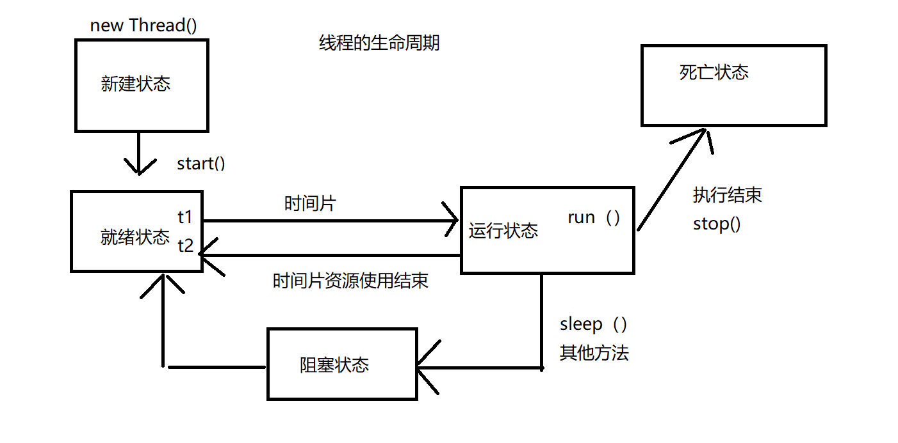

# 多线程


## 一、进程与线程

### 1、什么是进程

+ 进程是一个正在运行的应用程序
  + 如qq、eclipse、浏览器....
  + 这些进程之间是互不干扰的
  + 每一个进程都有自己的内存空间和系统资源
+ 进程的定义
  + 进程是一个具有一定独立功能的程序在一个数据集桑的一次动态的执行过程，是操作系统进行资源分配和调度的一个**独立单位**
  + 是应用程序的载体

### 2、什么是线程

+ 一个进程的运行过程中可以有多个任务同时执行
  + 如在一个游戏中（**进程**）有多个人物同时放技能
  + 每一个人物就是一个**线程**
+ 线程是一个进程中的某一个单个顺序控制流，是一条**执行路径**
+ 如果一个进程中只有一条执行路径，那么这个程序是一个**单线程程序**
  + 记事本
+ 如果一个进程中有多个执行路径，那么这个程序是一个**多线程程序**
  + 游戏

### 3、进程和线程的区别

+ 一个进程至少有一个线程或多个组成
+ 都是在同时执行多个任务
  + 进程之间的资源互不干扰
  + 在同一个进程中的所有线程**共享当前进程的资源**

## 二、创建线程对象

### 1、Thread

```java
package net.wanhe.j2se.day30;

/*
 * 自定义一个类继承Thread表示当前类是一个线程类
 */
public class MyThread extends Thread {
	
	/*
	 * 线程中的核心方法
	 * 当前线程对象需要执行的内容全部写在该方法中
	 */
	@Override
	public void run() {
		for(int i = 0;i < 50;i++) {
			System.out.println(i);
		}
	}

}
```

### 2、Runable

```java
package net.wanhe.j2se.day30;

public class MyTread1 implements Runnable {

	@Override
	public void run() {
		for(int i = 0;i < 50;i++) {
			System.out.println(i);
		}
	}

}

```

### 3、Thread和Runable的区别

+ 使用Runable可以避免Java单继承的局限性
+ 适合多个相同程序的代码去处理**同一个资源**的情况

## 三、开启线程的方法

```java
package net.wanhe.j2se.day30;

public class Test01 {
	
	public static void main(String[] args) {
		for(int i = 0;i < 50;i++) {
			System.out.println("----------");
		}
		//创建了两个线程对象
		MyThread t1 = new MyThread();
		MyThread t2 = new MyThread();
		//让两个线程对象开始执行
//		t1.run();
//		t2.run();
		//开启线程对象 该线程对象会独立运行run方法中的内容
		t1.start();
		t2.start();
		
		MyTread1 mt = new MyTread1();
		Thread t3 = new Thread(mt);
		Thread t4 = new Thread(mt);
		t3.start();
		t4.start();
	}
}
```

+ run方法和start方法的区别
  + run方法指定了当前线程独享需要做的事情，如果直接调用，相当于在调用普通方法
  + start方法用于启动线程，将当前线程对象中的run方法单独放在一条执行路径中执行
  + **跳出三界外，不在无形中**
+ 开启线程后，当前进程中有多个线程在同时执行，所以控制台会出现**交替输出**的现象

## 四、设置和获取线程名称

+ Thread类中有一个name属性
  + 用来记录当前线程对象的名称
  + getName
    + 获取线程名
  + setName
    + 设置线程名
  + currentThread
    + 获取当前正在执行的线程名称

```java
package net.wanhe.j2se.day30;

public class MyTread1 implements Runnable {

	@Override
	public void run() {
		for(int i = 0;i < 50;i++) {
			//Thread.currentThread() 获取当前正在执行的线程对象
			System.out.println(Thread.currentThread().getName() + ":" + i);
		}
	}

}
```

```java
package net.wanhe.j2se.day30;

public class Test02 {
	
	public static void main(String[] args) {
		MyThread t1 = new MyThread();
		MyThread t2 = new MyThread();
		t1.setName("王越");
		t2.setName("管超");
		
		MyTread1 m = new MyTread1();
		Thread t3 = new Thread(m,"沈杰");
		Thread t4 = new Thread(m,"陈海波");
		
		//线程对象的名称Thread-n
		//我们可以通过setName方法重新设置线程名称
		t1.start();
		t2.start();
		t3.start();
		t4.start();
	}
}
```

## 五、线程的生命周期

+ 新建状态

  使用new关键字创建线程对象后，该对象处于**新建状态**，该状态下的线程对象不具备**执行权**

+ 就绪状态

  当前调用了线程对象的start方法后，该对象进入**就绪状态**，就绪状态中的线程对象进入等待队列，等待JVM虚拟机分配资源

+ 运行状态

  当就绪状态中的线程对象获取到JVM虚拟机分配的资源调度时，该线程对象进入**运行状态**，处于运行状态的线程最为复杂

  他会变为**阻塞状态、就绪状态、死亡状态**

+ 死亡状态

  run方法中的内容执行结束了，该线程对象进入**死亡状态**

+ 阻塞状态

  + 等待阻塞
  + 同步阻塞
  + 其他阻塞



## 六、线程优先级

### 1、资源调度

+ 分时调度模型
  + 所有线程轮流使用CPU的使用权，平均分配每个线程占用的CPU时间片
+ 抢占式调度模型
  + 优先让优先级高的线程使用CPU，如果优先级相同，那么会随机选择一个
+ **Java中的线程使用的是抢占式调度模型**

### 2、设置和获取线程优先级

```java
package net.wanhe.j2se.day30;

public class Test03 {
	
	public static void main(String[] args) {
		MyTread1 m = new MyTread1();
		Thread t1 = new Thread(m,"沈杰");
		Thread t2 = new Thread(m,"陈海波");
		
		//5是默认优先级
		System.out.println(t1.getPriority());
		System.out.println(t2.getPriority());
		//设置优先级 优先级是1-10
		//设置优先级只能提高抢到CPU的概率
		t1.setPriority(Thread.MAX_PRIORITY);
		t2.setPriority(Thread.MIN_PRIORITY);
		
		t1.start();
		t2.start();
	}
}
```

## 七、线程控制

+ sleep(long)
  + 静态方法
  + 使当前正在执行的线程进入**阻塞状态**睡眠指定的时间
  + 睡眠状态中的线程对象会**释放CPU资源**
  + 当睡眠状态结束，当前线程对象会重新进入**就绪状态**

```java
package net.wanhe.j2se.day30;

public class SleepThread implements Runnable {

	@Override
	public void run() {
		for(int i = 0;i < 50;i++) {
			System.out.println(Thread.currentThread().getName() + ":" + i);
			try {
				Thread.sleep(2000);
			} catch (InterruptedException e) {
				e.printStackTrace();
			}
		}
		
	}
}
```

+ join()
  + 等待调用该方法的线程死亡
  + 其他线程必须等待调用该方法的线程对象执行完毕后才有机会继续执行

```java
package net.wanhe.j2se.day30;

public class JoinTest {
	
	public static void main(String[] args) {
		JoinThread t = new JoinThread();
		Thread t1 = new Thread(t,"康熙");
		Thread t2 = new Thread(t,"八阿哥");
		Thread t3 = new Thread(t,"尔康");
		t1.start();
		for(int i = 0;i < 20;i++) {
			System.out.println(Thread.currentThread().getName() + "-------");
		}
		try {
			t1.join();
		} catch (InterruptedException e) {
			e.printStackTrace();
		}

		
		
//		t2.start();
//		t3.start();
//		try {
//			t3.join();
//		} catch (InterruptedException e) {
//			e.printStackTrace();
//		}
		
	}
}
```

+ setDaemon(boolean);
  + 将线程对象标记为**守护线程**
  + 当就绪状态中的线程都是**守护线程时**,JVM虚拟机会自动退出

```java
package net.wanhe.j2se.day30;

public class DaemonTest {
	
	public static void main(String[] args) {
		DaemonThread t = new DaemonThread();
		Thread t1 = new Thread(t,"张飞");
		Thread t2 = new Thread(t,"关羽");
		Thread t3 = new Thread(t,"孙权");
		Thread.currentThread().setPriority(10);
		t1.setDaemon(true);
		t2.setDaemon(true);
		t1.start();
		t2.start();
		t3.start();
		for(int i = 0;i < 20;i++) {
			Thread.currentThread().setName("刘备");
			System.out.println(Thread.currentThread().getName()+ ":" + i);
		}
	}

}

```

## 八、综合练习

通过线程实现模拟3个窗口卖100张票

+ 只有100张票
+ 控制台输出 几号窗口 卖出了第几张票
+ 如果票卖完了 程序不停止运行

```java
package net.wanhe.j2se.day30;

public class SellThread implements Runnable {
	
	private int num = 100;

	@Override
	public void run() {
		while(true) {
			if(num > 0) {
				
				//窗口3卖出了第100张票  num 100
				
				//窗口1卖出了第100张票
				
				//窗口3 num-- 99
				//窗口3卖出了第99张票
				
				//窗口1卖出了第100张票
				System.out.println(Thread.currentThread().getName() + "卖出了第" + num + "张票");
				num--;
			}
		}
		
	}

}

```

```java
package net.wanhe.j2se.day30;

public class SellTest {
	
	public static void main(String[] args) {
		SellThread s = new SellThread();
		Thread t1 = new Thread(s,"窗口1");
		Thread t2 = new Thread(s,"窗口2");
		Thread t3 = new Thread(s,"窗口3");
		t1.start();
		t2.start();
		t3.start();
	}

}
```

## 九、线程同步

### 1、线程安全

+ 买票问题出现的原因
  + 多线程环境
  + 有共享数据
  + 有多个线程对象在**同时操作共享数据**
+ 当以上3种情况同时发生，就会出现线程安全的问题
+ 解决方案
  + 破坏掉以上3种情况中的任意一种，我们就可以实现线程安全
  + 我们可以将**操作共享数据的代码锁起来**，确保在一个时间段中，只有一个线程去操作共享数据

### 2、同步代码块

```java
synchronized (任意对象) {
  操作共享数据的代码
}
```

```java
package net.wanhe.j2se.day30;

public class SellThread implements Runnable {
	
	private int num = 100;
	
	private Object lock = new Object();

	@Override
	public void run() {
		while(true) {
			synchronized (lock) {
				if(num > 0) {
					System.out.println(Thread.currentThread().getName() + "卖出了第" + num + "张票");
					num--;
				}
			}
		}	
	}
}
```

+ **任意对象**相当于设置了一把锁，锁只能有一把
+ 只有获得锁对象的线程对象才能执行**同步代码块**中的代码
+ 同步的优缺点
  + 解决了多线程操作中共享数据的安全性问题
  + 降低了代码的运行效率

### 3、同步方法

+ 如果一个方法中的所有代码都要放在**同步代码块中**
  + 我们可以将该方法设置为**同步方法**
+ 同步成员方法的锁对象是`this`当前对象本身
+ 同步静态方法的锁对象是**当前类的Class对象**

### 4、线程安全的类

+ StringBuffer
+ Vector
+ HashTable


## 十、死锁

```java
package net.wanhe.j2se.day30;

public class Person1 implements Runnable {

	@Override
	public void run() {
		
		synchronized (Lock.smoke) {
			System.out.println(Thread.currentThread().getName() + "拿到烟");
			try {
				Thread.sleep(1000);
			} catch (InterruptedException e) {
				e.printStackTrace();
			}
			synchronized (Lock.fire) {
				System.out.println(Thread.currentThread().getName() + "拿到火");
				System.out.println(Thread.currentThread().getName() + "抽到了烟");
				
			}
		}
		
		
	}

}
```

```java
package net.wanhe.j2se.day30;

public class Person2 implements Runnable {

	@Override
	public void run() {

		synchronized (Lock.fire) {
			System.out.println(Thread.currentThread().getName() + "拿到火");
			try {
				Thread.sleep(1000);
			} catch (InterruptedException e) {
				e.printStackTrace();
			}
			synchronized (Lock.smoke) {
				System.out.println(Thread.currentThread().getName() + "拿到烟");
				System.out.println(Thread.currentThread().getName() + "抽到了烟");
				
			}
		}
		
	}

}
```

```java
package net.wanhe.j2se.day30;

public class Test04 {
	
	public static void main(String[] args) {
		
		Person1 p1 = new Person1();
		Person2 p2 = new Person2();
		Thread t1 = new Thread(p1,"张三");
		Thread t2 = new Thread(p2,"李四");
		t1.start();
		t2.start();
		
	}

}

```

## 十一、Lock锁

虽然我们使用同步代码块和同步方法对代码加上了锁

但是我们并没有直接看到什么时候加上了锁，什么时候释放了锁

为了更清晰的表达如何加锁和释放锁，JDK5以后提供了一个新的锁对象`Lock`

+ Lock提供了比`synchronized`更管饭的锁定操作
+ Lock中提供了获得锁和释放锁的方法
  + lock()
    + 获取锁资源
  + unlock()
    + 释放锁资源
+ Lock是一个接口，我们使用他的实现类`ReentrantLock`

```java
package net.wanhe.j2se.day31;

import java.util.ArrayList;
import java.util.concurrent.locks.Lock;
import java.util.concurrent.locks.ReentrantLock;

public class SellThread implements Runnable {
	
	private int num = 100;
	
	private Lock lock = new ReentrantLock();
	
	@Override
	public void run() {
		while(true) {
			try {
				Thread.sleep(1000);
			} catch (InterruptedException e) {
				e.printStackTrace();
			}
			try {
				//上锁
				lock.lock();
				if(num > 0) {
					System.out.println(Thread.currentThread().getName() + "卖出了第" + num + "张票");
					num--;
				}
			}finally {
				//释放锁
				lock.unlock();
			}
		}
		
	}
	
	/*
	 * 如果一个方法中的所有代码都需要放在同步代码块中执行
	 * 此时我们可以将该方法设置为同步方法
	 */
//	public synchronized void sell() {
//		if(num > 0) {
//			System.out.println(Thread.currentThread().getName() + "卖出了第" + num + "张票");
//			num--;
//		}
//	}

}

```

## 十二、生产者和消费者模式

### 1、简介

+ Java23种设计模式之一
+ 该模式是最经典的多线程协作的设计模式
+ 该模式主要包含两类线程
  + 生产者线程用于生产数据
  + 消费者线程用于消费数据
+ 为了解耦生产者和消费者的关系，通常会采用**共享的数据区域**作为数据的中转站
+ 生产者生产数据之后将数据放在共享区域种，并不需要关心消费者的行为
+ 消费者只需要从共享区域获取数据，并不关心生产者的行为
+ 该模式存在两个问题
  + 生产者生产数据后需要通知消费者消费
  + 消费者消费时生产者可能还没有生产
  + 这两个问题是该模式最经典的**等待唤醒**问题
  + 解决这些问题的方式我们称之为**线程通信**

### 2、线程通信

+ 为了使多个线程之间实现通信，JDK提供了几个方法供我们使用
+ 这几个方法都是Object方法，所以所有对象都拥有这些方法
  + wait()
    + 使调用该方法的对象进入等待状态，直到另一个线程调用该对象的`notify`或者notifyAll唤醒该线程
  + notify()
    + 唤醒线程对象
  + notifyAll()
    + 唤醒等待队列中的所有线程对象
  + 以上方法只能在**同步**中使用

### 3、实现

+ 菜鸟驿站
  + 容器
  + 存储的方法
  + 获取的方法

```java
package net.wanhe.j2se.day31;

public class CNBox {
	private int num;
	
	public synchronized void put() {
		if(num == 1) {
			try {
				this.wait();
			} catch (InterruptedException e) {
				e.printStackTrace();
			}
		}
		num++;
		System.out.println(Thread.currentThread().getName() + "存放了第" + num + "个快递");
		notifyAll();
		
	}
	
	public synchronized void get() {
		if(num == 0) {
			try {
				this.wait();
			} catch (InterruptedException e) {
				e.printStackTrace();
			}
		}
		System.out.println(Thread.currentThread().getName() + "取出了第" + num + "个快递");
		num--;
		//唤醒所有的等待线程
		notifyAll();
		
	}

}
```

+ 快递员
  + 调用菜鸟驿站的存储的方法

```java
package net.wanhe.j2se.day31;

public class Producter implements Runnable {
	
	private CNBox box;
	
	public Producter(CNBox box) {
		super();
		this.box = box;

	}

	@Override
	public void run() {
		while(true) {
			box.put();
		}
	}
}
```

+ 买家
  + 调用菜鸟驿站的获取的方法

```java
package net.wanhe.j2se.day31;

public class Customer implements Runnable {
	
	private CNBox cnBox;
	
	public Customer(CNBox cnBox) {
		super();
		this.cnBox = cnBox;
	}

	@Override
	public void run() {
		while(true) {
			cnBox.get();
		}
	}

}
```

+ 测试类
  + 创建驿站对象
  + 创建快递员对象 放入到线程中
  + 创建买家对象 放入到线程中
  + 开启线程

```java
package net.wanhe.j2se.day31;

public class Test {
	
	public static void main(String[] args) {
		CNBox box = new CNBox();
		Producter p = new Producter(box);
		Customer c = new Customer(box);
		Thread t1 = new Thread(p,"生产者");
		Thread t2 = new Thread(c,"消费者");
		t1.start();
		t2.start();
	}

}
```

